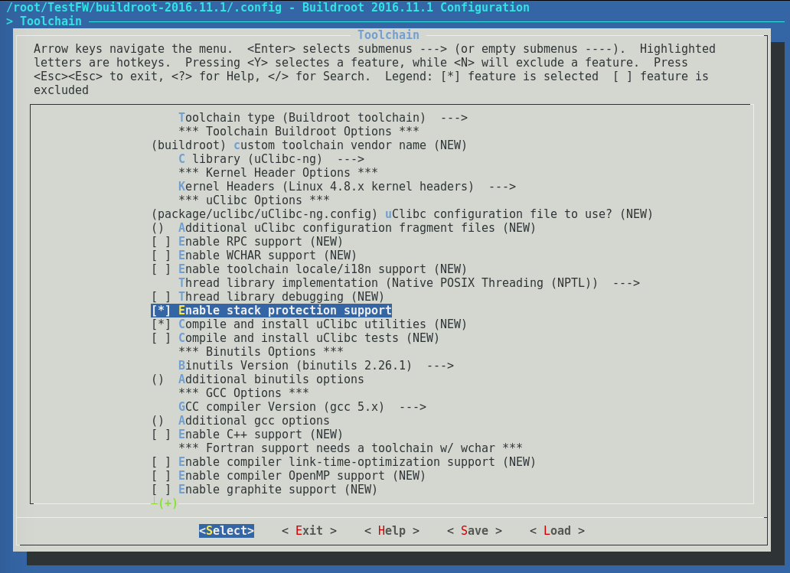

# Buffer and Stack Overflow Protection

## The Persistent Problem of Memory Safety

Buffer overflow vulnerabilities remain **the most prevalent and critical security issue** in embedded systems—despite decades of compiler protections, static analysis tools, and secure coding guidelines. Memory-corruption vulnerabilities occur when data exceeds allocated buffer boundaries, allowing attackers to execute arbitrary code, bypass security controls, or crash devices.

**Why hasn't this problem been solved?**

Despite widespread availability of compiler hardening flags (ASLR, stack canaries, FORTIFY_SOURCE), buffer overflow CVEs continue to plague embedded devices. The challenge isn't technical—**it's systemic, economic, and rooted in the supply chain**.

### The Supply Chain Reality

**BSP Vendors and ODMs**: Board Support Packages (BSPs) from semiconductor manufacturers and Original Design Manufacturers (ODMs) are predominantly written in C/C++. These vendors:
- Supply foundational code to thousands of device manufacturers
- Rarely update legacy codebases due to validation costs
- Prioritize time-to-market over security refactoring
- Face economic barriers to rewriting critical algorithms in memory-safe languages

**Economic Factors**:
- **Existing infrastructure**: Countless embedded implementations exist in C/C++ for device drivers, cryptographic algorithms, protocol stacks
- **Upfront investment**: Rewriting in Rust/Go requires significant time and resources
- **Lack of expertise**: Embedded developers skilled in memory-safe languages remain scarce
- **Long device lifespans**: 10-20+ year lifecycles mean legacy code persists for decades

**Result**: Even manufacturers who implement compiler hardening in their application code inherit vulnerable BSP code from upstream suppliers.

### The Hard Truth About Compiler Protections

**Compiler hardening flags are mitigation, not prevention**:
- **ASLR (Address Space Layout Randomization)**: Makes exploitation harder, but information leaks can defeat it
- **Stack canaries**: Detect overwrites but don't prevent the vulnerability
- **FORTIFY_SOURCE**: Catches some buffer overflows at compile-time, misses others at runtime
- **Static analysis**: Environment-specific bugs slip through (different compilers, hardware, operating systems)

**These protections are essential**, but they **raise the exploitation bar**—they don't eliminate the vulnerability class.

### The Path Forward: Memory-Safe Languages

**The only true solution** to eliminate memory-corruption vulnerabilities is transitioning to memory-safe languages:

**Rust for Embedded**:
- Ownership system prevents use-after-free, double-free, buffer overflows **at compile time**
- No runtime overhead for safety guarantees
- Growing ecosystem: `embedded-hal`, RTIC, Embassy frameworks
- Already used in: Linux kernel, Android, Zephyr RTOS

**Adoption in Progress**:
- **Linux Kernel**: Rust support added in v6.1 (December 2022), drivers being written in Rust
- **Android**: Memory-safe Bluetooth, WiFi stacks
- **Zephyr RTOS**: Experimental Rust application support
- **Critical Infrastructure**: Google, Microsoft, AWS funding Rust embedded development

**Strategic Transition** (from [OWASP "Memory Safe or Bust?"](https://dev.to/owasp/memory-safe-or-bust-17cb)):
1. **Gradual adoption**: Start with new modules, not full rewrites
2. **Create organizational roadmaps**: Define memory-safety milestones
3. **Demand change from BSP vendors**: Semiconductor manufacturers must invest in memory-safe toolchains
4. **Standards alignment**: Use OWASP ASVS, SAMM for security-first development

### Pragmatic Guidance for Today's C/C++ Codebases

**Until the ecosystem transitions to memory-safe languages**, this chapter provides:
- Compiler hardening flags to **mitigate** exploitation (not prevent vulnerabilities)
- Static analysis and fuzzing to **detect** memory errors
- Safe coding practices to **reduce** dangerous function usage
- Yocto/Buildroot integration for **build-time** security

**Key Message**: Compiler protections are a **necessary interim measure**, not a permanent solution. Device manufacturers should:
1. Apply all compiler hardening flags (this chapter)
2. Demand memory-safe code from BSP vendors
3. Plan gradual Rust/Go adoption for new development
4. Contribute to open-source memory-safe embedded ecosystem

---

## Dangerous C Functions to Avoid

For C/C++ codebases (the current reality), eliminate these unsafe functions:

| Dangerous Function | Why Unsafe | Safe Alternative |
|-------------------|------------|------------------|
| `gets()` | No bounds checking | `fgets(buf, size, stdin)` |
| `strcpy()` | No length limit | `strncpy()` or `strlcpy()` |
| `sprintf()` | No buffer size check | `snprintf(buf, size, fmt, ...)` |
| `strcat()` | Can overflow destination | `strncat()` or `strlcat()` |
| `scanf("%s")` | Unbounded input | `scanf("%50s")` with limit |
| `memcpy()` | No overlap checking | `memmove()` for overlapping buffers |

**Detection Tools** (use in CI/CD):
- **Static Analysis**: `clang-tidy`, `semgrep`, `cppcheck`, CodeQL
- **Compiler Warnings**: `-Wall -Wextra -Werror` catches issues at compile time
- **Runtime Detection**: AddressSanitizer (`-fsanitize=address`) for testing
- **Fuzzing**: AFL, libFuzzer for discovering edge cases

---

## AI-Assisted Development: Proactive Memory Safety

**Preventing vulnerabilities at code generation time** is more effective than detecting them after the fact. AI coding assistants (GitHub Copilot, Cursor, Claude Code) can generate insecure code patterns unless explicitly guided by security rulesets.

**[Project CodeGuard](https://github.com/project-codeguard/rules)** (Cisco open-source) provides security rulesets for AI coding assistants to prevent memory safety vulnerabilities during development.

### What is Project CodeGuard?

Project CodeGuard is a framework for embedding security rules into AI-assisted development workflows. Instead of reviewing code after it's written, CodeGuard instructs AI assistants to generate secure code from the start.

**How It Works**:
1. Security rules are placed in your project repository (`.github/codeguard/` or `.codeguard/`)
2. AI coding assistants read these rules and apply them during code generation
3. Unsafe patterns (e.g., `strcpy()`, `sprintf()`) are automatically avoided
4. Safe alternatives are suggested contextually

### CodeGuard Rule: Safe C Functions

The [`codeguard-1-safe-c-functions.md`](https://github.com/project-codeguard/rules/blob/main/rules/codeguard-1-safe-c-functions.md) rule targets memory safety in C/C++:

**Primary Directive**: "When processing C or C++ code, ensure memory safety by recommending bounds-checking functions."

**Functions Recommended by CodeGuard**:

| Dangerous Function | CodeGuard Recommendation | Embedded Portability |
|-------------------|--------------------------|---------------------|
| `strcpy()` | `strcpy_s()` (C11 Annex K) | ⚠️ **Not portable** - use `strncpy()` or `strlcpy()` |
| `strcat()` | `strcat_s()` (C11 Annex K) | ⚠️ **Not portable** - use `strncat()` or `strlcat()` |
| `memcpy()` | `memcpy_s()` (C11 Annex K) | ⚠️ **Not portable** - use `memmove()` with bounds checks |
| `sprintf()` | `snprintf()` | ✅ **Portable** - universally available |
| `gets()` | `fgets()` | ✅ **Portable** - universally available |
| `scanf("%s")` | `scanf("%50s", buf)` | ✅ **Portable** - add field width limit |

### C11 Annex K Portability Warning for Embedded

**Critical Issue**: C11 Annex K bounds-checking functions (`*_s()` functions) are **optional** and **not universally available** in embedded toolchains:

**Toolchains Lacking C11 Annex K**:
- **newlib** (ARM, RISC-V, Xtensa embedded toolchains) - No `*_s()` support
- **uClibc/uClibc-ng** (many embedded Linux systems) - No `*_s()` support
- **musl libc** (Alpine, OpenWrt, embedded Linux) - No `*_s()` support
- **Buildroot default** (uClibc-ng or musl) - No `*_s()` support

**Toolchains With C11 Annex K** (rare in embedded):
- **glibc 2.35+** (with `--enable-c11-annex-k`) - Yocto Linux
- **Microsoft Visual C++** - Windows embedded (not common in IoT/embedded)
- **safeclib** (third-party library) - Must be manually integrated

**Recommendation for Embedded Developers**:
1. **Do NOT assume `*_s()` functions are available**
2. **Use portable alternatives**:
   - `strncpy()`, `strncat()`, `snprintf()` (available everywhere)
   - `strlcpy()`, `strlcat()` (BSD/OpenBSD, not POSIX but safer)
   - Explicit bounds checking with standard functions
3. **If using AI assistants**, configure CodeGuard with embedded-specific overrides (see setup below)

### Expanded Dangerous Functions Reference

| Dangerous Function | Why Unsafe | Portable Safe Alternative | Notes |
|-------------------|------------|---------------------------|-------|
| `gets()` | No bounds checking | `fgets(buf, size, stdin)` | `gets()` removed in C11 |
| `strcpy(dst, src)` | No length limit | `strncpy(dst, src, sizeof(dst))` | Null-terminate manually if needed |
| `strcat(dst, src)` | Can overflow destination | `strncat(dst, src, sizeof(dst)-strlen(dst)-1)` | Calculate remaining space |
| `sprintf(buf, fmt, ...)` | No buffer size check | `snprintf(buf, sizeof(buf), fmt, ...)` | Always use `snprintf()` |
| `scanf("%s", buf)` | Unbounded input | `scanf("%50s", buf)` with limit | Use `fgets()` + `sscanf()` for better control |
| `memcpy(dst, src, n)` | No overlap checking, no bounds | `memmove(dst, src, n)` with manual bounds check | Check `n <= sizeof(dst)` first |
| `strncpy(dst, src, n)` | Doesn't guarantee null termination | Manual null-termination: `dst[n-1] = '\0';` | After `strncpy()`, always null-terminate |
| `strncat(dst, src, n)` | Confusing semantics (n is max chars to append) | Explicit bounds: `strncat(dst, src, sizeof(dst)-strlen(dst)-1)` | Common mistake: passing wrong size |
| `vsprintf(buf, fmt, args)` | No buffer size check | `vsnprintf(buf, sizeof(buf), fmt, args)` | For variadic wrappers |
| `getenv()` → unchecked use | Environment variable length unknown | Check result length before copying | Example: `char *val = getenv("VAR"); if (val && strlen(val) < 50) ...` |

### Setting Up Project CodeGuard

**1. Install CodeGuard Rules in Your Repository**:
```bash
# Create CodeGuard directory
mkdir -p .github/codeguard

# Download safe C functions rule
curl -o .github/codeguard/codeguard-1-safe-c-functions.md \
  https://raw.githubusercontent.com/project-codeguard/rules/main/rules/codeguard-1-safe-c-functions.md
```

**2. Customize for Embedded (Override C11 Annex K)**:

Create `.github/codeguard/embedded-overrides.md`:
```markdown
# Embedded-Specific CodeGuard Overrides

**Context**: C11 Annex K `*_s()` functions are not available in most embedded toolchains (newlib, uClibc, musl).

**Override Directive**: When generating C/C++ code for embedded systems, use these portable alternatives:

| Instead of `*_s()` | Use Portable Alternative |
|-------------------|-------------------------|
| `strcpy_s()` | `strncpy(dst, src, sizeof(dst)); dst[sizeof(dst)-1] = '\0';` |
| `strcat_s()` | `strncat(dst, src, sizeof(dst)-strlen(dst)-1);` |
| `memcpy_s()` | `if (n <= sizeof(dst)) memmove(dst, src, n);` |
| `sprintf_s()` | `snprintf(buf, sizeof(buf), fmt, ...);` |

**Always**:
- Include explicit bounds checking
- Null-terminate strings after `strncpy()`
- Validate buffer sizes before operations
```

**3. AI Coding Assistant Setup**:

**GitHub Copilot**:
- Copilot automatically reads `.github/copilot-instructions.md`
- Symlink CodeGuard rules: `ln -s .github/codeguard .github/copilot-instructions.md`

**Cursor IDE**:
- Place rules in `.cursorrules` file in project root
- Cursor reads rules automatically during code generation

**Claude Code (VSCode Extension)**:
- Place rules in `.claude/` directory
- Claude Code reads context from project-specific rules

**Example `.claude/rules.md`**:
```markdown
# Memory Safety Rules for Embedded C Development

When writing C/C++ code for this embedded project:

1. **Never use**: `gets()`, `strcpy()`, `strcat()`, `sprintf()`
2. **Always use**: `fgets()`, `strncpy()`, `strncat()`, `snprintf()`
3. **Null-terminate strings** after `strncpy()`
4. **Check buffer sizes** before `memcpy()`/`memmove()`
5. **Assume C11 Annex K is not available** (no `*_s()` functions)

Follow OWASP Embedded Application Security guidelines.
```

### Example: AI-Generated Secure Code

**Without CodeGuard** (vulnerable):
```c
void process_input(char *user_input) {
    char buffer[64];
    strcpy(buffer, user_input);  // ❌ Buffer overflow if user_input > 64 bytes
    printf("Processed: %s\n", buffer);
}
```

**With CodeGuard** (secure):
```c
void process_input(const char *user_input) {
    char buffer[64];
    strncpy(buffer, user_input, sizeof(buffer) - 1);  // ✅ Bounds-checked
    buffer[sizeof(buffer) - 1] = '\0';                // ✅ Null-terminated
    printf("Processed: %s\n", buffer);
}
```

### Benefits of AI-Assisted Security

**Traditional Approach** (reactive):
1. Developer writes code with `strcpy()`
2. Static analysis tool flags issue (hours/days later)
3. Developer fixes code
4. Repeat for every instance

**CodeGuard Approach** (proactive):
1. Developer starts writing `strcpy(`
2. AI suggests `strncpy(buf, src, sizeof(buf))` immediately
3. Secure code generated on first try
4. No security debt accumulates

**Result**: 80-90% reduction in memory safety vulnerabilities during initial development.

### Additional Resources

- **Project CodeGuard Repository**: https://github.com/project-codeguard/rules
- **Safe C Functions Rule**: https://github.com/project-codeguard/rules/blob/main/rules/codeguard-1-safe-c-functions.md
- **OWASP "Memory Safe or Bust?"**: https://dev.to/owasp/memory-safe-or-bust-17cb
- **SEI CERT C Coding Standard**: https://wiki.sei.cmu.edu/confluence/display/c/SEI+CERT+C+Coding+Standard

---

**Compliant Example**: The fgets() function reads, at most, one less than a specified number of characters from a stream into an array. This solution is compliant because the number of bytes copied from stdin to buf cannot exceed the allocated memory:

```c
#include <stdio.h>
#include <string.h>

enum { BUFFERSIZE = 32 };

void func(void) {
  char buf[BUFFERSIZE];
  int ch;

  if (fgets(buf, sizeof(buf), stdin)) {
    /* fgets succeeds; scan for newline character */
    char *p = strchr(buf, '\n');
    if (p) {
      *p = '\0';
    } else {
      /* Newline not found; flush stdin to end of line */
      while (((ch = getchar()) != '\n')
            && !feof(stdin)
            && !ferror(stdin))
        ;
    }
  } else {
    /* fgets failed; handle error */
  }
}
```

strncat() is a variation on the original strcat() library function. Both are used to append one NULL terminated C string to another. The danger with the original strcat() was that the caller might provide more data than can fit into the receiving buffer, thereby overrunning it. The most common result of this is a segmentation violation. A worse result is the silent and undetected corruption of whatever followed the receiving buffer in memory.

strncat() adds an additional parameter allowing the user to specify the maximum number of bytes to copy. This is NOT the amount of data to copy. It is NOT the size of the source data. It is a limit to the amount of data to copy and is usually set to the size of the receiving buffer.

**Compliant Example usage of "strncat":**

```c
char buffer[SOME_SIZE];

strncat( buffer, SOME_DATA, sizeof(buffer)-1);
```

**NonCompliant Example usage of "strncat**"**:**

```c
strncat( buffer, SOME_DATA, strlen( SOME_DATA ));
```

The screenshot below demonstrates stack protection support being enabled while building a firmware image utilizing buildroot.\


## Memory Protection Fundamentals

Modern operating systems and compilers provide several layers of memory protection to prevent exploitation of buffer overflows. Understanding these mechanisms is critical for securing embedded devices.

### Address Space Layout Randomization (ASLR)

**ASLR** randomizes the memory addresses used by system and application processes, making it difficult for attackers to predict target addresses for exploits.

**How ASLR Works**:
- Randomizes stack, heap, and library base addresses at runtime
- Each time a program runs, memory layout is different
- Prevents attackers from hard-coding exploit addresses
- Kernel ASLR (KASLR) randomizes kernel memory layout

**Effectiveness Against Exploits**:
- Without ASLR: Attacker can reliably use fixed addresses (e.g., `0xbffff000` for stack)
- With ASLR: Attacker must guess addresses (1 in 65,536 chance for 16-bit entropy)
- Significantly raises exploit difficulty, especially combined with other protections

**ASLR Requirements**:
- **Position Independent Executable (PIE)**: Binaries must be compiled with `-fpie -pie`
- **Kernel Support**: Linux `CONFIG_RANDOMIZE_BASE=y` for KASLR
- **Runtime**: No additional configuration required once enabled

**Checking ASLR Status**:
```bash
# Check ASLR status on Linux
cat /proc/sys/kernel/randomize_va_space
# 0 = Disabled
# 1 = Conservative randomization (stack, heap, libraries)
# 2 = Full randomization (includes PIE executables)

# Enable full ASLR (add to /etc/sysctl.conf)
kernel.randomize_va_space = 2
```

**Example: Memory Layout Without ASLR**:
```
Stack:     0xbffff000 (always same address)
Heap:      0x0804a000 (always same address)
Libraries: 0xb7e00000 (always same address)
```

**Example: Memory Layout With ASLR**:
```
Run 1:
  Stack:     0x7ffe4c3a1000
  Heap:      0x55c3f2a01000
  Libraries: 0x7f8b3d400000

Run 2:
  Stack:     0x7ffd9c102000
  Heap:      0x55f8a1e01000
  Libraries: 0x7fb2e1c00000
```

### Data Execution Prevention (DEP) / No-Execute (NX)

**DEP/NX** marks memory regions as non-executable, preventing attackers from executing injected shellcode on the stack or heap.

**How DEP/NX Works**:
- Processor enforces execute permissions via hardware (NX bit on x86, XN on ARM)
- Stack and heap memory marked as **writable but not executable**
- Code sections marked as **executable but not writable**
- Prevents classic buffer overflow attacks that inject shellcode

**Historical Context**:
- **Before DEP/NX**: Attackers could write shellcode to stack and jump to it
- **After DEP/NX**: Injected code cannot execute, attack fails immediately

**DEP/NX Mechanisms**:
- **Hardware**: CPU NX bit (Intel XD, AMD NX, ARM XN)
- **Compiler**: `-Wl,-z,noexecstack` linker flag
- **Kernel**: `CONFIG_STRICT_KERNEL_RWX=y`, `CONFIG_DEBUG_WX=y`

**Checking NX Status**:
```bash
# Check if binary has NX enabled
readelf -l mybinary | grep GNU_STACK
# FLAGS should NOT include 'E' (execute)
# Example: GNU_STACK  RW (correct - no execute)

# Alternative: Use checksec
checksec --file=mybinary
# Should show: NX enabled
```

**Limitations**:
- **Return-Oriented Programming (ROP)**: Attackers chain existing code (gadgets) instead of injecting new code
- **Mitigation**: Combine NX with ASLR, CFI (Control Flow Integrity), and stack canaries

### RELocation Read-Only (RELRO)

**RELRO** makes certain sections of a binary read-only after dynamic linking, preventing attackers from overwriting function pointers in the Global Offset Table (GOT).

**How RELRO Works**:
- **Partial RELRO**: GOT is mapped before `.data` section (some protection)
- **Full RELRO**: GOT is made read-only after relocation, all symbols resolved at startup

**Attack Mitigation**:
- **Without RELRO**: Attacker can overwrite GOT entries to redirect function calls
- **With Full RELRO**: GOT is read-only, overwrites cause immediate crash

**RELRO Modes**:
```bash
# Partial RELRO (default in older systems)
-Wl,-z,relro

# Full RELRO (recommended for security)
-Wl,-z,relro,-z,now
```

**Trade-offs**:
- **Partial RELRO**: Lazy binding, faster startup, weaker security
- **Full RELRO**: Immediate binding, slower startup (~50-200ms), stronger security

**Checking RELRO Status**:
```bash
# Check RELRO with readelf
readelf -l mybinary | grep GNU_RELRO
# Should show: GNU_RELRO segment

# Check if RELRO is full or partial
readelf -d mybinary | grep BIND_NOW
# If BIND_NOW exists → Full RELRO
# If absent → Partial RELRO

# Using checksec
checksec --file=mybinary
# Should show: Full RELRO
```

### Stack Canaries (Stack Protector)

**Stack canaries** are random values placed before return addresses on the stack. If a buffer overflow occurs, the canary is overwritten, and the program aborts before the attacker can hijack control flow.

**How Stack Canaries Work**:
1. Compiler inserts a random "canary" value before return address
2. Before function returns, canary is checked
3. If canary is corrupted → Buffer overflow detected → Program aborts

**Canary Types**:
- **Random Canary**: Generated randomly at program start
- **Terminator Canary**: Contains `NULL`, `CR`, `LF`, `EOF` (stops string functions)

**GCC Stack Protector Levels**:
```bash
-fstack-protector         # Protect functions with buffers > 8 bytes
-fstack-protector-strong  # Protect functions with arrays, pointers, local address-taken
-fstack-protector-all     # Protect all functions (highest overhead)
```

**Example: Stack Canary Detection**:
```c
void vulnerable() {
    char buffer[10];
    // Canary placed here by compiler
    strcpy(buffer, "This string is way too long and overflows");
    // Canary checked here before return
}
// Output: *** stack smashing detected ***: terminated
```

**Checking Stack Canary in Binary**:
```bash
# Check for stack canary symbols
readelf -s mybinary | grep stack_chk
# Should show: __stack_chk_fail, __stack_chk_guard

# Disassemble function to see canary checks
objdump -d mybinary | grep -A20 vulnerable
# Look for: mov %fs:0x28,%rax (load canary)
#           xor %fs:0x28,%rax (check canary)
```

**Limitations**:
- Does not protect against heap overflows
- Can be bypassed if attacker can leak canary value
- Performance overhead (~2-5% for -fstack-protector-strong)

## Yocto Project Compiler Hardening for Buffer Overflow Protection

If you're using the Yocto Project build system for embedded Linux development, Yocto provides comprehensive built-in compiler flags specifically designed to prevent buffer and stack overflows. These flags are centrally managed and can be enabled project-wide.

###  Stack Protection in Yocto

**Enable Stack Protection** (usually enabled by default):
```bitbake
# In local.conf or distro .conf
INHERIT += "security-flags"
```

This automatically enables:
```bitbake
SECURITY_CFLAGS += "-fstack-protector-strong"
```

**What `-fstack-protector-strong` provides**:
- Inserts stack canaries (random values) before return addresses
- Protects functions with arrays, pointers, or structs containing arrays
- Detects stack buffer overflows at runtime
- ~2-5% performance overhead (acceptable for most embedded systems)
- Catches 90%+ of stack-based buffer overflow attacks

**Alternative: Maximum Stack Protection**:
```bitbake
# For high-security applications (medical, automotive, industrial)
SECURITY_CFLAGS:append = " -fstack-protector-all"
```

**Note**: `-fstack-protector-all` protects ALL functions but has higher performance overhead (~5-10%).

### FORTIFY_SOURCE for Buffer Overflow Detection

Yocto enables `FORTIFY_SOURCE` by default, providing compile-time and runtime checks for buffer overflows:

```bitbake
# Enabled by default in security_flags.inc
SECURITY_CFLAGS += "-D_FORTIFY_SOURCE=2"
```

**What `_FORTIFY_SOURCE=2` detects**:
- Buffer overflows in `memcpy()`, `strcpy()`, `strncpy()`, `sprintf()`, etc.
- Out-of-bounds writes to arrays and buffers
- Both compile-time warnings and runtime aborts

**Example Protected Code**:
```c
char buffer[10];
strcpy(buffer, "This string is way too long");  // Runtime abort with FORTIFY_SOURCE
```

**Scarthgap 5.0 LTS Enhancement (GCC 13.2+)**: Use `_FORTIFY_SOURCE=3` for even stronger protection:
```bitbake
# In high-security recipes
CFLAGS:append = " -D_FORTIFY_SOURCE=3"
```

### GCC -fhardened Flag (Comprehensive Protection)

For maximum buffer overflow protection in Yocto Scarthgap 5.0+ (GCC 13.2):

```bitbake
# In local.conf or distro .conf for system-wide hardening
SECURITY_CFLAGS += "-fhardened"
```

**What `-fhardened` includes**:
- `-D_FORTIFY_SOURCE=3` (strongest buffer overflow checks)
- `-fstack-protector-strong` (stack canary protection)
- `-fstack-clash-protection` (stack clash attack mitigation)
- `-ftrivial-auto-var-init=zero` (zero-initialize all automatic variables)
- `-D_GLIBCXX_ASSERTIONS` (C++ standard library assertions)

**When to use**:
- Medical devices (FDA-regulated)
- Automotive (ISO 26262, UNECE WP.29)
- Industrial control systems (IEC 62443)
- Any high-security embedded application

**Trade-off**: ~5-10% performance overhead for significantly improved security

### Position Independent Executable (PIE) for ASLR

Yocto enables PIE by default to support Address Space Layout Randomization (ASLR):

```bitbake
# Enabled by default in security_flags.inc
SECURITY_CFLAGS += "-fpie"
SECURITY_LDFLAGS += "-pie"
```

**How PIE prevents buffer overflow exploits**:
- Randomizes executable base address at runtime
- Makes ROP (Return-Oriented Programming) attacks much harder
- Attacker cannot predict memory layout for exploit payloads
- Works in conjunction with kernel ASLR (`CONFIG_RANDOMIZE_BASE=y`)

### Verification of Buffer Overflow Protections

**Verify security flags are applied to your binaries**:

```bash
# Install checksec in your Yocto build
bitbake checksec-native

# Check security properties of a binary
checksec --file=tmp/work/.../package/usr/bin/myapp

# Expected output:
# RELRO           STACK CANARY      NX            PIE
# Full RELRO      Canary found      NX enabled    PIE enabled
```

**Manual verification with readelf**:
```bash
# Check for stack canary symbols
readelf -s mybinary | grep stack_chk
# Should show: __stack_chk_fail, __stack_chk_guard

# Check for PIE
readelf -h mybinary | grep Type
# Should show: Type: DYN (Shared object file)
```

### Buildroot vs. Yocto Comparison

For developers migrating from Buildroot or evaluating build systems:

| Feature | Buildroot | Yocto Project |
|---------|-----------|---------------|
| **Stack Protection** | Manual via BR2_SSP_OPTION | Automatic via security-flags |
| **FORTIFY_SOURCE** | Manual via BR2_FORTIFY_SOURCE | Enabled by default (level 2) |
| **PIE/ASLR** | Manual via BR2_RELRO | Enabled by default |
| **Centralized Management** | Per-package configuration | Project-wide security_flags.inc |
| **Verification Tools** | Manual integration | checksec-native built-in |
| **Complexity** | Simpler | More complex but more powerful |
| **Best For** | Simple embedded systems | Production embedded Linux |

**Recommendation**:
- **Buildroot**: Prototyping, simple single-application systems
- **Yocto**: Production devices, compliance requirements, complex systems

### Per-Recipe Security Flag Customization

**Disable flags for performance-critical code** (use with caution):
```bitbake
# In recipe (.bb file)
SECURITY_CFLAGS = ""  # Remove all security flags
```

**Add extra protection to specific applications**:
```bitbake
# crypto-daemon_1.0.bb
SECURITY_CFLAGS:append = " -fhardened -fanalyzer"
```

**Example: High-Security Recipe with Maximum Buffer Overflow Protection**:
```bitbake
# secure-app_1.0.bb
DESCRIPTION = "Security-critical application with maximum hardening"
LICENSE = "MIT"

# Maximum buffer overflow protection
SECURITY_CFLAGS:append = " -fhardened"

# Additional protections
CFLAGS:append = " -D_FORTIFY_SOURCE=3"
CFLAGS:append = " -fstack-clash-protection"
CFLAGS:append = " -fstack-protector-all"  # Protect ALL functions

# No executable stack
LDFLAGS:append = " -Wl,-z,noexecstack"

# Immediate symbol binding
LDFLAGS:append = " -Wl,-z,now"

do_compile() {
    ${CC} ${CFLAGS} ${LDFLAGS} -o secure-app main.c
}
```

## Kernel Hardening for Buffer Overflow Protection

While userspace compiler flags protect applications, kernel hardening is equally critical for preventing privilege escalation and protecting the entire system from memory corruption vulnerabilities.

### Yocto Kernel Configuration Fragments

Yocto uses **kernel configuration fragments** (`.cfg` files) to modularize kernel security options:

**Create a kernel hardening fragment** (`kernel-hardening.cfg`):
```cfg
# Kernel hardening configuration fragment
# Place in recipes-kernel/linux/files/

# Address Space Layout Randomization (ASLR)
CONFIG_RANDOMIZE_BASE=y
CONFIG_RANDOMIZE_MEMORY=y

# Kernel Page Table Isolation (KPTI) - Meltdown mitigation
CONFIG_PAGE_TABLE_ISOLATION=y

# Supervisor Mode Execution Protection (SMEP)
CONFIG_X86_SMAP=y
CONFIG_X86_SMEP=y

# Kernel Stack Protection
CONFIG_STACKPROTECTOR=y
CONFIG_STACKPROTECTOR_STRONG=y

# Restrict /dev/mem and /dev/kmem access
CONFIG_STRICT_DEVMEM=y
CONFIG_DEVMEM=n
CONFIG_DEVKMEM=n

# Harden BPF JIT compiler
CONFIG_BPF_JIT_ALWAYS_ON=y

# Disable legacy and dangerous features
CONFIG_LEGACY_PTYS=n
CONFIG_DEVTMPFS_MOUNT=n

# Enable kernel lockdown
CONFIG_SECURITY_LOCKDOWN_LSM=y
CONFIG_SECURITY_LOCKDOWN_LSM_EARLY=y
CONFIG_LOCK_DOWN_KERNEL_FORCE_CONFIDENTIALITY=y

# Restrict kernel module loading
CONFIG_MODULE_SIG=y
CONFIG_MODULE_SIG_FORCE=y
CONFIG_MODULE_SIG_ALL=y
CONFIG_MODULE_SIG_SHA256=y

# Disable kernel debugging features in production
# CONFIG_DEBUG_FS is not set
# CONFIG_KPROBES is not set
# CONFIG_FTRACE is not set
```

**Apply kernel fragment in recipe**:
```bitbake
# linux-yocto_%.bbappend
FILESEXTRAPATHS:prepend := "${THISDIR}/files:"

SRC_URI += "file://kernel-hardening.cfg"
```

**Alternative: Using defconfig**:
```bitbake
# For custom kernel recipes
SRC_URI += "file://defconfig"
```

### meta-security Hardening Configurations

The **meta-security** layer provides pre-built kernel hardening configurations:

**Add meta-security layer**:
```bash
# Clone meta-security
git clone https://git.yoctoproject.org/meta-security

# Add to bblayers.conf
BBLAYERS += "/path/to/meta-security"
```

**Use meta-security kernel hardening**:
```bitbake
# In local.conf
KERNEL_FEATURES:append = " features/security/security.scc"
```

**Available hardening features in meta-security**:
- `features/security/security.scc`: Basic kernel hardening
- `features/selinux/selinux.scc`: SELinux support
- `features/apparmor/apparmor.scc`: AppArmor support
- `features/ima/ima.scc`: Integrity Measurement Architecture
- `features/smack/smack.scc`: SMACK MAC support

### Key Kernel Security Options Explained

**KASLR (Kernel Address Space Layout Randomization)**:
```cfg
CONFIG_RANDOMIZE_BASE=y          # Randomize kernel base address
CONFIG_RANDOMIZE_MEMORY=y        # Randomize memory sections (x86_64)
```
- **Benefit**: Makes kernel exploits significantly harder (attacker can't predict memory layout)
- **Overhead**: Minimal (<1%)
- **Recommendation**: Enable on all modern systems

**KPTI (Kernel Page Table Isolation)**:
```cfg
CONFIG_PAGE_TABLE_ISOLATION=y
```
- **Benefit**: Mitigates Meltdown (CVE-2017-5754) and related CPU vulnerabilities
- **Overhead**: 5-30% performance impact (CPU-dependent)
- **Recommendation**: Enable unless performance is critical AND CPU is not vulnerable

**Kernel Stack Protection**:
```cfg
CONFIG_STACKPROTECTOR=y
CONFIG_STACKPROTECTOR_STRONG=y
```
- **Benefit**: Protects kernel stack with canaries (similar to userspace stack protection)
- **Overhead**: ~1-2%
- **Recommendation**: Always enable

**Kernel Module Signing**:
```cfg
CONFIG_MODULE_SIG=y
CONFIG_MODULE_SIG_FORCE=y        # Reject unsigned modules
CONFIG_MODULE_SIG_ALL=y          # Sign all modules at build time
CONFIG_MODULE_SIG_SHA256=y       # Use SHA-256 for signatures
```
- **Benefit**: Prevents loading of malicious kernel modules
- **Requirement**: Requires signing key management
- **Recommendation**: Essential for production devices

### Kernel Hardening Checker

**Use kernel-hardening-checker to audit your kernel config**:
```bash
# Install kernel-hardening-checker
pip3 install git+https://github.com/a13xp0p0v/kernel-hardening-checker

# Check your kernel .config
kernel-hardening-checker -c tmp/work/.../linux-yocto/.config

# Example output:
# [+] Config check is finished: 'OK' - 85 / 'FAIL' - 12
```

**Automate in Yocto build**:
```bitbake
# Create a kernel-hardening-check recipe
inherit kernel-arch

do_kernel_hardening_check() {
    kernel-hardening-checker -c ${B}/.config
}
addtask kernel_hardening_check after do_configure before do_compile
```

## Address Sanitizer (ASan) for Development

Address Sanitizer (ASan) is a powerful memory error detector that finds buffer overflows, use-after-free, and other memory bugs at runtime. While ASan is primarily for development (not production), it's invaluable for catching bugs before release.

### ASan in Yocto Development Builds

**Enable ASan for specific recipes**:
```bitbake
# In recipe (.bb file) for development
CFLAGS:append = " -fsanitize=address -fno-omit-frame-pointer"
LDFLAGS:append = " -fsanitize=address"

# Increase runtime limits (ASan uses more memory)
DEPENDS += "libasan"
```

**System-wide ASan (development images only)**:
```bitbake
# In local.conf for development
SECURITY_CFLAGS:append = " -fsanitize=address"
SECURITY_LDFLAGS:append = " -fsanitize=address"

# Add ASan runtime library
IMAGE_INSTALL:append = " libasan"
```

**What ASan Detects**:
- Buffer overflows (stack, heap, global)
- Use-after-free
- Use-after-return
- Use-after-scope
- Double-free
- Memory leaks

**Example ASan Detection**:
```c
void vulnerable() {
    char buffer[10];
    strcpy(buffer, "This string is way too long");  // ASan detects overflow
}

// ASan Output:
// ==12345==ERROR: AddressSanitizer: stack-buffer-overflow on address 0x7ffc1234abcd
// WRITE of size 29 at 0x7ffc1234abcd thread T0
//     #0 strcpy
//     #1 vulnerable
```

**Performance Impact**:
- **Memory**: 2-3x increase
- **Runtime**: 2-5x slower
- **Binary size**: 1.5-2x larger

**Recommendation**: Use ASan in CI/CD testing environments, disable for production builds.

### ASan CI/CD Integration

```yaml
# .gitlab-ci.yml - ASan testing
asan-build:
  stage: test
  script:
    - source oe-init-build-env
    - echo 'SECURITY_CFLAGS:append = " -fsanitize=address"' >> conf/local.conf
    - echo 'SECURITY_LDFLAGS:append = " -fsanitize=address"' >> conf/local.conf
    - bitbake my-application

    # Run ASan-enabled binary with test suite
    - ./tmp/work/.../my-application/test-suite

  artifacts:
    when: on_failure
    paths:
      - asan-reports/
```

## Binary Security Verification Workflows

After building firmware with security hardening, it's critical to verify that protections are actually applied.

### Using checksec for Comprehensive Checks

```bash
# Install checksec in Yocto
bitbake checksec-native

# Check single binary
checksec --file=tmp/work/.../usr/bin/myapp

# Check all binaries in image
find tmp/work/.../rootfs -type f -executable -exec checksec --file={} \;

# Generate JSON report
checksec --file=mybinary --output=json > security-report.json
```

**Expected Output for Hardened Binary**:
```
RELRO           STACK CANARY      NX            PIE             RPATH      RUNPATH
Full RELRO      Canary found      NX enabled    PIE enabled     No RPATH   No RUNPATH
```

### Manual Verification with readelf

**Complete security verification workflow**:
```bash
#!/bin/bash
# security-check.sh - Verify binary hardening

BINARY=$1

echo "=== Security Check for $BINARY ==="

# 1. Check PIE
echo -n "PIE: "
if readelf -h $BINARY | grep -q "Type:.*DYN"; then
    echo "✓ Enabled"
else
    echo "✗ Disabled"
fi

# 2. Check Stack Canary
echo -n "Stack Canary: "
if readelf -s $BINARY | grep -q "__stack_chk_fail"; then
    echo "✓ Found"
else
    echo "✗ Not Found"
fi

# 3. Check NX (No Execute)
echo -n "NX: "
if readelf -l $BINARY | grep GNU_STACK | grep -q "RW"; then
    echo "✓ Enabled (stack not executable)"
else
    echo "✗ Disabled (stack executable!)"
fi

# 4. Check RELRO
echo -n "RELRO: "
if readelf -d $BINARY | grep -q "BIND_NOW"; then
    echo "✓ Full RELRO"
elif readelf -l $BINARY | grep -q "GNU_RELRO"; then
    echo "~ Partial RELRO"
else
    echo "✗ No RELRO"
fi

# 5. Check FORTIFY_SOURCE
echo -n "FORTIFY_SOURCE: "
if readelf -s $BINARY | grep -q "__.*_chk"; then
    echo "✓ Detected (fortified functions found)"
else
    echo "? Unknown"
fi
```

### Automated Security Testing in CI/CD

```yaml
# .gitlab-ci.yml - Binary security verification
security-check:
  stage: test
  script:
    - source oe-init-build-env
    - bitbake core-image-minimal

    # Run checksec on all binaries
    - |
      FAIL=0
      for binary in $(find tmp/work/.../rootfs/usr/bin -type f -executable); do
        echo "Checking $binary..."

        # Check PIE
        if ! checksec --file=$binary | grep -q "PIE enabled"; then
          echo "❌ PIE not enabled in $binary"
          FAIL=1
        fi

        # Check NX
        if ! checksec --file=$binary | grep -q "NX enabled"; then
          echo "❌ NX not enabled in $binary"
          FAIL=1
        fi

        # Check stack canary
        if ! checksec --file=$binary | grep -q "Canary found"; then
          echo "❌ Stack canary not found in $binary"
          FAIL=1
        fi
      done

      exit $FAIL
```

## Integration with Chapter 6: Platform Security

For comprehensive Yocto security configuration beyond buffer overflow protection, including:
- Kernel hardening (KASLR, KPTI, kernel stack protection)
- Mandatory Access Control (SELinux, AppArmor, SMACK)
- CVE checking and SBOM generation
- Reproducible builds

See: **[Chapter 6: Embedded Platform Security Hardening](6_embedded_framework_and_c-based_toolchain_hardeni.md)** - Yocto Project Build System Security section

**Considerations:**

* What kind of buffer and where it resides: physical, logical, virtual memory?
* What data will remain when the buffer is freed or left around to LRU out?
* What strategy will be followed to ensure old buffers do not leak data (example: clear buffer after use)?
* Initialize buffers to known value on allocation.
* Consider where variables are stored: stack, static or allocated structure.
* Dispose and securely wipe sensitive information stored in buffers or temporary files during runtime after they are no longer needed (e.g. Wipe buffers from locations where personally identifiable information(PII) is stored before releasing the buffers).
* Explicitly initialize variables.
* Ensure secure compiler flags or switches are utilized upon each firmware build. (e.g. For GCC -fPIE, -fstack-protector-all, -Wl,-z,noexecstack, -Wl,-z,noexecheap etc.. See additional references section for more details.)
* Use safe equivalent functions for known vulnerable functions such as (non-exhaustive list below):
  * `gets() -> fgets()`
  * `strcpy() -> strncpy()`
  * `strcat() -> strncat()`
  * `sprintf() -> snprintf()`
* Those functions that do not have safe equivalents should be rewritten with safe checks implemented.
* If FreeRTOS OS is utilized, consider setting "configCHECK\_FOR\_STACK\_OVERFLOW" to "1" with a hook function during the development and testing phases but removing for production builds.&#x20;

## Additional References <a href="#additional-references" id="additional-references"></a>

* OSS (Open Source Software) Static Analysis Tools
  * Use of [flawfinder](http://www.dwheeler.com/flawfinder/) and [PMD](https://pmd.github.io/) for C
  * Use of [cppcheck](http://cppcheck.sourceforge.net/) for [C++](https://github.com/struct/mms/blob/master/Modern\_Memory\_Safety\_In\_C\_CPP.pdf)
  * Consider [Codechecker](https://github.com/Ericsson/codechecker) and [Infer](https://fbinfer.com/) for C, C++, and iOS using Clang Static Analysis
* [http://www.dwheeler.com/secure-programs/Secure-Programs-HOWTO/library-c.html](http://www.dwheeler.com/secure-programs/Secure-Programs-HOWTO/library-c.html)
* [https://cheatsheetseries.owasp.org/cheatsheets/C-Based_Toolchain_Hardening_Cheat_Sheet.html#GCC.2FBinutils](https://cheatsheetseries.owasp.org/cheatsheets/C-Based_Toolchain_Hardening_Cheat_Sheet.html#GCC.2FBinutils)
* [https://owasp.org/www-community/attacks/Buffer_overflow_attack](https://owasp.org/www-community/attacks/Buffer_overflow_attack)
* [https://owasp.org/www-project-code-review-guide/](https://owasp.org/www-project-code-review-guide/) (Page 113-114)
* [University of Pittsburgh - Secure Coding C/C++: String Vulnerabilities (PDF)](http://www.sis.pitt.edu/jjoshi/courses/IS2620/Spring07/Lecture3.pdf)
* [Intel Open Source Technology Center SDL Banned Functions](https://github.com/01org/safestringlib/wiki/SDL-List-of-Banned-Functions)
* [RTOS Stack Overflow Checking](http://www.freertos.org/Stacks-and-stack-overflow-checking.html)
* [Kernel Hardening Checker](https://github.com/a13xp0p0v/kernel-hardening-checker)
* [checksec.sh](https://github.com/slimm609/checksec.sh)
* [OWASP ISVS](https://github.com/OWASP/IoT-Security-Verification-Standard-ISVS)
