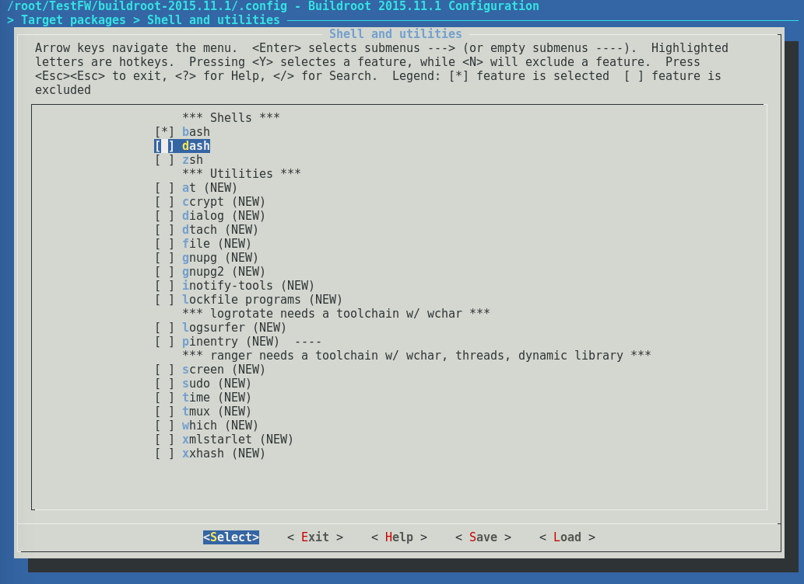

# Embedded Framework and C-Based Toolchain Hardening

Limit BusyBox, embedded frameworks, and toolchains to only those libraries and functions being used when configuring firmware builds. Embedded Linux build systems such as Buildroot, Yocto and others typically perform this task. Removal of known insecure libraries and protocols such as Telnet not only minimize attack entry points in firmware builds, but also provide a secure-by-design approach to building software in efforts to thwart potential security threats.

**Hardening a library** [**Example**](https://www.owasp.org/index.php/C-Based_Toolchain_Hardening)**:** It is known that [compression is insecure](http://arstechnica.com/security/2012/09/crime-hijacks-https-sessions/) \(amongst others\),[SSLv2 is insecure](http://www.schneier.com/paper-ssl-revised.pdf), [SSLv3 is insecure](http://www.yaksman.org/~lweith/ssl.pdf), as well as early versions of TLS . In addition, suppose you don't use hardware and engines, and only allow static linking. Given the knowledge and specifications, you would configure the OpenSSL library as follows:

```bash
$ Configure darwin64-x86_64-cc -no-hw -no-engine -no-comp -no-shared -no-dso -no-ssl2 -no-ssl3 --openssldir=
```

**Selecting one shell Example**: Utilizing buildroot, the screenshot below demonstrates only one Shell being enabled, bash. \(_Note: Buildroot examples are shown below but there are other ways to accomplish the same configuration with other embedded Linux build systems._\)  




**Hardening Services Example**: The screenshot below shows openssh enabled but not FTP daemons proftpd and pure-ftpd. Only enable FTP if TLS is to be utilized. For example, proftpd and pureftpd require custom compilation to use TLS with mod\_tls for proftpd and passing `./configure --with-tls` for pureftpd.


**Hardening Das U-boot Example:** Often, physical access to an embedded device enables attack paths to modify bootloader configurations. Below, example best practice configurations for `uboot_config` are provided_. Note: The_ `uboot_config` _file is typically auto generated depending on the build environment and specific board._ 

Configure "Verified Boot" \(secure boot\) for U-Boot 2013.07 versions and above. Verified Boot is not enabled by default and requires board support with the below configurations required at the minimum.

`CONFIG_ENABLE_VBOOT=y #Enables Verified Boot`

`CONFIG_FIT_SIGNATURE=y #Enables signature verification of FIT images.`

`CONFIG_RSA=y #Enables RSA algorithm used for FIT image verification`

`CONFIG_OF_SEPARATE=y #Enables separate build of u-Boot from the device tree.`

`CONFIG_FIT=y #Enables support for Flat Image Tree (FIT) uImage format.`

`CONFIG_OF_CONTROL=y #Enables Flattened Device Tree (FDT) configuration.`

`CONFIG_OF_LIBFDT=y`

`CONFIG_DEFAULT_DEVICE_TREE=y #Specifies the default Device Tree used for the run-time configuration of U-Boot.`

Afterwards, a series of steps are needed for configuring Verified Boot. An example overview of building [Verified Boot for a Beaglebone black board](https://github.com/siemens/u-boot/blob/master/doc/uImage.FIT/beaglebone_vboot.txt) is:

1. Build U-Boot for the board, with the verified boot options enabled.
2. Obtain a suitable Linux kernel \(preferably the latest\)
3. Create a Image Tree Source file \(ITS\) file describing how you want the kernel to be packaged, compressed and signed.
4. Create an RSA key pair with RSA2048 and use SHA256 hashing algorithm for authentication \(**store your private key in a safe place and not hardcoded into firmware**\)
5. Sign the kernel
6. Put the **public key** into U-Boot's image
7. Put U-Boot and the kernel onto the board
8. Test the image and boot configurations

In addition to the above, make the applicable configurations valid to the context of your embedded device. Below are notable configurations that can be made.

`CONFIG_BOOTDELAY -2. #Prevents access to u-boot's console when auto boot is used`

`CONFIG_CMD_USB=n #Disables basic USB support and the usb command`

`CONFIG_USB_UHCI: defines the lowlevel part.`

`CONFIG_USB_KEYBOARD: enables the USB Keyboard`

`CONFIG_USB_STORAGE: enables the USB storage devices`

`CONFIG_USB_HOST_ETHER: enables USB ethernet adapter support`

Disabling serial console output in U-Boot via the following configuration macros:

`CONFIG_SILENT_CONSOLE`

`CONFIG_SYS_DEVICE_NULLDEV`

`CONFIG_SILENT_CONSOLE_UPDATE_ON_RELOC`

To enable immutable U-boot environment variables to prevent unauthorized changes \(e.g. Modifying bootargs, updating verified boot public keys etc.\) or side-loading of firmware, remove non-volatile memory settings such as the following:

`#define CONFIG_ENV_IS_IN_MMC`

`#define CONFIG_ENV_IS_IN_NAND`

`#define CONFIG_ENV_IS_IN_NVRAM`

`#define CONFIG_ENV_IS_IN_SPI_FLASH`

`#define CONFIG_ENV_IS_IN_REMOTE`

`#define CONFIG_ENV_IS_IN_EEPROM`

`#define CONFIG_ENV_IS_IN_FLASH`

`#define CONFIG_ENV_IS_IN_DATAFLASH`

`#define CONFIG_ENV_IS_IN_MMC`

`#define CONFIG_ENV_IS_IN_FAT`

`#define CONFIG_ENV_IS_IN_ONENAND`

`#define CONFIG_ENV_IS_IN_UBI`

**Considerations \(Disclaimer: The List below is non-exhaustive\):**

* Ensure services such as SSH have a secure password created.
* Remove unused language interpreters such as: perl, python, lua.
* Remove dead code from unused library functions.
* Remove unused shell interpreters such as: ash, dash, zsh.
  * Review `/etc/shell`
* Remove legacy insecure daemons which includes but not limited to:
  * telnetd
  * ftpd
  * ftpget
  * ftpput
  * tftp
  * rlogind
  * rshd
  * rexd
  * rcmd
  * rhosts
  * rexecd
  * rwalld
  * rbootd
  * rusersd
  * rquotad
  * rstatd
  * nfs
* Remove unused/unnecessary utilities such as:

  * sed, wget, curl, awk, cut, df, dmesg, echo, fdisk, grep, mkdir, mount \(vfat\), printf, tail, tee, test \(directory\), test \(file\), head, cat

  [Automotive Grade Linux \(AGL\) has developed an example table](http://docs.automotivelinux.org/docs/architecture/en/dev/reference/security/07-system-hardening.html#removal-or-non-inclusion-of-utilities) of common utilities and their usage for debug or production environments \(builds\).

| Utility Name | Location | Debug Environment | Production Environment |
| :--- | :--- | :--- | :--- |
| Strace | /bin/trace | INCLUDE | EXCLUDE |
| Klogd | /sbin/klogd | INCLUDE | EXCLUDE |
| Syslogd\(logger\) | /bin/logger | INCLUDE | EXCLUDE |
| Gdbserver | /bin/gdbserver | INCLUDE | EXCLUDE |
| Dropbear | Remove “dropbear” from ‘/etc/init.d/rcs’ | EXCLUDE | EXCLUDE |
| SSH | NA | INCLUDE | EXCLUDE |
| Editors \(vi\) | /bin/vi | INCLUDE | EXCLUDE |
| Dmesg | /bin/dmesg | INCLUDE | EXCLUDE |
| UART | /proc/tty/driver/ | INCLUDE | EXCLUDE |
| Hexdump | /bin/hexdump | INCLUDE | EXCLUDE |
| Dnsdomainname | /bin/dnsdomainname | EXCLUDE | EXCLUDE |
| Hostname | /bin/hostname | INCLUDE | EXCLUDE |
| Pmap | /bin/pmap | INCLUDE | EXCLUDE |
| su | /bin/su | INCLUDE | EXCLUDE |
| Which | /bin/which | INCLUDE | EXCLUDE |
| Who and whoami | /bin/whoami | INCLUDE | EXCLUDE |
| ps | /bin/ps | INCLUDE | EXCLUDE |
| lsmod | /sbin/lsmod | INCLUDE | EXCLUDE |
| install | /bin/install | INCLUDE | EXCLUDE |
| logger | /bin/logger | INCLUDE | EXCLUDE |
| ps | /bin/ps | INCLUDE | EXCLUDE |
| rpm | /bin/rpm | INCLUDE | EXCLUDE |
| Iostat | /bin/iostat | INCLUDE | EXCLUDE |
| find | /bin/find | INCLUDE | EXCLUDE |
| Chgrp | /bin/chgrp | INCLUDE | EXCLUDE |
| Chmod | /bin/chmod | INCLUDE | EXCLUDE |
| Chown | /bin/chown | INCLUDE | EXCLUDE |
| killall | /bin/killall | INCLUDE | EXCLUDE |
| top | /bin/top | INCLUDE | EXCLUDE |
| stbhotplug | /sbin/stbhotplug | INCLUDE | EXCLUDE |

* Utilize tools such as [Lynis](https://raw.githubusercontent.com/CISOfy/lynis/master/lynis) for hardening auditing and suggestions.

  ```text
  *   wget --no-check-certificate https://github.com/CISOfy/lynis/archive/master.zip && unzip master.zip && cd lynis-master/ && bash lynis audit system
  ```

  * Review the report in: `/var/log/lynis.log`

* Perform iterative threat model exercises with developers as well as relative stakeholders on software running on the embedded device.

## Additional References <a id="additional-references"></a>

* [https://www.owasp.org/index.php/C-Based\_Toolchain\_Hardening](https://www.owasp.org/index.php/C-Based_Toolchain_Hardening)
* [https://www.bulkorder.ftc.gov/system/files/publications/pdf0199-carefulconnections-buildingsecurityinternetofthings.pdf](https://www.bulkorder.ftc.gov/system/files/publications/pdf0199-carefulconnections-buildingsecurityinternetofthings.pdf)
* [http://isa99.isa.org/Public/Documents/ISA-62443-4-1-WD.pdf](http://isa99.isa.org/Public/Documents/ISA-62443-4-1-WD.pdf) \(page 34-38\)
* [https://events.linuxfoundation.org/sites/events/files/slides/belloni-petazzoni-buildroot-oe\_0.pdf](https://events.linuxfoundation.org/sites/events/files/slides/belloni-petazzoni-buildroot-oe_0.pdf) - Details on buildroot and yocto
* [http://elinux.org/Toolchains](http://elinux.org/Toolchains)
* [https://download.pureftpd.org/pub/pure-ftpd/doc/README.TLS](https://download.pureftpd.org/pub/pure-ftpd/doc/README.TLS)
* [http://www.proftpd.org/docs/howto/TLS.html](http://www.proftpd.org/docs/howto/TLS.html)
* [https://www.owasp.org/index.php/Application\_Threat\_Modeling](https://www.owasp.org/index.php/Application_Threat_Modeling)
* [GNU C Library Vulnerability in Industrial Products](http://www.siemens.com/cert/pool/cert/siemens_security_advisory_ssa-301706.pdf)
* [Linux Exploit Quick Listing](http://www.kmbl.us/les/working.php)
* [Hardened U-boot](http://docs.automotivelinux.org/docs/architecture/en/dev/reference/security/07-system-hardening.html#hardened-boot)
  * [Verified boot](https://lwn.net/Articles/571031/)
* [Improving Your Embedded Linux Security Posture with Yocto](https://www.nccgroup.trust/globalassets/our-research/us/whitepapers/2018/improving-embedded-linux-security-yocto3.pdf)

