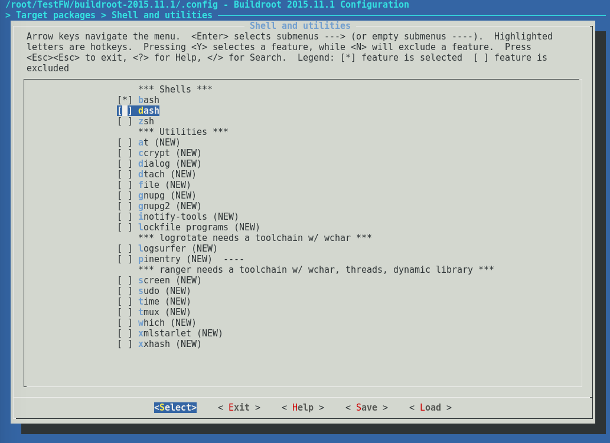
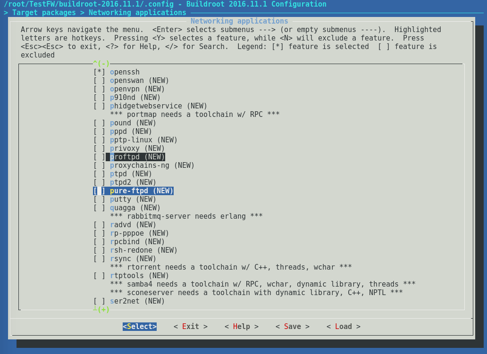

# Embedded Platform Security Hardening

Securing embedded devices requires hardening multiple layers of the software platform: build systems, bootloaders, kernels, and runtime environments. This chapter covers comprehensive security configuration for embedded Linux platforms including build systems (Yocto, Buildroot), bootloader hardening (U-Boot), kernel security, mandatory access control (SELinux, AppArmor, SMACK), and system-level protections for IoT, Industrial IoT (ICS/SCADA), and enterprise network devices.

**Chapter Scope:**
This chapter addresses platform-level security across multiple domains:

- **Build System Security**: Yocto Project, Buildroot configuration and hardening
- **Bootloader Security**: U-Boot verified boot and secure boot chain
- **Kernel Hardening**: Security flags, kernel lockdown, and exploit mitigation
- **Mandatory Access Control (MAC)**: SELinux, AppArmor, and SMACK configuration
- **Advanced SELinux**: Policy development, testing, CVE analysis, ICS/SCADA security
- **Runtime Integrity**: IMA/EVM integration and file system protection
- **Reproducible Builds**: Supply chain security and build verification

**Target Audiences:**
- IoT device manufacturers (consumer devices, smart home, edge computing)
- Industrial IoT (IIoT) developers (SCADA, ICS, factory automation, Industry 4.0)
- Enterprise network equipment vendors (routers, switches, firewalls, UTM, SD-WAN, NFV/VNF)

---

Limit BusyBox, embedded frameworks, and toolchains to only those libraries and functions being used when configuring firmware builds. Embedded Linux build systems such as Buildroot, Yocto and others typically perform this task. Removal of known insecure libraries and protocols such as Telnet not only minimizes attack entry points in firmware builds, but also provides a secure-by-design approach to building software in efforts to thwart potential security threats.

**Hardening a library** [**Example**](https://cheatsheetseries.owasp.org/cheatsheets/C-Based_Toolchain_Hardening_Cheat_Sheet.html)**:** It is known that [compression is insecure](http://arstechnica.com/security/2012/09/crime-hijacks-https-sessions/) (amongst others),[SSLv2 is insecure](http://www.schneier.com/paper-ssl-revised.pdf), [SSLv3 is insecure](http://www.yaksman.org/\~lweith/ssl.pdf), as well as early versions of TLS . In addition, suppose you don't use hardware and engines, and only allow static linking. Given the knowledge and specifications, you would configure the OpenSSL library as follows:

```bash
$ Configure darwin64-x86_64-cc -no-hw -no-engine -no-comp -no-shared -no-dso -no-ssl2 -no-ssl3 --openssldir=
```

**Selecting one shell Example**: Utilizing buildroot, the screenshot below demonstrates only one Shell being enabled, bash. (_Note: Buildroot examples are shown below but there are other ways to accomplish the same configuration with other embedded Linux build systems._)\




**Hardening Services Example**: The screenshot below shows openssh enabled but not FTP daemons proftpd and pure-ftpd. Only enable FTP if TLS is to be utilized. For example, proftpd and pureftpd require custom compilation to use TLS with mod\_tls for proftpd and passing `./configure --with-tls` for pureftpd.



**Hardening Das U-boot Example:** Often, physical access to an embedded device enables attack paths to modify bootloader configurations. Below, example best practice configurations for `uboot_config` are provided_. Note: The_ `uboot_config` _file is typically auto generated depending on the build environment and specific board._&#x20;

Configure "Verified Boot" (secure boot) for U-Boot 2013.07 versions and above. Verified Boot is not enabled by default and requires board support with the below configurations required at the minimum.

`CONFIG_ENABLE_VBOOT=y #Enables Verified Boot`

`CONFIG_FIT_SIGNATURE=y #Enables signature verification of FIT images.`

`CONFIG_RSA=y #Enables RSA algorithm used for FIT image verification`

`CONFIG_OF_SEPARATE=y #Enables separate build of u-Boot from the device tree.`

`CONFIG_FIT=y #Enables support for Flat Image Tree (FIT) uImage format.`

`CONFIG_OF_CONTROL=y #Enables Flattened Device Tree (FDT) configuration.`

`CONFIG_OF_LIBFDT=y`

`CONFIG_DEFAULT_DEVICE_TREE=y #Specifies the default Device Tree used for the run-time configuration of U-Boot.`

Afterwards, a series of steps are needed for configuring Verified Boot. An example overview of building [Verified Boot for a Beaglebone black board](https://github.com/siemens/u-boot/blob/master/doc/uImage.FIT/beaglebone\_vboot.txt) is:

1. Build U-Boot for the board, with the verified boot options enabled.
2. Obtain a suitable Linux kernel (preferably the latest)
3. Create a Image Tree Source file (ITS) file describing how you want the kernel to be packaged, compressed and signed.
4. Create an RSA key pair with RSA2048 and use SHA256 hashing algorithm for authentication (**store your private key in a safe place and not hardcoded into firmware**)
5. Sign the kernel
6. Put the **public key** into U-Boot's image
7. Put U-Boot and the kernel onto the board
8. Test the image and boot configurations

In addition to the above, make the applicable configurations valid to the context of your embedded device. Below are notable configurations that can be made.

`CONFIG_BOOTDELAY -2. #Prevents access to u-boot's console when auto boot is used`

`CONFIG_CMD_USB=n #Disables basic USB support and the usb command`

`CONFIG_USB_UHCI: defines the lowlevel part.`

`CONFIG_USB_KEYBOARD: enables the USB Keyboard`

`CONFIG_USB_STORAGE: enables the USB storage devices`

`CONFIG_USB_HOST_ETHER: enables USB ethernet adapter support`

Disabling serial console output in U-Boot via the following configuration macros:

`CONFIG_SILENT_CONSOLE`

`CONFIG_SYS_DEVICE_NULLDEV`

`CONFIG_SILENT_CONSOLE_UPDATE_ON_RELOC`

To enable immutable U-boot environment variables to prevent unauthorized changes (e.g. Modifying bootargs, updating verified boot public keys etc.) or side-loading of firmware, remove non-volatile memory settings such as the following:

`#define CONFIG_ENV_IS_IN_MMC`

`#define CONFIG_ENV_IS_IN_NAND`

`#define CONFIG_ENV_IS_IN_NVRAM`

`#define CONFIG_ENV_IS_IN_SPI_FLASH`

`#define CONFIG_ENV_IS_IN_REMOTE`

`#define CONFIG_ENV_IS_IN_EEPROM`

`#define CONFIG_ENV_IS_IN_FLASH`

`#define CONFIG_ENV_IS_IN_DATAFLASH`

`#define CONFIG_ENV_IS_IN_MMC`

`#define CONFIG_ENV_IS_IN_FAT`

`#define CONFIG_ENV_IS_IN_ONENAND`

`#define CONFIG_ENV_IS_IN_UBI`

**Considerations (Disclaimer: The List below is non-exhaustive):**

* Ensure services such as SSH have a secure password created.
* Remove unused language interpreters such as: perl, python, lua.
* Remove dead code from unused library functions.
* Remove unused shell interpreters such as: ash, dash, zsh.
  * Review `/etc/shell`
* Remove legacy insecure daemons which includes but not limited to:
  * telnetd
  * ftpd
  * ftpget
  * ftpput
  * tftp
  * rlogind
  * rshd
  * rexd
  * rcmd
  * rhosts
  * rexecd
  * rwalld
  * rbootd
  * rusersd
  * rquotad
  * rstatd
  * nfs
*   Remove unused/unnecessary utilities such as:

    * sed, wget, curl, awk, cut, df, dmesg, echo, fdisk, grep, mkdir, mount (vfat), printf, tail, tee, test (directory), test (file), head, cat

    [Automotive Grade Linux (AGL) has developed an example table](http://docs.automotivelinux.org/docs/architecture/en/dev/reference/security/07-system-hardening.html#removal-or-non-inclusion-of-utilities) of common utilities and their usage for debug or production environments (builds).

| Utility Name    | Location                                 | Debug Environment | Production Environment |
| --------------- | ---------------------------------------- | ----------------- | ---------------------- |
| Strace          | /bin/trace                               | INCLUDE           | EXCLUDE                |
| Klogd           | /sbin/klogd                              | INCLUDE           | EXCLUDE                |
| Syslogd(logger) | /bin/logger                              | INCLUDE           | EXCLUDE                |
| Gdbserver       | /bin/gdbserver                           | INCLUDE           | EXCLUDE                |
| Dropbear        | Remove “dropbear” from ‘/etc/init.d/rcs’ | EXCLUDE           | EXCLUDE                |
| SSH             | NA                                       | INCLUDE           | EXCLUDE                |
| Editors (vi)    | /bin/vi                                  | INCLUDE           | EXCLUDE                |
| Dmesg           | /bin/dmesg                               | INCLUDE           | EXCLUDE                |
| UART            | /proc/tty/driver/                        | INCLUDE           | EXCLUDE                |
| Hexdump         | /bin/hexdump                             | INCLUDE           | EXCLUDE                |
| Dnsdomainname   | /bin/dnsdomainname                       | EXCLUDE           | EXCLUDE                |
| Hostname        | /bin/hostname                            | INCLUDE           | EXCLUDE                |
| Pmap            | /bin/pmap                                | INCLUDE           | EXCLUDE                |
| su              | /bin/su                                  | INCLUDE           | EXCLUDE                |
| Which           | /bin/which                               | INCLUDE           | EXCLUDE                |
| Who and whoami  | /bin/whoami                              | INCLUDE           | EXCLUDE                |
| ps              | /bin/ps                                  | INCLUDE           | EXCLUDE                |
| lsmod           | /sbin/lsmod                              | INCLUDE           | EXCLUDE                |
| install         | /bin/install                             | INCLUDE           | EXCLUDE                |
| logger          | /bin/logger                              | INCLUDE           | EXCLUDE                |
| ps              | /bin/ps                                  | INCLUDE           | EXCLUDE                |
| rpm             | /bin/rpm                                 | INCLUDE           | EXCLUDE                |
| Iostat          | /bin/iostat                              | INCLUDE           | EXCLUDE                |
| find            | /bin/find                                | INCLUDE           | EXCLUDE                |
| Chgrp           | /bin/chgrp                               | INCLUDE           | EXCLUDE                |
| Chmod           | /bin/chmod                               | INCLUDE           | EXCLUDE                |
| Chown           | /bin/chown                               | INCLUDE           | EXCLUDE                |
| killall         | /bin/killall                             | INCLUDE           | EXCLUDE                |
| top             | /bin/top                                 | INCLUDE           | EXCLUDE                |
| stbhotplug      | /sbin/stbhotplug                         | INCLUDE           | EXCLUDE                |

* Utilize tools such as [Lynis](https://raw.githubusercontent.com/CISOfy/lynis/master/lynis) for hardening auditing and suggestions. `wget --no-check-certificate https://github.com/CISOfy/lynis/archive/master.zip && unzip master.zip && cd lynis-master/ && bash lynis audit system`
  * Review the report in: `/var/log/lynis.log`
* Perform iterative threat model exercises with developers as well as relative stakeholders on software running on the embedded device.

## Yocto Project Build System Security (2024-2025)

The Yocto Project provides a comprehensive, production-grade embedded Linux build system with extensive built-in security features. As of 2025, Yocto has become the de facto standard for secure embedded Linux development in automotive, industrial, medical, and consumer IoT markets. This section covers security hardening capabilities specific to Yocto builds.

### Yocto Scarthgap 5.0 LTS Security Foundation (2024)

**Yocto Project 5.0 "Scarthgap"** (May 2024) is the current Long-Term Support (LTS) release with 4 years of security maintenance. It provides a modern, secure foundation:

**Core Components**:
- **Linux Kernel 6.6 LTS**: Long-term kernel support with extensive security backports
- **GCC 13.2**: Modern compiler with enhanced security analysis and hardening features
- **glibc 2.39**: Latest GNU C Library with security improvements
- **LLVM 18.1**: Alternative toolchain with sanitizers and static analysis
- **OpenSSL 3.2**: Latest TLS 1.3 implementation
- **100% Reproducible Builds**: Achieved in 2022, maintained in all LTS releases

**Key Security Enhancements**:
- Enhanced CVE database synchronization
- Improved SBOM generation (SPDX 3.0.1 default)
- Automatic SECURITY file checking in layers
- Continuous security patches for core recipes (cups, curl, openssl, qemu, python3, vim)

### Compiler Security Flags

Yocto includes a comprehensive set of compiler security flags that harden binaries against common vulnerabilities. These flags are centrally managed in `meta/conf/distro/include/security_flags.inc`.

#### Enabling Security Flags

**Basic Configuration (local.conf or distro .conf)**:
```bitbake
# Enable all security flags for the build
# This is usually enabled by default in modern Yocto versions
INHERIT += "security-flags"
```

**Verify Security Flags are Active**:
```bash
# Check if security flags are enabled in your build
bitbake-getvar SECURITY_CFLAGS
bitbake-getvar SECURITY_LDFLAGS
```

#### Key Security Compiler Flags Explained

**1. Stack Protection (`-fstack-protector-strong`)**:
```bitbake
# Enabled by default in security_flags.inc
SECURITY_CFLAGS += "-fstack-protector-strong"
```

**What it does**:
- Inserts stack canaries before return addresses
- Protects functions with vulnerable parameters (arrays, pointers, structs with arrays)
- Detects stack buffer overflows at runtime
- Stronger than `-fstack-protector`, less overhead than `-fstack-protector-all`

**Impact**: ~2-5% performance overhead, catches 90%+ of stack overflow attacks

**2. FORTIFY_SOURCE (`-D_FORTIFY_SOURCE=2`)**:
```bitbake
# Enabled by default in security_flags.inc
SECURITY_CFLAGS += "-D_FORTIFY_SOURCE=2"
```

**What it does**:
- Compile-time and runtime checks for buffer overflows in memory/string functions
- Detects out-of-bounds writes to `memcpy()`, `strcpy()`, `sprintf()`, etc.
- Level 2 provides stronger checks than level 1

**Requires**: Optimization level -O1 or higher (Yocto uses -O2 by default)

**Example Protection**:
```c
char buf[10];
strcpy(buf, "This string is way too long");  // Caught at runtime with FORTIFY_SOURCE
```

**3. Position Independent Executable (`-fpie -pie`)**:
```bitbake
# Enabled by default for executables
SECURITY_CFLAGS += "-fpie"
SECURITY_LDFLAGS += "-pie"
```

**What it does**:
- Enables Address Space Layout Randomization (ASLR)
- Randomizes executable load address at runtime
- Makes exploit development significantly harder (attackers can't predict memory addresses)

**Note**: All modern embedded systems should enable PIE unless hardware constraints prevent it

**4. Format String Protection (`-Wformat -Wformat-security`)**:
```bitbake
# Enabled by default
SECURITY_CFLAGS += "-Wformat -Wformat-security -Werror=format-security"
```

**What it does**:
- Detects format string vulnerabilities at compile time
- Warns about unsafe uses of `printf()`, `scanf()`, etc.
- Prevents classic format string exploits

**Example Vulnerability Caught**:
```c
char *user_input = get_user_data();
printf(user_input);  // ❌ Compile error with -Werror=format-security
printf("%s", user_input);  // ✅ Safe
```

**5. Read-Only Relocations (`-Wl,-z,relro,-z,now`)**:
```bitbake
# Enabled by default
SECURITY_LDFLAGS += "-Wl,-z,relro,-z,now"
```

**What it does**:
- **RELRO (RELocation Read-Only)**: Makes GOT (Global Offset Table) read-only after relocation
- **NOW**: Forces all symbols to be resolved at load time (disables lazy binding)
- Prevents GOT overwrite attacks

**Trade-off**: Slightly slower startup time due to immediate symbol resolution

#### GCC -fhardened Flag (GCC 13.2+)

**Modern Hardening Flag (Scarthgap 5.0+)**:
```bitbake
# In your distro .conf or local.conf
SECURITY_CFLAGS += "-fhardened"
```

**What it enables** (GCC 13.2 in Scarthgap):
- `-D_FORTIFY_SOURCE=3` (level 3 - even stronger checks)
- `-D_GLIBCXX_ASSERTIONS` (C++ standard library assertions)
- `-ftrivial-auto-var-init=zero` (zero-initialize automatic variables)
- `-fstack-protector-strong`
- `-fstack-clash-protection` (protect against stack clash attacks)

**When to use**: High-security applications (medical, automotive, industrial control)

**Trade-off**: ~5-10% performance overhead, significantly improved security

#### Customizing Security Flags Per Recipe

**Disable security flags for specific recipes** (e.g., performance-critical code):
```bitbake
# In recipe (.bb file)
SECURITY_CFLAGS = ""
SECURITY_LDFLAGS = ""
```

**Add additional flags for specific recipes**:
```bitbake
# In recipe (.bb file)
SECURITY_CFLAGS:append = " -fstack-clash-protection"
```

**Example: High-Security Recipe**:
```bitbake
# crypto-app_1.0.bb
DESCRIPTION = "Cryptographic application requiring maximum security"
LICENSE = "MIT"

# Enable maximum security hardening
SECURITY_CFLAGS:append = " -fhardened -fanalyzer"
SECURITY_LDFLAGS:append = " -Wl,-z,noexecstack"

# Fortify source level 3 (GCC 13+)
CFLAGS:append = " -D_FORTIFY_SOURCE=3"

# Stack clash protection
CFLAGS:append = " -fstack-clash-protection"
```

#### Verifying Security Flags in Binaries

**Use checksec to verify security hardening**:
```bash
# Install checksec
bitbake checksec-native

# Check security properties of a binary
checksec --file=tmp/work/.../package/usr/bin/myapp

# Example output:
# RELRO           STACK CANARY      NX            PIE
# Full RELRO      Canary found      NX enabled    PIE enabled
```

**Manual verification with readelf**:
```bash
# Check for PIE
readelf -h binary | grep Type
# Should show: Type: DYN (Shared object file)

# Check for stack canary
readelf -s binary | grep stack_chk_fail
# Should show: __stack_chk_fail symbol

# Check for RELRO
readelf -l binary | grep GNU_RELRO
# Should show: GNU_RELRO segment
```

### Kernel Hardening in Yocto

Linux kernel hardening is critical for embedded security. Yocto provides multiple mechanisms to configure kernel security options.

#### Kernel Configuration Fragments

Yocto uses **kernel configuration fragments** (`.cfg` files) to modularize kernel configuration changes:

**Create a kernel hardening fragment** (`kernel-hardening.cfg`):
```cfg
# Kernel hardening configuration fragment
# Place in recipes-kernel/linux/files/

# Address Space Layout Randomization (ASLR)
CONFIG_RANDOMIZE_BASE=y
CONFIG_RANDOMIZE_MEMORY=y

# Kernel Page Table Isolation (KPTI) - Meltdown mitigation
CONFIG_PAGE_TABLE_ISOLATION=y

# Supervisor Mode Execution Protection (SMEP)
CONFIG_X86_SMAP=y
CONFIG_X86_SMEP=y

# Kernel Stack Protection
CONFIG_STACKPROTECTOR=y
CONFIG_STACKPROTECTOR_STRONG=y

# Restrict /dev/mem and /dev/kmem access
CONFIG_STRICT_DEVMEM=y
CONFIG_DEVMEM=n
CONFIG_DEVKMEM=n

# Harden BPF JIT compiler
CONFIG_BPF_JIT_ALWAYS_ON=y

# Disable legacy and dangerous features
CONFIG_LEGACY_PTYS=n
CONFIG_DEVTMPFS_MOUNT=n

# Enable kernel lockdown
CONFIG_SECURITY_LOCKDOWN_LSM=y
CONFIG_SECURITY_LOCKDOWN_LSM_EARLY=y
CONFIG_LOCK_DOWN_KERNEL_FORCE_CONFIDENTIALITY=y

# Restrict kernel module loading
CONFIG_MODULE_SIG=y
CONFIG_MODULE_SIG_FORCE=y
CONFIG_MODULE_SIG_ALL=y
CONFIG_MODULE_SIG_SHA256=y

# Disable kernel debugging features in production
# CONFIG_DEBUG_FS is not set
# CONFIG_KPROBES is not set
# CONFIG_FTRACE is not set
```

**Apply kernel fragment in recipe**:
```bitbake
# linux-yocto_%.bbappend
FILESEXTRAPATHS:prepend := "${THISDIR}/files:"

SRC_URI += "file://kernel-hardening.cfg"
```

**Alternative: Using defconfig**:
```bitbake
# For custom kernel recipes
SRC_URI += "file://defconfig"
```

#### meta-security Hardening Configurations

The **meta-security** layer provides pre-built kernel hardening configurations:

**Add meta-security layer**:
```bash
# Clone meta-security
git clone https://git.yoctoproject.org/meta-security

# Add to bblayers.conf
BBLAYERS += "/path/to/meta-security"
```

**Use meta-security kernel hardening**:
```bitbake
# In local.conf
KERNEL_FEATURES:append = " features/security/security.scc"
```

**Available hardening features in meta-security**:
- `features/security/security.scc`: Basic kernel hardening
- `features/selinux/selinux.scc`: SELinux support
- `features/apparmor/apparmor.scc`: AppArmor support
- `features/ima/ima.scc`: Integrity Measurement Architecture
- `features/smack/smack.scc`: SMACK MAC support

#### Kernel Hardening Checker

**Use kernel-hardening-checker to audit your kernel config**:
```bash
# Install kernel-hardening-checker
pip3 install git+https://github.com/a13xp0p0v/kernel-hardening-checker

# Check your kernel .config
kernel-hardening-checker -c tmp/work/.../linux-yocto/.config

# Example output:
# [+] Config check is finished: 'OK' - 85 / 'FAIL' - 12
```

**Automate in Yocto build**:
```bitbake
# Create a kernel-hardening-check recipe
inherit kernel-arch

do_kernel_hardening_check() {
    kernel-hardening-checker -c ${B}/.config
}
addtask kernel_hardening_check after do_configure before do_compile
```

#### Key Kernel Security Options Explained

**KASLR (Kernel Address Space Layout Randomization)**:
```cfg
CONFIG_RANDOMIZE_BASE=y          # Randomize kernel base address
CONFIG_RANDOMIZE_MEMORY=y        # Randomize memory sections (x86_64)
```
- **Benefit**: Makes kernel exploits significantly harder (attacker can't predict memory layout)
- **Overhead**: Minimal (<1%)
- **Recommendation**: Enable on all modern systems

**KPTI (Kernel Page Table Isolation)**:
```cfg
CONFIG_PAGE_TABLE_ISOLATION=y
```
- **Benefit**: Mitigates Meltdown (CVE-2017-5754) and related CPU vulnerabilities
- **Overhead**: 5-30% performance impact (CPU-dependent)
- **Recommendation**: Enable unless performance is critical AND CPU is not vulnerable

**Kernel Module Signing**:
```cfg
CONFIG_MODULE_SIG=y
CONFIG_MODULE_SIG_FORCE=y        # Reject unsigned modules
CONFIG_MODULE_SIG_ALL=y          # Sign all modules at build time
CONFIG_MODULE_SIG_SHA256=y       # Use SHA-256 for signatures
```
- **Benefit**: Prevents loading of malicious kernel modules
- **Requirement**: Requires signing key management
- **Recommendation**: Essential for production devices

### Kernel Security Mechanisms: Isolation and Resource Control

Beyond basic kernel hardening, Linux provides several powerful security mechanisms for process isolation, privilege management, and resource control. These mechanisms form the foundation of container security and defense-in-depth strategies for embedded devices. This section covers **Linux namespaces**, **control groups (cgroups)**, **seccomp-BPF syscall filtering**, and **Linux capabilities** with focus on Yocto integration, hardware requirements, and practical deployment for IoT, Industrial IoT, and enterprise network devices.

#### Hardware Requirements and Device Suitability

Different security mechanisms have varying resource overhead. Choose mechanisms appropriate for your device constraints and security requirements.

**Hardware Requirements Matrix:**

| Security Mechanism | Min RAM | Min CPU | Kernel Version | Runtime Overhead | Best For |
|-------------------|---------|---------|----------------|-----------------|----------|
| **Linux Capabilities** | Any | Any | 2.2+ | ~0% | All devices (universal) |
| **Seccomp-BPF (basic, 5-10 filters)** | 16MB+ | Any | 3.5+ | <1% CPU, ~20% syscall latency | Resource-constrained IoT |
| **Seccomp-BPF (complex, 32+ filters)** | 32MB+ | Any | 3.5+ | ~78% syscall latency | Advanced filtering needs |
| **Namespaces (PID + Network)** | 32MB+ | Single core | 3.8+ | ~2-5MB RAM | Basic process isolation |
| **User Namespaces** | 64MB+ | Single core | 3.8+ | ~5-10MB RAM | Rootless containers |
| **cgroups v1** | 64MB+ | Single core | 2.6.24+ | ~2-5MB RAM, <0.1% CPU | Resource limiting |
| **cgroups v2 (unified)** | 128MB+ | Dual core | 4.5+ | ~5-10MB RAM, <0.5% CPU | Modern resource control |
| **Full Defense-in-Depth Stack** | 256MB+ | Dual core | 5.0+ | ~15-25MB RAM, <2% CPU | Enterprise/IIoT gateways |

**Performance Overhead Details:**
- **Capabilities**: Zero overhead (kernel feature since 1999)
- **Seccomp-BPF**: Per-filter overhead ~18ns CPU + ~17ns BPF evaluation
  - 1 filter: +19.8% syscall latency
  - 4 filters: +33.0% syscall latency
  - 32 filters: +78.3% syscall latency
  - Optimization: Binary search tree (libseccomp) reduces to O(log n)
- **Namespaces**: Memory overhead per instance
  - PID namespace: ~512KB
  - Network namespace: ~2MB (routing tables, netfilter state)
  - Mount namespace: ~1MB (mount table duplication)
  - User namespace: ~5MB (UID/GID mapping overhead)
- **cgroups**: Base overhead + per-cgroup overhead
  - cgroups v1: ~2-5MB base + ~100KB per cgroup
  - cgroups v2: ~5-10MB base + ~200KB per cgroup
  - Memory controller: Additional ~1-2MB (disabled by default on Raspberry Pi)

**Device Profile Decision Matrix:**

```
Device Profile           RAM     CPU         Recommended Mechanisms                          Skip
───────────────────────  ──────  ──────────  ──────────────────────────────────────────────  ────────────────────
Ultra-constrained IoT    <32MB   Single core Capabilities only                               Namespaces, cgroups
Consumer IoT             32-64MB Single core Capabilities + Seccomp (5-10 filters)           User NS, cgroups v2
Industrial IoT           64-128MB Single/Dual Capabilities + Seccomp + Namespaces (PID+Net)  cgroups v2 (use v1)
Industrial Gateway       128MB+  Dual core   Capabilities + Seccomp + Namespaces + cgroups  None (full stack OK)
Enterprise Network Device 256MB+ Dual core+  Full defense-in-depth (all mechanisms)         None
```

**Example: Raspberry Pi Zero (512MB RAM, Single Core, ARMv6)**
- ✅ **Capabilities**: No overhead, universal benefit - always enable
- ✅ **Seccomp with 10 filters**: ~20% syscall overhead acceptable for security benefit
- ✅ **PID + Network namespaces**: ~3MB RAM overhead (< 1% of total) - enable for isolation
- ⚠️ **cgroups memory controller**: Disabled by default due to overhead
  - Enable only if needed: Add `cgroup_enable=memory` to `/boot/cmdline.txt`
- ❌ **User namespaces**: 5-10MB overhead not justified unless rootless operation required
- ❌ **cgroups v2**: 10MB+ overhead too high - use cgroups v1 if resource limits needed

**Example: Industrial IoT Gateway (2GB RAM, Quad Core, x86_64)**
- ✅ **Full stack**: All mechanisms enabled
- ✅ **cgroups v2**: Unified hierarchy for cleaner management
- ✅ **User namespaces**: Enable rootless containers
- ✅ **Complex seccomp profiles**: 30+ filters acceptable with quad core

### Mandatory Access Control (MAC) Systems

Yocto supports multiple MAC frameworks to enforce security policies beyond traditional DAC (Discretionary Access Control).

#### Comparison: SELinux vs. AppArmor vs. SMACK

| Feature | SELinux | AppArmor | SMACK |
|---------|---------|----------|-------|
| **Complexity** | High | Medium | Low |
| **Policy Language** | Type enforcement (TE) | Path-based | Label-based |
| **Performance Impact** | 3-7% | 1-3% | <1% |
| **Memory Overhead** | High | Medium | Low |
| **Use Case** | High-security servers, Android | Desktop, embedded | Minimal embedded, IoT |
| **Yocto Layer** | meta-selinux | meta-security | meta-security |
| **Learning Curve** | Steep | Moderate | Gentle |
| **Audit Capabilities** | Comprehensive | Good | Basic |

**Recommendation**:
- **SELinux**: Highly regulated markets (automotive, industrial, medical with FDA requirements)
- **AppArmor**: General embedded systems, easier to configure than SELinux
- **SMACK**: Resource-constrained devices (< 64MB RAM), simple security models

#### Using AppArmor with Yocto

**Enable AppArmor** (via meta-security):
```bitbake
# In local.conf
DISTRO_FEATURES:append = " apparmor"

# Add meta-security to bblayers.conf
BBLAYERS += "/path/to/meta-security"

# Include AppArmor in image
IMAGE_INSTALL:append = " apparmor apparmor-profiles"
```

**Kernel configuration for AppArmor**:
```cfg
# Automatically added by meta-security when DISTRO_FEATURES includes apparmor
CONFIG_SECURITY_APPARMOR=y
CONFIG_SECURITY_APPARMOR_BOOTPARAM_VALUE=1
CONFIG_DEFAULT_SECURITY_APPARMOR=y
```

**Example AppArmor Profile**:
```bash
# /etc/apparmor.d/usr.bin.myapp
#include <tunables/global>

/usr/bin/myapp {
  #include <abstractions/base>

  # Allow read/write to specific directories
  /var/lib/myapp/ rw,
  /var/lib/myapp/** rw,

  # Allow network access
  network inet stream,
  network inet6 stream,

  # Deny access to sensitive files
  deny /etc/shadow r,
  deny /root/** rw,

  # Allow execution of specific binaries
  /usr/bin/openssl rix,

  # Deny capability escalation
  deny capability setuid,
  deny capability setgid,
}
```

**Load AppArmor profile at boot**:
```bitbake
# In your application recipe
inherit apparmor

APPARMOR_PROFILES = "${WORKDIR}/myapp.apparmor"

do_install:append() {
    install -d ${D}${sysconfdir}/apparmor.d
    install -m 0644 ${APPARMOR_PROFILES} ${D}${sysconfdir}/apparmor.d/usr.bin.myapp
}
```

#### Using SELinux with Yocto

**Enable SELinux** (via meta-selinux):
```bash
# Clone meta-selinux
git clone https://git.yoctoproject.org/meta-selinux

# Add to bblayers.conf
BBLAYERS += "/path/to/meta-selinux"
```

**Configuration (local.conf)**:
```bitbake
# Enable SELinux
DISTRO_FEATURES:append = " selinux"

# Choose SELinux mode
# enforcing: Enforce policies, deny violations
# permissive: Log violations, don't deny (testing)
# disabled: SELinux off
SELINUX_MODE = "enforcing"

# Select policy type
# targeted: Protect specific daemons
# mls: Multi-Level Security (high-security)
# minimum: Minimal policy
SELINUX_POLICY_TYPE = "targeted"

# Include SELinux tools in image
IMAGE_INSTALL:append = " selinux-autorelabel selinux-labeldev audit"
```

**SELinux kernel config** (auto-configured by meta-selinux):
```cfg
CONFIG_SECURITY_SELINUX=y
CONFIG_SECURITY_SELINUX_BOOTPARAM=y
CONFIG_SECURITY_SELINUX_BOOTPARAM_VALUE=1
CONFIG_SECURITY_SELINUX_DEVELOP=y
CONFIG_SECURITY_SELINUX_AVC_STATS=y
CONFIG_DEFAULT_SECURITY_SELINUX=y
CONFIG_AUDIT=y
```

**Testing SELinux policies**:
```bash
# On target device
# Check SELinux status
sestatus

# List all booleans
getsebool -a

# Check file contexts
ls -Z /usr/bin/myapp

# Check process contexts
ps -eZ | grep myapp

# Temporarily set permissive mode for testing
setenforce 0

# Re-enable enforcing mode
setenforce 1
```

### Advanced SELinux Security for Embedded Systems (2025)

The basic SELinux configuration above provides foundational mandatory access control (MAC). This section extends that foundation with advanced policy development, comprehensive testing methodologies, vulnerability scanning, and real-world security scenarios specifically for **IoT devices**, **Industrial IoT (IIoT)** systems, and **enterprise network equipment**.

**Target Audiences:**
- IoT device manufacturers (consumer devices, smart home, edge computing)
- Industrial IoT (SCADA, ICS, factory automation, Industry 4.0)
- Enterprise network equipment vendors (routers, switches, firewalls, UTM, SD-WAN, NFV/VNF)

**Coverage:**
- Policy development lifecycle and testing
- Static analysis with SELint + CI/CD integration
- Dynamic testing with setools (sesearch, seinfo, sechecker)
- Runtime verification with IMA/EVM
- Enforcement bypass scenarios and CVE analysis
- Critical infrastructure (IEC 62443, NERC CIP)
- Enterprise network device hardening

#### SELinux Policy Development Lifecycle

Developing secure, maintainable SELinux policies for embedded systems requires a structured approach. This section covers policy selection strategies and custom policy creation for IoT, IIoT, and enterprise network devices.

##### Policy Type Selection Matrix

Choose the appropriate SELinux policy type based on your device constraints and security requirements:

| Policy Type | Memory Overhead | Development Effort | Use Case | Best For |
|-------------|----------------|-------------------|----------|----------|
| **Minimum** | ~2-5 MB | Low | Simple, single-purpose devices | Consumer IoT (< 64MB RAM) |
| **Targeted** | ~10-20 MB | Medium | Multi-service systems | Enterprise network devices, IIoT gateways |
| **MLS** | ~30-50 MB | High | Multi-level security | Critical infrastructure, defense systems |

**Decision Tree:**
1. **Memory < 32MB?** → Use minimal policy (or consider SMACK)
2. **SCADA/ICS system?** → Use targeted policy (IEC 62443 compliance)
3. **Classified data processing?** → Use MLS policy
4. **Enterprise network device?** → Use targeted policy with custom modules

##### Custom Policy Creation for Industrial Sensors

**Example 1: Industrial Sensor Domain Policy**

This example demonstrates a minimal custom policy for an industrial temperature sensor that only reads data and publishes to MQTT.

**sensor-monitor.te** (Type Enforcement):
```te
# SELinux policy module for industrial temperature sensor
policy_module(sensor_monitor, 1.0.0)

# Declare domain type for sensor process
type sensor_monitor_t;
type sensor_monitor_exec_t;
init_daemon_domain(sensor_monitor_t, sensor_monitor_exec_t)

# Declare types for sensor data files
type sensor_data_t;
files_type(sensor_data_t)

# Allow sensor to read hardware devices
dev_read_sysfs(sensor_monitor_t)
dev_read_hwmon(sensor_monitor_t)

# Allow sensor to write data to designated directory
allow sensor_monitor_t sensor_data_t:file { create write read getattr };
allow sensor_monitor_t sensor_data_t:dir { add_name write read };

# Allow network access for MQTT publishing
corenet_tcp_connect_mqtt_port(sensor_monitor_t)
corenet_tcp_sendrecv_generic_if(sensor_monitor_t)
corenet_tcp_sendrecv_generic_node(sensor_monitor_t)

# Explicitly deny dangerous capabilities
dontaudit sensor_monitor_t self:capability { sys_admin sys_module };

# Deny filesystem modifications outside sensor_data_t
neverallow sensor_monitor_t { file_type -sensor_data_t }:file { write append };
```

**sensor-monitor.fc** (File Contexts):
```
# Label sensor executable
/usr/bin/sensor-monitor  --  gen_context(system_u:object_r:sensor_monitor_exec_t,s0)

# Label sensor data directory
/var/lib/sensor(/.*)?  --  gen_context(system_u:object_r:sensor_data_t,s0)
```

**Build and install:**
```bash
# Compile policy module
checkmodule -M -m -o sensor-monitor.mod sensor-monitor.te
semodule_package -o sensor-monitor.pp -m sensor-monitor.mod -fc sensor-monitor.fc

# Install on target device
semodule -i sensor-monitor.pp

# Relabel filesystem
restorecon -Rv /usr/bin/sensor-monitor /var/lib/sensor
```

##### Custom Policy for Enterprise Network Appliances

**Example 2: Network Service Confinement for SD-WAN Gateway**

This example shows how to confine an SD-WAN routing daemon with network access but limited filesystem permissions.

**sdwan-daemon.te**:
```te
policy_module(sdwan_daemon, 1.0.0)

# Domain for SD-WAN routing daemon
type sdwan_daemon_t;
type sdwan_daemon_exec_t;
init_daemon_domain(sdwan_daemon_t, sdwan_daemon_exec_t)

# Configuration and state files
type sdwan_config_t;
files_config_file(sdwan_config_t)

type sdwan_state_t;
files_type(sdwan_state_t)

# Allow daemon to read configuration
allow sdwan_daemon_t sdwan_config_t:file { read getattr open };
allow sdwan_daemon_t sdwan_config_t:dir { read search open };

# Allow daemon to manage state files
manage_files_pattern(sdwan_daemon_t, sdwan_state_t, sdwan_state_t)
manage_dirs_pattern(sdwan_daemon_t, sdwan_state_t, sdwan_state_t)

# Network access for SD-WAN tunnels
corenet_all_recvfrom_unlabeled(sdwan_daemon_t)
corenet_tcp_sendrecv_generic_if(sdwan_daemon_t)
corenet_udp_sendrecv_generic_if(sdwan_daemon_t)
corenet_tcp_bind_generic_node(sdwan_daemon_t)
corenet_udp_bind_generic_node(sdwan_daemon_t)

# Allow IPsec/WireGuard tunnel creation
allow sdwan_daemon_t self:capability { net_admin net_raw };
allow sdwan_daemon_t self:rawip_socket { create bind read write };
allow sdwan_daemon_t self:netlink_route_socket { create bind read write nlmsg_read nlmsg_write };

# Allow TUN/TAP device access for VPN tunnels
allow sdwan_daemon_t tun_tap_device_t:chr_file { read write open ioctl };

# Deny access to sensitive system files
neverallow sdwan_daemon_t { etc_t -sdwan_config_t }:file write;
neverallow sdwan_daemon_t { shadow_t passwd_file_t }:file read;

# Deny execution of other binaries (prevent command injection)
neverallow sdwan_daemon_t { bin_t sbin_t }:file execute;
```

##### Yocto Integration for Custom SELinux Policies

**Example 3: BitBake Recipe for Custom Policy Module**

**sensor-monitor-selinux_1.0.bb**:
```bitbake
SUMMARY = "SELinux policy module for industrial sensor monitor"
LICENSE = "MIT"
LIC_FILES_CHKSUM = "file://${COREBASE}/meta/COPYING.MIT;md5=3da9cfbcab..."

DEPENDS = "checkpolicy-native policycoreutils-native selinux-policy"

SRC_URI = " \
    file://sensor-monitor.te \
    file://sensor-monitor.fc \
    file://sensor-monitor.if \
"

S = "${WORKDIR}"

inherit selinux-policy

# Compile SELinux policy module
do_compile() {
    # Generate policy module
    checkmodule -M -m -o ${S}/sensor-monitor.mod ${S}/sensor-monitor.te

    # Package policy module with file contexts
    semodule_package -o ${S}/sensor-monitor.pp \
        -m ${S}/sensor-monitor.mod \
        -fc ${S}/sensor-monitor.fc
}

# Install policy module
do_install() {
    install -d ${D}${datadir}/selinux/targeted
    install -m 0644 ${S}/sensor-monitor.pp ${D}${datadir}/selinux/targeted/
}

FILES:${PN} = "${datadir}/selinux/targeted/sensor-monitor.pp"

# Post-install: Load module on first boot
pkg_postinst_ontarget:${PN}() {
    semodule -i ${datadir}/selinux/targeted/sensor-monitor.pp
    restorecon -Rv /usr/bin/sensor-monitor /var/lib/sensor
}
```

**Usage in image recipe:**
```bitbake
# In your custom image recipe
IMAGE_INSTALL:append = " sensor-monitor-selinux"
```

#### Static Policy Testing with SELint

SELint performs static code analysis on SELinux policy source files to identify maintainability issues, security weaknesses, and style violations **before** deployment. This is critical for CI/CD pipelines in IoT and enterprise device manufacturing.

##### SELint Installation and Configuration

**Example 4: SELint Configuration for Embedded Policies**

**Install SELint:**
```bash
# On Fedora/RHEL/CentOS
dnf install selint

# On Ubuntu (build from source)
git clone https://github.com/SELinuxProject/selint.git
cd selint
make
sudo make install
```

**Create .selint configuration file** (`.selint`):
```ini
# SELint configuration for embedded device policies
# Placed in policy source directory

# Set severity levels
severity = warning

# Disable style checks for embedded (resource-constrained)
disable = S-001,S-002,S-003

# Enable critical security checks
enable = W-001,W-002,W-005,E-002,E-003,E-005

# Custom checks for industrial devices
# W-001: Interfaces should be used instead of allow rules
# W-002: Avoid allow rules with negated types
# W-005: Avoid domain transitions to unconfined domains
# E-002: Require explicit denials for sys_admin capability
# E-003: Require neverallow rules for critical paths
# E-005: Avoid wildcards in file contexts

# Set verbosity
verbose = true

# Output format for CI/CD parsing
format = parsable
```

**SELint severity levels:**
- **C (Convention)**: Style and formatting issues
- **S (Style)**: Refpolicy style deviations
- **W (Warning)**: Potential security or maintainability problems
- **E (Error)**: Security vulnerabilities or policy violations
- **F (Fatal)**: Syntax errors preventing compilation

##### CI/CD Integration with SELint

**Example 5: GitHub Actions CI/CD Pipeline with SELint**

**.github/workflows/selinux-policy-check.yml**:
```yaml
name: SELinux Policy CI/CD

on:
  push:
    branches: [ main, develop ]
    paths:
      - 'selinux-policy/**'
  pull_request:
    branches: [ main ]
    paths:
      - 'selinux-policy/**'

jobs:
  selinux-policy-lint:
    name: SELint Static Analysis
    runs-on: ubuntu-latest

    steps:
      - name: Checkout code
        uses: actions/checkout@v3

      - name: Install SELinux build tools
        run: |
          sudo apt-get update
          sudo apt-get install -y \
            selinux-policy-dev \
            checkpolicy \
            policycoreutils

      - name: Install SELint
        run: |
          git clone https://github.com/SELinuxProject/selint.git
          cd selint
          make
          sudo make install

      - name: Run SELint on policy modules
        id: selint
        run: |
          selint --config .selint \
                 --fail \
                 --severity warning \
                 --format parsable \
                 selinux-policy/*.te > selint-results.txt || true

          # Check if any issues found
          if [ -s selint-results.txt ]; then
            echo "::error::SELint found policy issues"
            cat selint-results.txt
            exit 1
          fi

      - name: Upload SELint results
        if: always()
        uses: actions/upload-artifact@v3
        with:
          name: selint-results
          path: selint-results.txt

  selinux-policy-build:
    name: Policy Compilation Test
    runs-on: ubuntu-latest
    needs: selinux-policy-lint

    steps:
      - name: Checkout code
        uses: actions/checkout@v3

      - name: Install build dependencies
        run: |
          sudo apt-get update
          sudo apt-get install -y \
            selinux-policy-dev \
            checkpolicy \
            policycoreutils \
            semodule-utils

      - name: Compile policy modules
        run: |
          cd selinux-policy
          for te_file in *.te; do
            module_name="${te_file%.te}"
            echo "Compiling $module_name..."

            # Compile .te to .mod
            checkmodule -M -m -o "$module_name.mod" "$te_file"

            # Package .mod and .fc to .pp
            if [ -f "$module_name.fc" ]; then
              semodule_package -o "$module_name.pp" \
                -m "$module_name.mod" \
                -fc "$module_name.fc"
            else
              semodule_package -o "$module_name.pp" \
                -m "$module_name.mod"
            fi
          done

      - name: Upload compiled policy modules
        uses: actions/upload-artifact@v3
        with:
          name: selinux-policy-modules
          path: selinux-policy/*.pp
```

**GitLab CI equivalent** (`.gitlab-ci.yml`):
```yaml
stages:
  - lint
  - build
  - test

variables:
  SELINT_CONFIG: ".selint"

selinux-lint:
  stage: lint
  image: fedora:latest
  before_script:
    - dnf install -y selint selinux-policy-devel
  script:
    - selint --config $SELINT_CONFIG
             --fail
             --severity warning
             --format parsable
             selinux-policy/*.te
  allow_failure: false
  artifacts:
    when: always
    reports:
      junit: selint-junit.xml

selinux-build:
  stage: build
  image: fedora:latest
  before_script:
    - dnf install -y selinux-policy-devel checkpolicy policycoreutils
  script:
    - cd selinux-policy
    - for te in *.te; do
        checkmodule -M -m -o "${te%.te}.mod" "$te";
        semodule_package -o "${te%.te}.pp" -m "${te%.te}.mod";
      done
  artifacts:
    paths:
      - selinux-policy/*.pp
    expire_in: 1 week
  dependencies:
    - selinux-lint
```

##### Building Policy Interface Database

**Example 6: Reference Policy Interface Generation**

SELinux reference policies use **interfaces** to provide reusable, safe policy patterns. The policy interface database enables audit2allow to generate cleaner policies.

```bash
# Build interface database (required for audit2allow -R)
# On Yocto build host

# 1. Install sepolgen (policy generator)
bitbake sepolgen-native

# 2. Generate interface database from reference policy
sepolgen-ifgen \
    --policyvers 33 \
    --refpolicy /usr/share/selinux/devel/include \
    --interface_info /var/lib/sepolgen/interface_info

# 3. Verify database created
ls -lh /var/lib/sepolgen/interface_info

# 4. Test with audit2allow reference mode
audit2allow -a -R  # Uses interface database
```

**Yocto integration:**
```bitbake
# In local.conf or distro .conf
# Enable interface database generation during build
SELINUX_POLICYPKGNAME = "selinux-policy-refpolicy"

# Include sepolgen for policy development
IMAGE_INSTALL:append = " sepolgen audit2allow"
```

#### Dynamic Policy Testing and Audit Tools

Static analysis with SELint catches policy errors before deployment. Dynamic testing with **setools** analyzes compiled policies at runtime, identifying permission paths, vulnerabilities, and compliance violations.

##### setools: SELinux Policy Analysis Suite

**setools** is a collection of command-line tools for querying and analyzing SELinux policies. Critical for security audits, penetration testing, and compliance verification.

**Install setools:**
```bash
# Yocto/embedded target
IMAGE_INSTALL:append = " setools"

# Development workstation
dnf install setools setools-console  # Fedora/RHEL
apt-get install setools  # Debian/Ubuntu
```

**Key setools commands:**
- **sesearch**: Search allow/deny rules, type transitions, role allows
- **seinfo**: Query policy components (types, attributes, classes, booleans)
- **sechecker**: Automated security policy checks
- **sediff**: Compare two policies (e.g., before/after changes)
- **sedta**: Domain transition analysis
- **seinfoflow**: Information flow analysis

##### Example 7: Finding Dangerous Permission Paths with sesearch

**Scenario:** Audit an IoT gateway policy to find processes that can modify network configuration (potential attack vector).

```bash
# Search for all allow rules granting write access to network config files
sesearch --allow -t net_conf_t -c file -p write -ds

# Example output:
# allow dhclient_t net_conf_t:file { read write create unlink };
# allow NetworkManager_t net_conf_t:file { read write };
# allow iot_daemon_t net_conf_t:file { write };  # ← Suspicious!

# Investigate iot_daemon_t domain
seinfo -t iot_daemon_t -x

# Find all permissions granted to iot_daemon_t
sesearch --allow -s iot_daemon_t

# Check if iot_daemon can transition to unconfined domains (critical vulnerability)
sesearch --allow -s iot_daemon_t -t unconfined_t -c process -p transition

# Find processes that can load kernel modules (sys_module capability)
sesearch --allow -c capability -p sys_module

# Example output:
# allow init_t self:capability { sys_module };
# allow insmod_t self:capability { sys_module };
# allow firmware_loader_t self:capability { sys_module };

# Audit network-facing services for dangerous capabilities
sesearch --allow -s httpd_t -c capability -p { sys_admin sys_module }

# Should return empty! If not, policy is too permissive
```

**Critical checks for enterprise network devices:**
```bash
# 1. Ensure firewall daemon cannot execute arbitrary binaries
sesearch --allow -s iptables_t -c file -p execute -t bin_t
# Should be restricted to specific labeled executables

# 2. Verify SD-WAN daemon cannot modify system binaries
sesearch --allow -s sdwan_daemon_t -t { bin_t sbin_t } -c file -p write
# Should return no results (neverallow enforced)

# 3. Check for unconfined domain transitions (major vulnerability)
sesearch --allow -t unconfined_t -c process -p transition
# Minimize domains that can transition to unconfined_t
```

##### Example 8: Policy Inventory with seinfo

**seinfo** provides statistics and enumeration of policy components.

```bash
# Get policy statistics (types, attributes, classes, rules)
seinfo

# Example output:
# Statistics for policy file: /etc/selinux/targeted/policy/policy.33
# Policy Version: 33 (MLS enabled)
#
# Classes:        134  Permissions:     458
# Types:         5012  Attributes:      385
# Users:            8  Roles:           14
# Booleans:       346  Cond. Expr.:     401
# Allow:       115823  Neverallow:        0
# Auditallow:     165  Dontaudit:     10452

# List all types in policy
seinfo -t

# List all types with "network" in the name
seinfo -t | grep network

# Show expanded information for a specific type
seinfo -t httpd_t -x

# Example output:
# httpd_t
#    domain
#    daemon
#    apache_domain
#    nsswitch_domain

# List all attributes
seinfo -a

# Find all types with 'domain' attribute (executable processes)
seinfo -a domain -x

# List all network-related classes
seinfo -c | grep net

# List all SELinux booleans
seinfo -b

# Industrial IoT specific: Find all types related to SCADA
seinfo -t | grep -E "(scada|modbus|opcua|mqtt)"
```

##### Example 9: Automated Vulnerability Scanning with sechecker

**sechecker** runs automated security checks against SELinux policies, identifying common misconfigurations and vulnerabilities.

**Create security check profile** (`iot-security-checks.conf`):
```ini
# Security checks for IoT/IIoT devices
[checks]
# Check for domains with excessive capabilities
unrestricted_capabilities = true

# Check for unconfined domains (should be minimal)
unconfined_domains = true

# Check for domains that can load kernel modules
kernel_module_loading = true

# Check for world-writable files
world_writable_files = true

# Check for missing neverallow rules
missing_neverallow = true

# Check for overly permissive network access
unrestricted_network = true

[capability_checks]
# Capabilities that should be tightly controlled
restricted_caps = sys_admin, sys_module, sys_rawio, sys_ptrace, dac_override

[file_checks]
# Sensitive files that should have strict access
protected_files = /etc/shadow, /etc/passwd, /root, /boot
```

**Run sechecker:**
```bash
# Run security checks on current policy
sechecker --config iot-security-checks.conf /etc/selinux/targeted/policy/policy.33

# Example output:
# ========================================
# Security Check Results
# ========================================
#
# [FAIL] Unrestricted Capabilities
#   - mqtt_bridge_t has capability sys_admin
#   - custom_daemon_t has capability dac_override
#
# [PASS] Unconfined Domains
#   - Only init_t and unconfined_t can transition to unconfined
#
# [FAIL] World-Writable Files
#   - /tmp has world-writable permissions
#   - /var/tmp has world-writable permissions
#
# [WARN] Kernel Module Loading
#   - insmod_t, modprobe_t can load kernel modules (expected)
#   - init_t can load kernel modules (review needed)

# Generate detailed report
sechecker --config iot-security-checks.conf \
          --output-format html \
          /etc/selinux/targeted/policy/policy.33 \
          > policy-audit-report.html
```

##### Example 10: audit2allow for Policy Generation (Recommended Workflow)

**audit2allow** generates SELinux policy rules from audit log denials. **Critical:** Always review generated rules—they may be overly permissive.

**Recommended workflow:**

```bash
# Step 1: Run application in permissive mode, collect denials
setenforce 0  # Permissive mode (logs but doesn't enforce)

# Start your application and exercise all functionality
systemctl start iot-gateway
# ... test all features ...

# Step 2: Review audit denials
ausearch -m avc -ts recent | audit2allow -a

# Example output:
# #============= iot_gateway_t ==============
# allow iot_gateway_t net_conf_t:file { read write };
# allow iot_gateway_t sysfs_t:dir read;
# allow iot_gateway_t self:capability net_admin;

# Step 3: CRITICAL - Analyze if these permissions are necessary
# Q: Does iot_gateway really need to write network config?
# Q: Can we use a more specific type instead of sysfs_t?
# Q: Is net_admin capability justified?

# Step 4: Generate policy using REFERENCE MODE (recommended)
ausearch -m avc -ts recent | audit2allow -a -R

# Example output (using interfaces):
# require {
#     type iot_gateway_t;
# }
#
# #============= iot_gateway_t ==============
# corenet_tcp_bind_generic_node(iot_gateway_t)
# files_read_etc_files(iot_gateway_t)
# sysnet_dns_name_resolve(iot_gateway_t)
# dev_read_sysfs(iot_gateway_t)

# Step 5: Create policy module
ausearch -m avc -ts recent | audit2allow -a -R -M iot_gateway_custom

# Step 6: Review generated .te file BEFORE installing
cat iot_gateway_custom.te

# Step 7: Edit to add neverallow rules and remove excessive permissions
nano iot_gateway_custom.te

# Add explicit denials:
# neverallow iot_gateway_t shadow_t:file read;
# neverallow iot_gateway_t { bin_t sbin_t }:file execute;

# Step 8: Install module
semodule -i iot_gateway_custom.pp

# Step 9: Re-enable enforcing mode and test
setenforce 1
systemctl restart iot_gateway

# Step 10: Monitor for remaining denials
ausearch -m avc -ts recent
```

##### Example 11: Avoiding Over-Permissive Policies with audit2allow

**Bad practice (direct allow rules):**
```bash
# DON'T DO THIS - overly broad permissions
ausearch -m avc | audit2allow -a -M mypolicy
semodule -i mypolicy.pp
```

This creates rules like:
```te
# Dangerous - grants access to ALL file types
allow myapp_t file_type:file { read write };

# Dangerous - grants ALL capabilities
allow myapp_t self:capability *;
```

**Good practice (reference mode + manual review):**
```bash
# Use reference mode (-R flag)
ausearch -m avc | audit2allow -a -R -M mypolicy

# Generated policy uses interfaces:
require {
    type myapp_t;
}

# Good - uses specific interfaces
files_read_etc_files(myapp_t)       # Only /etc, not all files
logging_send_syslog_msg(myapp_t)    # Only syslog, not all logging
corenet_tcp_connect_http_port(myapp_t)  # Only HTTP ports

# Add explicit denials
neverallow myapp_t { shadow_t passwd_file_t }:file read;
```

#### Runtime Policy Verification and Integrity Monitoring

Static and dynamic testing validate policies before deployment. Runtime verification ensures policies remain intact and effective during operation, detecting tampering, misconfigurations, and attacks.

##### IMA/EVM Integration with SELinux

**Integrity Measurement Architecture (IMA)** and **Extended Verification Module (EVM)** protect file metadata, including SELinux extended attributes (`security.selinux`), from tampering.

**How EVM protects SELinux:**
1. EVM creates HMAC of file metadata including `security.selinux` label
2. HMAC stored in `security.evm` extended attribute
3. Kernel verifies HMAC before allowing metadata changes
4. Prevents attackers from relabeling files to bypass SELinux

##### Example 12: Enabling IMA/EVM for SELinux Protection

**Kernel configuration** (add to `kernel-hardening.cfg` fragment):
```cfg
# IMA/EVM for runtime integrity
CONFIG_INTEGRITY=y
CONFIG_IMA=y
CONFIG_IMA_MEASURE_PCR_IDX=10
CONFIG_IMA_APPRAISE=y
CONFIG_IMA_APPRAISE_BOOTPARAM=y
CONFIG_IMA_TRUSTED_KEYRING=y
CONFIG_EVM=y
CONFIG_EVM_ATTR_FSUUID=y

# Protect SELinux extended attributes
CONFIG_SECURITY_SELINUX=y
CONFIG_INTEGRITY_SIGNATURE=y
```

**Yocto configuration** (local.conf):
```bitbake
# Enable IMA/EVM via meta-security meta-integrity
DISTRO_FEATURES:append = " ima selinux"

# Include IMA/EVM tools
IMAGE_INSTALL:append = " ima-evm-utils keyutils"

# Use meta-integrity layer
BBLAYERS += "/path/to/meta-security/meta-integrity"
```

**IMA policy to protect SELinux labels** (`/etc/ima/ima-policy`):
```
# Measure and appraise all SELinux security contexts
appraise func=SETXATTR_CHECK xattr_name=security.selinux
measure func=SETXATTR_CHECK xattr_name=security.selinux

# Appraise all executables (includes verifying security.selinux)
appraise func=BPRM_CHECK
appraise func=FILE_MMAP mask=MAY_EXEC

# Measure all files in critical directories
measure func=FILE_CHECK mask=MAY_READ uid=0 \
    obj_type=bin_t|sbin_t|lib_t|etc_t
```

**Generate EVM signing key:**
```bash
# On build host (secure environment)
openssl genrsa -out evm_signing_key.pem 2048
openssl rsa -in evm_signing_key.pem -pubout -out evm_public_key.pem

# Convert public key to DER format for kernel
openssl rsa -in evm_public_key.pem -pubin -outform DER -out evm_public_key.der

# Embed public key in kernel or load at boot
# Option 1: Kernel config
# CONFIG_SYSTEM_TRUSTED_KEYS="/path/to/evm_public_key.der"

# Option 2: Load at boot via initramfs
keyctl padd asymmetric "" %keyring:.evm < /etc/keys/evm_public_key.der
```

**Sign files with EVM:**
```bash
# Sign critical binaries and configs
evmctl ima_sign --key /path/to/evm_signing_key.pem /usr/bin/iot-gateway
evmctl ima_sign --key /path/to/evm_signing_key.pem /etc/iot-gateway.conf

# Sign all files in /usr/bin
find /usr/bin -type f -exec evmctl ima_sign --key /path/to/evm_signing_key.pem {} \;

# Verify signature
getfattr -d -m security.evm /usr/bin/iot-gateway
# security.evm: 0x03...  (HMAC signature)
```

##### Example 13: Detecting SELinux Policy Tampering

**Scenario:** Detect if an attacker attempts to relabel files or modify policy.

**IMA measurement log monitoring:**
```bash
# Monitor IMA measurement log for SELinux context changes
tail -f /sys/kernel/security/ima/ascii_runtime_measurements | \
    grep "security.selinux"

# Example output (attacker attempting relabel):
# 10 a3b5c8... ima-ng sha256:d4e6f2... boot_aggregate
# 10 b7c3d9... ima-ng sha256:e8f4a6... /usr/bin/iot-gateway security.selinux=unconfined_t

# Alert: /usr/bin/iot-gateway relabeled to unconfined_t (suspicious!)
```

**Automated monitoring script** (`monitor-selinux-integrity.sh`):
```bash
#!/bin/bash
# Monitor for unauthorized SELinux context changes

BASELINE_DB="/var/lib/selinux-integrity/baseline.db"
ALERT_LOG="/var/log/selinux-integrity-alerts.log"

# Create baseline of all file contexts
create_baseline() {
    find / -xdev -print0 2>/dev/null | \
        xargs -0 ls -Z 2>/dev/null | \
        awk '{print $NF, $1}' > "$BASELINE_DB"
}

# Check for deviations from baseline
check_integrity() {
    local violations=0

    while IFS= read -r line; do
        file=$(echo "$line" | awk '{print $1}')
        expected_context=$(echo "$line" | awk '{print $2}')

        if [ -e "$file" ]; then
            current_context=$(ls -Z "$file" 2>/dev/null | awk '{print $1}')

            if [ "$current_context" != "$expected_context" ]; then
                echo "[$(date)] VIOLATION: $file" >> "$ALERT_LOG"
                echo "  Expected: $expected_context" >> "$ALERT_LOG"
                echo "  Current:  $current_context" >> "$ALERT_LOG"
                ((violations++))
            fi
        fi
    done < "$BASELINE_DB"

    if [ $violations -gt 0 ]; then
        echo "[$(date)] ALERT: $violations SELinux context violations detected" >> "$ALERT_LOG"
        # Send alert (syslog, SNMP trap, webhook, etc.)
        logger -p security.crit "SELinux integrity violation: $violations files relabeled"
    fi
}

# Run as systemd timer or cron job
case "$1" in
    baseline)
        create_baseline
        ;;
    check)
        check_integrity
        ;;
    *)
        echo "Usage: $0 {baseline|check}"
        exit 1
        ;;
esac
```

**Systemd timer for continuous monitoring:**
```ini
# /etc/systemd/system/selinux-integrity.timer
[Unit]
Description=SELinux Integrity Monitoring Timer

[Timer]
OnBootSec=5min
OnUnitActiveSec=1h
Unit=selinux-integrity.service

[Install]
WantedBy=timers.target
```

```ini
# /etc/systemd/system/selinux-integrity.service
[Unit]
Description=SELinux Integrity Check

[Service]
Type=oneshot
ExecStart=/usr/local/bin/monitor-selinux-integrity.sh check
```

#### Enforcement Bypass Scenarios and CVE Analysis

Understanding how attackers bypass SELinux is critical for hardening policies. This section analyzes real-world CVEs and provides mitigation strategies for IoT, IIoT, and enterprise network devices.

##### Recent SELinux Bypass Vulnerabilities (2024-2025)

**CVE-2024-1086**: Universal Linux Kernel Privilege Escalation
- **Severity**: CVSS 7.8 (High)
- **Affected**: Linux kernels v5.14 - v6.6
- **Impact**: Local privilege escalation to root, bypasses SELinux confinement
- **Attack**: Use-after-free in netfilter nf_tables subsystem
- **SELinux impact**: Confined domains can escalate to unconfined_t

**CVE-2025-9074**: Docker Container Escape
- **Severity**: CVSS 9.3 (Critical)
- **Affected**: Docker Desktop < 4.44.3
- **Impact**: Container escape to host, bypasses SELinux container isolation
- **Attack**: Unauthenticated API access to Docker Engine
- **SELinux impact**: svirt_lxc_net_t containers can access host filesystem

**CVE-2025-23266**: NVIDIA Container Toolkit Escape (NVIDIAScape)
- **Severity**: CVSS 9.0 (Critical)
- **Affected**: NVIDIA Container Toolkit (NCT)
- **Impact**: Container escape to root on host
- **Attack**: OCI hook misconfiguration allows breakout
- **SELinux impact**: GPU-accelerated containers bypass nvidia_container_t confinement

##### Common Bypass Techniques

**1. Unconfined Domain Exploitation**
- Attackers target processes running in `unconfined_t` domain
- Transition from confined → unconfined → root
- **Mitigation**: Minimize unconfined domains, use targeted policies

**2. Security Hook Manipulation**
- Kernel exploits remove SELinux LSM hooks from `security_hook_heads`
- All permission checks bypassed
- **Mitigation**: Kernel lockdown mode, verified boot, kernel module signing

**3. Capability Abuse**
- Domains with `sys_admin` or `sys_module` capabilities can load kernel modules
- Malicious modules disable SELinux
- **Mitigation**: Strict capability policies, kernel module signing enforcement

##### Example 14: Kernel Lockdown Configuration for Bypass Prevention

**Kernel configuration** (add to `kernel-hardening.cfg`):
```cfg
# Kernel Lockdown - Prevent runtime security modifications
CONFIG_SECURITY_LOCKDOWN_LSM=y
CONFIG_SECURITY_LOCKDOWN_LSM_EARLY=y
CONFIG_LOCK_DOWN_KERNEL_FORCE_CONFIDENTIALITY=y

# Prevent loading unsigned kernel modules
CONFIG_MODULE_SIG=y
CONFIG_MODULE_SIG_FORCE=y
CONFIG_MODULE_SIG_ALL=y
CONFIG_MODULE_SIG_SHA256=y

# Prevent /dev/mem and /dev/kmem access (bypass vector)
CONFIG_STRICT_DEVMEM=y
CONFIG_DEVMEM=n
CONFIG_DEVKMEM=n

# Disable kexec (prevents loading unsigned kernels)
CONFIG_KEXEC=n
CONFIG_KEXEC_FILE=n

# Disable hibernation (prevents offline modification)
CONFIG_HIBERNATION=n

# Kernel address space layout randomization
CONFIG_RANDOMIZE_BASE=y
CONFIG_RANDOMIZE_MEMORY=y

# Prevent debugfs access (information disclosure)
# CONFIG_DEBUG_FS is not set

# Prevent kprobes (dynamic kernel instrumentation)
# CONFIG_KPROBES is not set
```

**Boot parameters** (`/boot/grub/grub.cfg` or U-Boot environment):
```
# Enforce kernel lockdown from boot
lockdown=confidentiality

# Disable SELinux runtime mode changes
selinux=1 enforcing=1 security=selinux

# Prevent module loading after boot (optional, extreme hardening)
modules_disabled=1
```

##### Example 15: SELinux Policy Hardening Against Bypasses

**Hardening checklist:**
```te
# 1. Minimize unconfined domains
# Ensure only init and essential services are unconfined
neverallow { domain -init_t -unconfined_t -kernel_t } unconfined_t:process transition;

# 2. Restrict sys_admin capability (used in many exploits)
neverallow { domain -init_t -insmod_t -iptables_t } self:capability sys_admin;

# 3. Prevent kernel module loading from confined domains
neverallow { domain -init_t -insmod_t -modprobe_t } self:capability sys_module;

# 4. Restrict /dev/mem and /dev/kmem access
neverallow { domain -init_t } devmem_t:chr_file { read write };

# 5. Prevent execution from writable directories
neverallow { domain } { tmp_t var_t }:file execute;

# 6. Restrict ptrace (used for process injection)
neverallow { domain -unconfined_t -strace_t -gdb_t } domain:process ptrace;

# 7. Prevent setuid/setgid on confined domains
neverallow { domain -init_t -su_t -sudo_t } self:capability { setuid setgid };

# 8. Restrict network-facing services
# Example: Web server cannot execute system binaries
neverallow httpd_t { bin_t sbin_t }:file execute;

# 9. Container confinement
# Prevent containers from accessing host filesystem
neverallow svirt_lxc_net_t { file_type -svirt_sandbox_file_t }:file write;

# 10. Prevent SELinux policy modifications
neverallow { domain -init_t -load_policy_t } security_t:security { load_policy setenforce };
```

##### Example 16: Defense-in-Depth for Enterprise Network Devices

**Multi-layered protection for routers, firewalls, SD-WAN gateways:**

```bash
# Layer 1: Kernel hardening + SELinux
# - Lockdown mode (prevents runtime modifications)
# - Module signing (prevents malicious module loading)
# - SELinux enforcing (MAC enforcement)

# Layer 2: Network service confinement
# - Each daemon runs in separate SELinux domain
# - Minimal capabilities (no sys_admin, sys_module)
# - Restricted filesystem access

# Example policy for firewall daemon
allow iptables_t self:capability { net_admin net_raw };
allow iptables_t self:rawip_socket { create bind read write };
neverallow iptables_t { bin_t sbin_t }:file execute;  # No shell access
neverallow iptables_t self:capability sys_module;     # No module loading

# Layer 3: IMA/EVM integrity
# - Sign all executables and configs
# - Verify on every execution and modification
# - Detect file tampering

# Layer 4: Runtime monitoring
# - Audit log analysis (ausearch)
# - File integrity monitoring (AIDE/Tripwire)
# - SELinux violation alerts

# Layer 5: Secure boot chain
# - U-Boot verified boot
# - Kernel signature verification
# - Immutable rootfs with dm-verity
```

**Verification commands:**
```bash
# Verify kernel lockdown active
cat /sys/kernel/security/lockdown
# Output: [none] integrity [confidentiality]

# Verify SELinux enforcing
getenforce
# Output: Enforcing

# Verify no unconfined processes (except init)
ps -eZ | grep unconfined_t
# Should only show init and direct children

# Verify module signing enforced
cat /proc/sys/kernel/modules_disabled
# Output: 1 (if modules disabled after boot)

# Check for SELinux policy load capability (should be denied)
sesearch --allow -t security_t -c security -p load_policy
# Should only show init_t and load_policy_t

# Audit for privilege escalation attempts
ausearch -m avc -ts today | grep unconfined_t
```

#### Critical Infrastructure: ICS/SCADA Security

Industrial Control Systems (ICS) and SCADA networks require specialized SELinux policies to meet compliance frameworks like **IEC 62443** and **NERC CIP**. This section provides policy examples for industrial IoT deployments.

##### IEC 62443 Security Levels and SELinux

**IEC 62443 defines 4 Security Levels (SL):**
- **SL 1**: Protection against casual or coincidental violation
- **SL 2**: Protection against intentional violation using simple means
- **SL 3**: Protection against intentional violation using sophisticated means
- **SL 4**: Protection against intentional violation using sophisticated means with extended resources

**SELinux alignment:**
| IEC 62443 Requirement | SELinux Implementation |
|-----------------------|------------------------|
| Access control (CR 1.1) | Targeted policies with MAC |
| Use control (CR 1.2) | Domain-based execution control |
| System integrity (CR 3.4) | IMA/EVM + neverallow rules |
| Confidentiality (CR 3.5) | MLS policies for classified data |
| Audit trail (CR 2.8) | SELinux audit logging |

##### Example 17: Zone Segmentation with SELinux for IEC 62443

**IEC 62443 Zone Model:**
- **Zone 0**: Enterprise IT network
- **Zone 1**: Site operations (SCADA HMI, historians)
- **Zone 2**: Area supervisory control (PLCs, DCS)
- **Zone 3**: Field devices (sensors, actuators, RTUs)

**SELinux policy for zone isolation:**

```te
# Zone isolation policy for industrial network
policy_module(iec62443_zones, 1.0.0)

# Zone 0: Enterprise IT (untrusted)
type zone0_t;
domain_type(zone0_t)

# Zone 1: SCADA HMI
type zone1_scada_t;
domain_type(zone1_scada_t)

# Zone 2: PLC/DCS controllers
type zone2_plc_t;
domain_type(zone2_plc_t)

# Zone 3: Field devices
type zone3_field_t;
domain_type(zone3_field_t)

# Zone communication rules (conduits)
# Zone 1 can read from Zone 2 (HMI reads PLC data)
allow zone1_scada_t zone2_plc_t:tcp_socket { read write };

# Zone 2 can read from Zone 3 (PLC reads sensor data)
allow zone2_plc_t zone3_field_t:tcp_socket { read write };

# CRITICAL: Zone 0 CANNOT directly access Zone 2/3 (air gap enforcement)
neverallow zone0_t zone2_plc_t:tcp_socket { connect };
neverallow zone0_t zone3_field_t:tcp_socket { connect };

# Zone 1 can communicate with Zone 0 (reporting to enterprise)
allow zone1_scada_t zone0_t:tcp_socket { connect write read };

# Field devices (Zone 3) cannot initiate connections upward (unidirectional)
neverallow zone3_field_t { zone2_plc_t zone1_scada_t }:tcp_socket { connect };
```

##### Example 18: PLC Communication Isolation

**Scenario:** Modbus TCP PLC must only communicate with authorized HMI and field devices.

```te
policy_module(modbus_plc, 1.0.0)

# PLC domain
type modbus_plc_t;
type modbus_plc_exec_t;
init_daemon_domain(modbus_plc_t, modbus_plc_exec_t)

# HMI domain (trusted)
type scada_hmi_t;

# Field device domain
type field_sensor_t;

# PLC data storage
type modbus_data_t;
files_type(modbus_data_t)

# Allow PLC to manage its data
manage_files_pattern(modbus_plc_t, modbus_data_t, modbus_data_t)

# Allow PLC to listen on Modbus port (502/TCP)
corenet_tcp_bind_generic_node(modbus_plc_t)
allow modbus_plc_t self:tcp_socket { create bind listen accept read write };

# RESTRICTED: Only HMI can connect to PLC
allow scada_hmi_t modbus_plc_t:tcp_socket { connect write read };

# RESTRICTED: Only field sensors can send data to PLC
allow field_sensor_t modbus_plc_t:tcp_socket { connect write };

# DENY: Enterprise IT cannot directly access PLC
type enterprise_t;
neverallow enterprise_t modbus_plc_t:tcp_socket { connect };

# DENY: PLC cannot execute arbitrary binaries (prevent lateral movement)
neverallow modbus_plc_t { bin_t sbin_t }:file execute;

# DENY: PLC cannot access internet (isolated OT network)
neverallow modbus_plc_t http_port_t:tcp_socket { connect };
neverallow modbus_plc_t dns_port_t:udp_socket { connect };

# Audit all connection attempts
auditallow { domain -scada_hmi_t -field_sensor_t } modbus_plc_t:tcp_socket connect;
```

##### Example 19: HMI (Human-Machine Interface) Confinement

**Scenario:** SCADA HMI must display data from PLCs but cannot modify control logic.

```te
policy_module(scada_hmi, 1.0.0)

# HMI domain
type scada_hmi_t;
type scada_hmi_exec_t;
init_daemon_domain(scada_hmi_t, scada_hmi_exec_t)

# HMI data (read-only cache of PLC data)
type scada_hmi_data_t;
files_type(scada_hmi_data_t)

# PLC data (on PLC, not HMI)
type modbus_data_t;

# Allow HMI to read from PLCs
allow scada_hmi_t modbus_plc_t:tcp_socket { connect read };

# Allow HMI to cache data locally (read-only)
allow scada_hmi_t scada_hmi_data_t:file { read getattr open };
allow scada_hmi_t scada_hmi_data_t:dir { read search };

# CRITICAL: HMI cannot WRITE to PLC data (read-only monitoring)
neverallow scada_hmi_t modbus_data_t:file { write append };

# CRITICAL: HMI cannot execute PLC control binaries
neverallow scada_hmi_t modbus_plc_exec_t:file execute;

# Allow HMI to display UI (X11 or web interface)
xserver_user_x_domain_template(scada_hmi, scada_hmi_t, scada_hmi_tmpfs_t)

# Allow web interface (read-only dashboard)
allow scada_hmi_t self:tcp_socket { create bind listen accept };
corenet_tcp_bind_http_port(scada_hmi_t)

# DENY: HMI cannot access enterprise databases directly (data diode)
neverallow scada_hmi_t oracle_port_t:tcp_socket { connect };

# Audit all write attempts to PLC data (indicates attack or misconfiguration)
auditallow scada_hmi_t modbus_data_t:file { write append };
```

#### Enterprise Network Device Hardening

Network equipment (routers, switches, firewalls, SD-WAN gateways, UTM appliances) run embedded Linux and require specialized SELinux policies to prevent compromise and lateral movement.

##### Network Appliance Threat Model

**Attack vectors for enterprise network devices:**
1. **Management interface exploitation** (SSH, web UI, SNMP)
2. **Control plane attacks** (BGP hijacking, OSPF poisoning)
3. **Data plane attacks** (packet injection, man-in-the-middle)
4. **Firmware/config tampering** (persistent backdoors)
5. **Container escapes** (for NFV/VNF deployments)

**SELinux mitigations:**
- Confine management daemons (sshd, httpd, snmpd)
- Isolate routing protocols in separate domains
- Protect configuration files from unauthorized modification
- Enforce IMA/EVM integrity for firmware and config
- Isolate virtualized network functions (VNFs)

##### Example 20: Firewall/UTM Appliance SELinux Hardening

**Scenario:** Hardware firewall/UTM running iptables, intrusion detection, and VPN termination.

```te
policy_module(utm_appliance, 1.0.0)

# Firewall/iptables domain
type utm_firewall_t;
type utm_firewall_exec_t;
init_daemon_domain(utm_firewall_t, utm_firewall_exec_t)

# VPN daemon domain
type utm_vpn_t;
type utm_vpn_exec_t;
init_daemon_domain(utm_vpn_t, utm_vpn_exec_t)

# IDS/IPS domain (Snort/Suricata)
type utm_ids_t;
type utm_ids_exec_t;
init_daemon_domain(utm_ids_t, utm_ids_exec_t)

# Firewall rules file
type utm_firewall_config_t;
files_config_file(utm_firewall_config_t)

# Allow firewall daemon to manage iptables
allow utm_firewall_t self:capability { net_admin net_raw };
allow utm_firewall_t self:rawip_socket { create bind read write };
kernel_read_network_state(utm_firewall_t)
kernel_rw_net_sysctls(utm_firewall_t)

# Allow firewall to read config
allow utm_firewall_t utm_firewall_config_t:file { read getattr open };

# CRITICAL: Firewall cannot execute arbitrary binaries (prevent shell injection)
neverallow utm_firewall_t { bin_t sbin_t }:file execute;
neverallow utm_firewall_t shell_exec_t:file execute;

# CRITICAL: Only firewall domain can modify netfilter rules
neverallow { domain -utm_firewall_t -iptables_t } iptables_exec_t:file execute;

# VPN daemon isolation
allow utm_vpn_t self:capability { net_admin };
allow utm_vpn_t tun_tap_device_t:chr_file { read write ioctl };

# VPN cannot access firewall config (separation of duties)
neverallow utm_vpn_t utm_firewall_config_t:file { read write };

# IDS/IPS can only read network traffic (passive monitoring)
allow utm_ids_t self:capability { net_admin net_raw };
allow utm_ids_t self:packet_socket { create bind read };

# IDS cannot modify firewall rules (read-only monitoring)
neverallow utm_ids_t utm_firewall_config_t:file write;
neverallow utm_ids_t iptables_exec_t:file execute;

# Management interface isolation
# Web UI can read status but not modify config
type utm_webui_t;
allow utm_webui_t utm_firewall_config_t:file { read getattr };
neverallow utm_webui_t utm_firewall_config_t:file { write append };
```

##### Example 21: SD-WAN Gateway Policy

**Scenario:** SD-WAN gateway with IPsec/WireGuard tunnels, dynamic routing, and application-aware routing.

```te
policy_module(sdwan_gateway, 1.0.0)

# SD-WAN daemon domain
type sdwan_daemon_t;
type sdwan_daemon_exec_t;
init_daemon_domain(sdwan_daemon_t, sdwan_daemon_exec_t)

# Configuration files
type sdwan_config_t;
files_config_file(sdwan_config_t)

# State/routing table
type sdwan_state_t;
files_type(sdwan_state_t)

# Allow SD-WAN daemon to manage tunnels
allow sdwan_daemon_t self:capability { net_admin net_raw };
allow sdwan_daemon_t self:rawip_socket { create bind read write };
allow sdwan_daemon_t tun_tap_device_t:chr_file { read write ioctl open };

# Allow netlink for routing table manipulation
allow sdwan_daemon_t self:netlink_route_socket { create bind read write nlmsg_read nlmsg_write };

# Allow reading network interfaces
kernel_read_network_state(sdwan_daemon_t)
kernel_rw_net_sysctls(sdwan_daemon_t)

# Allow reading config
allow sdwan_daemon_t sdwan_config_t:file { read getattr open };

# Allow managing state files
manage_files_pattern(sdwan_daemon_t, sdwan_state_t, sdwan_state_t)

# Allow encrypted tunnel communication (IPsec, WireGuard)
allow sdwan_daemon_t self:key_socket { create read write };
allow sdwan_daemon_t ipsec_spd_t:association { sendto recvfrom };

# CRITICAL: SD-WAN cannot modify system config files
neverallow sdwan_daemon_t { etc_t -sdwan_config_t }:file write;

# CRITICAL: SD-WAN cannot execute arbitrary binaries (command injection prevention)
neverallow sdwan_daemon_t { bin_t sbin_t }:file execute;

# Telemetry and monitoring (send metrics to controller)
allow sdwan_daemon_t http_port_t:tcp_socket { connect write read };

# DENY: SD-WAN cannot access unrelated services
neverallow sdwan_daemon_t postgresql_port_t:tcp_socket connect;
neverallow sdwan_daemon_t mysql_port_t:tcp_socket connect;
```

##### Example 22: NFV/VNF Isolation for Virtualized Network Functions

**Scenario:** Network Function Virtualization (NFV) platform running multiple Virtual Network Functions (VNFs) as VMs or containers.

```te
policy_module(nfv_platform, 1.0.0)

# NFVI (NFV Infrastructure) domain
type nfvi_platform_t;
domain_type(nfvi_platform_t)

# VNF types (different network functions)
type vnf_router_t;
type vnf_firewall_t;
type vnf_loadbalancer_t;
domain_type(vnf_router_t)
domain_type(vnf_firewall_t)
domain_type(vnf_loadbalancer_t)

# VNF data isolation
type vnf_router_data_t;
type vnf_firewall_data_t;
type vnf_loadbalancer_data_t;
files_type(vnf_router_data_t)
files_type(vnf_firewall_data_t)
files_type(vnf_loadbalancer_data_t)

# NFVI can manage all VNFs (orchestration)
allow nfvi_platform_t { vnf_router_t vnf_firewall_t vnf_loadbalancer_t }:process { signal transition };

# VNF isolation - each VNF can only access its own data
allow vnf_router_t vnf_router_data_t:file { read write };
neverallow vnf_router_t { vnf_firewall_data_t vnf_loadbalancer_data_t }:file { read write };

allow vnf_firewall_t vnf_firewall_data_t:file { read write };
neverallow vnf_firewall_t { vnf_router_data_t vnf_loadbalancer_data_t }:file { read write };

# VNFs cannot access NFVI management plane
neverallow { vnf_router_t vnf_firewall_t vnf_loadbalancer_t } nfvi_platform_t:file read;

# VNFs cannot transition to unconfined domains (container escape prevention)
neverallow { vnf_router_t vnf_firewall_t vnf_loadbalancer_t } unconfined_t:process transition;

# VNFs cannot access host devices (prevent hardware attacks)
neverallow { vnf_router_t vnf_firewall_t vnf_loadbalancer_t } device_t:blk_file { read write };
```

##### Example 23: Container Network Function (CNF) Security for 5G

**Scenario:** 5G core network CNFs running in Kubernetes with SELinux pod security.

**Kubernetes SELinux pod security context:**
```yaml
apiVersion: v1
kind: Pod
metadata:
  name: 5g-upf-cnf
  namespace: 5g-core
spec:
  securityContext:
    # SELinux context for entire pod
    seLinuxOptions:
      level: "s0:c100,c200"  # MCS categories for isolation
      type: "cnf_5g_upf_t"   # Custom SELinux type

  containers:
  - name: upf-container
    image: 5g-upf:v1.2.3
    securityContext:
      # Additional container-level restrictions
      seLinuxOptions:
        type: "cnf_5g_upf_t"
      allowPrivilegeEscalation: false
      readOnlyRootFilesystem: true
      capabilities:
        drop: ["ALL"]
        add: ["NET_ADMIN", "NET_RAW"]  # Only what's needed for UPF

    volumeMounts:
    - name: upf-config
      mountPath: /etc/upf
      readOnly: true  # Config is read-only

  volumes:
  - name: upf-config
    configMap:
      name: upf-config
```

**SELinux policy for 5G CNF:**
```te
policy_module(cnf_5g_upf, 1.0.0)

# 5G UPF (User Plane Function) CNF domain
type cnf_5g_upf_t;
domain_type(cnf_5g_upf_t)

# Allow UPF to process network packets
allow cnf_5g_upf_t self:capability { net_admin net_raw };
allow cnf_5g_upf_t self:packet_socket { create bind read write };

# Allow UPF to manage GTP-U tunnels (port 2152/UDP)
allow cnf_5g_upf_t self:udp_socket { create bind read write };
allow cnf_5g_upf_t gtpu_port_t:udp_socket { send_msg recv_msg };

# CRITICAL: UPF cannot access other CNF data (isolation)
type cnf_5g_amf_t;  # Access and Mobility Management Function
type cnf_5g_smf_t;  # Session Management Function
neverallow cnf_5g_upf_t { cnf_5g_amf_t cnf_5g_smf_t }:file { read write };

# CRITICAL: CNF cannot escape container (svirt)
neverallow cnf_5g_upf_t { file_type -svirt_sandbox_file_t }:file { write execute };

# Allow communication with SMF control plane (limited)
allow cnf_5g_upf_t cnf_5g_smf_t:tcp_socket { connect write read };

# DENY: UPF cannot access Kubernetes API (prevent cluster takeover)
neverallow cnf_5g_upf_t kubernetes_api_port_t:tcp_socket connect;
```

#### SELinux Security Checklist for Embedded Systems

Use this comprehensive checklist to validate SELinux security posture across IoT, IIoT, and enterprise network devices.

##### Policy Development & Deployment

**Policy Selection**
- [ ] Appropriate policy type selected (minimal/targeted/MLS) based on device constraints
- [ ] Memory overhead acceptable (< 10% of total RAM for targeted policy)
- [ ] Policy scope covers all security-sensitive processes
- [ ] Unconfined domains minimized (only init_t if possible)

**Custom Policy Quality**
- [ ] All custom domains have explicit file context labels (.fc files)
- [ ] neverallow rules defined for critical security boundaries
- [ ] Least privilege enforced (minimal capabilities granted)
- [ ] No wildcards in sensitive allow rules (e.g., `allow foo_t *:file read`)

**Yocto Integration**
- [ ] meta-selinux layer added to bblayers.conf
- [ ] DISTRO_FEATURES includes "selinux"
- [ ] SELINUX_MODE set to "enforcing" for production builds
- [ ] Custom policy modules packaged as .bb recipes
- [ ] File contexts applied during do_install

##### Static Testing (Pre-Deployment)

**SELint Analysis**
- [ ] SELint installed and configured (.selint config file present)
- [ ] CI/CD pipeline includes SELint check with `--fail` flag
- [ ] Severity threshold set to "warning" or higher
- [ ] All SELint errors resolved before deployment
- [ ] Policy style follows refpolicy conventions

**Policy Compilation**
- [ ] All .te files compile without errors (checkmodule successful)
- [ ] Policy modules package correctly (semodule_package successful)
- [ ] Interface database generated (sepolgen-ifgen) if using audit2allow -R
- [ ] No circular dependencies between policy modules

##### Dynamic Testing (Runtime)

**setools Audit**
- [ ] sesearch used to find dangerous permission paths
- [ ] Verified no domains can transition to unconfined_t (except init)
- [ ] Verified no domains have sys_admin + sys_module capabilities
- [ ] Verified network-facing domains cannot execute binaries (shell injection prevention)
- [ ] sechecker security checks passed (if applicable)

**Runtime Behavior**
- [ ] All services start successfully in enforcing mode
- [ ] No AVC denials during normal operation (ausearch -m avc)
- [ ] Application functionality fully tested in enforcing mode
- [ ] Permissive mode only used for initial policy development

##### Runtime Integrity & Monitoring

**IMA/EVM Protection**
- [ ] IMA/EVM enabled in kernel (CONFIG_IMA=y, CONFIG_EVM=y)
- [ ] IMA policy protects SELinux extended attributes (security.selinux)
- [ ] Critical binaries and configs signed with evmctl
- [ ] EVM public key loaded into kernel keyring
- [ ] IMA measurement log monitored for unauthorized changes

**Continuous Monitoring**
- [ ] Audit daemon (auditd) running and logging AVC denials
- [ ] Automated monitoring for file context changes (baseline integrity check)
- [ ] Alerts configured for SELinux policy violations
- [ ] Log retention meets compliance requirements (e.g., 90 days for IEC 62443)

##### Bypass Prevention

**Kernel Hardening**
- [ ] Kernel lockdown mode enabled (CONFIG_SECURITY_LOCKDOWN_LSM=y)
- [ ] Kernel module signing enforced (CONFIG_MODULE_SIG_FORCE=y)
- [ ] /dev/mem and /dev/kmem disabled (CONFIG_STRICT_DEVMEM=y)
- [ ] Debugfs disabled in production (CONFIG_DEBUG_FS=n)
- [ ] Kprobes disabled (CONFIG_KPROBES=n)

**Policy Hardening**
- [ ] neverallow rules prevent unconfined transitions
- [ ] neverallow rules restrict sys_admin, sys_module capabilities
- [ ] neverallow rules prevent execution from writable directories
- [ ] neverallow rules prevent policy modifications at runtime
- [ ] Verified with: `sesearch --neverallow`

**CVE Mitigation**
- [ ] Kernel version not vulnerable to CVE-2024-1086 (or patched)
- [ ] Container runtime not vulnerable to CVE-2025-9074 (Docker Desktop >= 4.44.3)
- [ ] NVIDIA Container Toolkit not vulnerable to CVE-2025-23266 (or not used)
- [ ] Security advisories monitored and patches applied

##### Compliance (Industry-Specific)

**IoT Devices**
- [ ] Minimal policy used if memory < 64MB
- [ ] Network services confined (MQTT, CoAP, HTTP)
- [ ] OTA update process verifies policy integrity
- [ ] Default credentials disabled (CWE-798 prevention)

**Industrial IoT (IEC 62443)**
- [ ] Security Level (SL) requirements mapped to SELinux policy
- [ ] Zone segmentation enforced with SELinux domains
- [ ] PLC/RTU communication isolated
- [ ] HMI confined to read-only monitoring
- [ ] Audit logs retained per CR 2.8 requirements

**Enterprise Network Devices**
- [ ] Management interface confined (SSH, web UI, SNMP)
- [ ] Routing protocols isolated in separate domains
- [ ] Configuration files protected from unauthorized modification
- [ ] Firmware integrity verified with IMA/EVM
- [ ] VNF/CNF isolation enforced (if applicable)
- [ ] Zero Trust principles applied (least privilege, micro-segmentation)

**Critical Infrastructure (NERC CIP)**
- [ ] Bulk electric system components identified and confined
- [ ] Electronic Access Control (CIP-005) enforced with SELinux
- [ ] System Security Management (CIP-007) audit logs enabled
- [ ] Configuration Change Management (CIP-010) baseline established
- [ ] Incident Response (CIP-008) procedures include SELinux forensics

##### Production Deployment

**Pre-Deployment**
- [ ] SELinux enforcing mode enabled in production image
- [ ] Boot parameters prevent runtime mode changes (enforcing=1)
- [ ] All policy modules loaded successfully
- [ ] File contexts relabeled (restorecon -Rv / or autorelabel on first boot)
- [ ] Secure boot chain includes policy integrity verification

**Post-Deployment**
- [ ] `getenforce` returns "Enforcing"
- [ ] `sestatus` shows policy loaded and no errors
- [ ] No unexpected AVC denials in audit log
- [ ] Functionality smoke tests passed
- [ ] Monitoring and alerting operational

##### Documentation & Maintenance

**Policy Documentation**
- [ ] Policy design decisions documented (rationale for neverallow rules)
- [ ] Custom domains and types catalogued
- [ ] Known AVC denials (if any) documented with justification
- [ ] Compliance mapping documented (IEC 62443, NERC CIP, etc.)

**Change Management**
- [ ] Policy changes versioned in source control
- [ ] Policy updates tested in staging environment before production
- [ ] Rollback procedure documented
- [ ] Security regression testing includes SELinux policy validation

---

### Additional Resources: Advanced SELinux

**SELinux Policy Development**
- [SELinux Reference Policy](https://github.com/SELinuxProject/refpolicy) - Base policy for most distributions
- [SELinux Notebook](https://github.com/SELinuxProject/selinux-notebook) - Comprehensive SELinux architecture guide
- [SELinux Project Wiki - Tools](https://github.com/SELinuxProject/selinux/wiki/Tools) - Complete tool ecosystem

**Policy Testing and Analysis**
- [SELint - Static Analysis](https://github.com/SELinuxProject/selint) - Policy linter
- [setools - Policy Analysis](https://github.com/SELinuxProject/setools) - Query and analysis tools
- [SELinux Testsuite](https://github.com/SELinuxProject/selinux-testsuite) - Kernel functionality regression tests
- [sepolicy_analysis](https://github.com/vmojzis/sepolicy_analysis) - CVE and vulnerability path analysis

**Runtime Verification**
- [IMA/EVM Documentation](https://sourceforge.net/p/linux-ima/wiki/Home/) - Integrity subsystem
- [meta-integrity (Yocto)](https://git.yoctoproject.org/meta-security/tree/meta-integrity) - IMA/EVM for embedded

**Compliance Frameworks**
- [IEC 62443 Standards](https://www.isa.org/standards-and-publications/isa-standards/isa-iec-62443-series-of-standards) - Industrial cybersecurity
- [NERC CIP Compliance](https://www.nerc.com/pa/Stand/Pages/CIPStandards.aspx) - Bulk electric system protection
- [NIST SP 800-82](https://csrc.nist.gov/publications/detail/sp/800-82/rev-2/final) - ICS security

**CVE Resources**
- [SELinux CVE Search](https://cve.mitre.org/cgi-bin/cvekey.cgi?keyword=selinux) - SELinux-related vulnerabilities
- [Red Hat SELinux Security](https://access.redhat.com/articles/6964380) - Real-world bypass examples

**Yocto SELinux Integration**
- [meta-selinux Git Repository](https://git.yoctoproject.org/meta-selinux/) - SELinux support for Yocto
- [Yocto Security Hardening Guide](https://docs.yoctoproject.org/dev/dev-manual/securing-images.html) - Official security guide

**Enterprise Network Security**
- [SELinux in Containers](https://www.redhat.com/en/blog/you-can-skip-virtual-machine-using-selinux-containers-help-secure-cloud-native-5g) - 5G CNF security
- [Kubernetes SELinux Policies](https://kubernetes.io/docs/tutorials/security/seccomp/) - Pod security contexts

#### Using SMACK with Yocto

**Enable SMACK** (via meta-security):
```bitbake
# In local.conf
DISTRO_FEATURES:append = " smack"

# Include SMACK tools
IMAGE_INSTALL:append = " smack smack-userspace"
```

**SMACK kernel config**:
```cfg
CONFIG_SECURITY_SMACK=y
CONFIG_DEFAULT_SECURITY_SMACK=y
```

**Example SMACK labeling**:
```bash
# On target device
# Set SMACK label on file
chsmack -a "AppData" /var/lib/myapp/data.db

# Set SMACK label on process
chsmack -e "MyApp" /usr/bin/myapp

# Define access rules
echo "MyApp AppData rw" > /sys/fs/smackfs/load2
```

**SMACK in Yocto recipes**:
```bitbake
# In application recipe
inherit smack

# Set SMACK labels during install
do_install:append() {
    # Label executable
    echo "MyApp" > ${D}${bindir}/myapp.smack

    # Label data directory
    install -d ${D}${localstatedir}/lib/myapp
    echo "AppData" > ${D}${localstatedir}/lib/myapp.smack
}
```

### Integrity Measurement Architecture (IMA/EVM)

IMA/EVM provides file integrity verification and protection against unauthorized modifications.

**Enable IMA/EVM** (via meta-security):
```bitbake
# In local.conf
DISTRO_FEATURES:append = " ima"

# Include IMA tools
IMAGE_INSTALL:append = " ima-evm-utils keyutils"
```

**Kernel configuration for IMA**:
```cfg
CONFIG_INTEGRITY=y
CONFIG_IMA=y
CONFIG_IMA_MEASURE_PCR_IDX=10
CONFIG_IMA_APPRAISE=y
CONFIG_IMA_TRUSTED_KEYRING=y
CONFIG_EVM=y
```

**IMA Policy Example**:
```bash
# /etc/ima/ima-policy
# Measure all executables
measure func=BPRM_CHECK
measure func=FILE_MMAP mask=MAY_EXEC

# Appraise all files in /usr
appraise fowner=0 func=FILE_MMAP mask=MAY_EXEC
appraise fowner=0 func=BPRM_CHECK
```

**Sign files for IMA/EVM**:
```bash
# Generate IMA signing key
openssl genrsa -out ima_signing_key.pem 2048

# Sign a file
evmctl ima_sign --key ima_signing_key.pem /usr/bin/myapp

# Load IMA public key into kernel keyring (at boot)
keyctl padd asymmetric "" %keyring:.ima < ima_public_key.der
```

### Read-Only Root Filesystem with Overlays

A read-only root filesystem prevents persistent malware and unauthorized modifications.

**Enable read-only rootfs** (local.conf):
```bitbake
# Make root filesystem read-only
IMAGE_FEATURES += "read-only-rootfs"

# Specify writable directories via tmpfs overlays
VOLATILE_LOG_DIR = "yes"

# Custom overlay mounts
OVERLAYFS_MOUNT_POINT[data] = "/var/lib/myapp"
OVERLAYFS_WRITABLE_PATHS[data] = "/var/lib/myapp"
```

**fstab configuration for overlays**:
```bash
# /etc/fstab
tmpfs  /tmp       tmpfs  mode=1777,strictatime,nosuid,nodev,size=50M  0  0
tmpfs  /var/log   tmpfs  mode=0755,strictatime,nosuid,nodev,size=20M  0  0
tmpfs  /var/tmp   tmpfs  mode=1777,strictatime,nosuid,nodev,size=10M  0  0

# Persistent writable overlay (e.g., on separate partition)
/dev/mmcblk0p3  /var/lib/myapp  ext4  defaults,noatime  0  2
```

**OverlayFS configuration for selective writes**:
```bitbake
# In image recipe
IMAGE_FEATURES += "overlayfs"

# Specify overlay mounts
OVERLAYFS_MOUNT_POINT[config] = "/etc"
OVERLAYFS_WRITABLE_PATHS[config] = "/etc/myapp.conf"

OVERLAYFS_MOUNT_POINT[data] = "/var"
OVERLAYFS_WRITABLE_PATHS[data] = "/var/lib/myapp"
```

**Benefits**:
- Prevents persistent rootkits
- Easy factory reset (reboot clears tmpfs)
- Reduces flash wear
- Simplifies OTA updates (atomic rootfs replacement)

**Trade-offs**:
- Requires careful planning of persistent data locations
- Log aggregation needed for persistent logging
- Configuration changes need explicit persistence mechanism

### Reproducible Builds

Yocto achieved **100% reproducible builds** in 2022, meaning identical source code produces bit-for-bit identical binaries.

**Benefits**:
- **Supply chain security**: Verify official builds match your rebuild
- **Backdoor detection**: Independent verification prevents hidden malware
- **Compliance**: Auditors can verify build provenance

**Enable reproducible builds** (default in modern Yocto):
```bitbake
# In local.conf (usually default)
INHERIT += "reproducible_build"

# Use fixed timestamps
SOURCE_DATE_EPOCH = "1704067200"  # Fixed timestamp (2024-01-01)
```

**Verify reproducibility**:
```bash
# Build twice and compare
bitbake core-image-minimal
mv tmp/deploy/images/ deploy1

bitbake -c cleanall core-image-minimal
bitbake core-image-minimal
mv tmp/deploy/images/ deploy2

# Compare
diffoscope deploy1/image.rootfs.tar.gz deploy2/image.rootfs.tar.gz
```

### Making Images More Secure (Official Yocto Guide)

Yocto's official documentation provides comprehensive guidance on securing images:

**Reference**: [https://docs.yoctoproject.org/dev/dev-manual/securing-images.html](https://docs.yoctoproject.org/dev/dev-manual/securing-images.html)

**Key Recommendations from Official Guide**:

1. **Remove debug tools in production**:
```bitbake
# In local.conf for production builds
EXTRA_IMAGE_FEATURES:remove = "debug-tweaks"
EXTRA_IMAGE_FEATURES:remove = "tools-debug"
EXTRA_IMAGE_FEATURES:remove = "tools-testapps"
```

2. **Minimize attack surface**:
```bitbake
# Remove unnecessary services
PACKAGECONFIG:remove:pn-systemd = "networkd"

# Disable unnecessary features
DISTRO_FEATURES:remove = "x11 wayland bluetooth wifi nfc"
```

3. **Secure default passwords**:
```bitbake
# Force password change on first boot
INHERIT += "extrausers"
EXTRA_USERS_PARAMS = "usermod -L root;"  # Lock root account
```

4. **Use package management wisely**:
```bitbake
# For production, disable package manager to prevent runtime modifications
IMAGE_FEATURES:remove = "package-management"
```

5. **Implement secure boot** (see Chapter 3 for details):
```bitbake
# U-Boot verified boot
UBOOT_SIGN_ENABLE = "1"
UBOOT_MKIMAGE_DTCOPTS = "-I dts -O dtb -p 2000"
UBOOT_SIGN_KEYDIR = "${DEPLOY_DIR_IMAGE}/keys"
```

### Yocto Security Best Practices Checklist

Use this checklist for every Yocto-based embedded Linux project:

**Build Configuration**:
- [ ] Security flags enabled (`INHERIT += "security-flags"`)
- [ ] Compiler hardening verified (`checksec` on binaries)
- [ ] GCC `-fhardened` flag enabled for high-security applications
- [ ] Reproducible builds enabled and verified

**Kernel Hardening**:
- [ ] Kernel hardening config fragment applied
- [ ] KASLR enabled (`CONFIG_RANDOMIZE_BASE=y`)
- [ ] KPTI enabled if needed (`CONFIG_PAGE_TABLE_ISOLATION=y`)
- [ ] Kernel module signing enforced (`CONFIG_MODULE_SIG_FORCE=y`)
- [ ] Debug interfaces disabled in production (`CONFIG_DEBUG_FS=n`)
- [ ] Kernel hardening checker passed

**Access Control**:
- [ ] MAC system selected and configured (SELinux/AppArmor/SMACK)
- [ ] MAC policies tested in permissive mode before enforcement
- [ ] IMA/EVM file integrity enabled for critical files
- [ ] Read-only rootfs with tmpfs/overlayfs for writable paths

**Vulnerability Management**:
- [ ] CVE checking enabled (`INHERIT += "cve-check"`)
- [ ] CVE reports reviewed and documented
- [ ] Known false positives added to `CVE_CHECK_IGNORE` with justification
- [ ] CI/CD CVE scanning integrated (fail on critical/high unpatched)

**SBOM and Supply Chain**:
- [ ] SBOM generation enabled (`INHERIT += "create-spdx-3.0"`)
- [ ] buildhistory tracking enabled for package changes
- [ ] SBOM validated with spdx-tools
- [ ] SBOM shared with customers/stakeholders
- [ ] Third-party layers audited for security

**Image Security**:
- [ ] Debug tools removed from production images (`EXTRA_IMAGE_FEATURES:remove = "debug-tweaks"`)
- [ ] Root account locked or password enforced
- [ ] Package management removed from production (`IMAGE_FEATURES:remove = "package-management"`)
- [ ] Minimal attack surface (only necessary services enabled)
- [ ] Secure boot implemented (U-Boot verified boot or UEFI Secure Boot)

**Development vs. Production**:
- [ ] Separate build configurations for debug/development and production
- [ ] Production builds tested with security scanners (Lynis, OpenSCAP)
- [ ] Security regression testing automated in CI/CD
- [ ] Threat modeling updated for Yocto-specific attack vectors

## Additional References <a href="#additional-references" id="additional-references"></a>

* [https://cheatsheetseries.owasp.org/cheatsheets/C-Based_Toolchain_Hardening_Cheat_Sheet.html](https://cheatsheetseries.owasp.org/cheatsheets/C-Based_Toolchain_Hardening_Cheat_Sheet.html)
* [https://www.bulkorder.ftc.gov/system/files/publications/pdf0199-carefulconnections-buildingsecurityinternetofthings.pdf](https://www.bulkorder.ftc.gov/system/files/publications/pdf0199-carefulconnections-buildingsecurityinternetofthings.pdf)
* [http://isa99.isa.org/Public/Documents/ISA-62443-4-1-WD.pdf](http://isa99.isa.org/Public/Documents/ISA-62443-4-1-WD.pdf) (page 34-38)
* [https://events.linuxfoundation.org/sites/events/files/slides/belloni-petazzoni-buildroot-oe\_0.pdf](https://events.linuxfoundation.org/sites/events/files/slides/belloni-petazzoni-buildroot-oe\_0.pdf) - Details on buildroot and yocto
* [http://elinux.org/Toolchains](http://elinux.org/Toolchains)
* [https://download.pureftpd.org/pub/pure-ftpd/doc/README.TLS](https://download.pureftpd.org/pub/pure-ftpd/doc/README.TLS)
* [http://www.proftpd.org/docs/howto/TLS.html](http://www.proftpd.org/docs/howto/TLS.html)
* [https://owasp.org/www-community/Application_Threat_Modeling](https://owasp.org/www-community/Application_Threat_Modeling)
* [GNU C Library Vulnerability in Industrial Products](http://www.siemens.com/cert/pool/cert/siemens\_security\_advisory\_ssa-301706.pdf)
* [Linux Exploit Quick Listing](http://www.kmbl.us/les/working.php)
* [Hardened U-boot](http://docs.automotivelinux.org/docs/architecture/en/dev/reference/security/07-system-hardening.html#hardened-boot)
  * [Verified boot](https://lwn.net/Articles/571031/)
* [Improving Your Embedded Linux Security Posture with Yocto](https://research.nccgroup.com/2018/08/27/improving-your-embedded-linux-security-posture-with-yocto/)

### Yocto Project Security Resources
* [Yocto Project Official Documentation - Making Images More Secure](https://docs.yoctoproject.org/dev/dev-manual/securing-images.html) - Official security hardening guide
* [Yocto Project Security Wiki](https://wiki.yoctoproject.org/wiki/Security) - Community security resources
* [Yocto Security Hardening: Security Flags](https://www.thegoodpenguin.co.uk/blog/yocto-security-hardening-security-flags/) - Deep dive on security_flags.inc
* [Yocto Kernel Development & Security Hardening](https://witekio.com/blog/yocto-kernel-development-security-hardening/) - Kernel hardening best practices
* [meta-security Layer Index](https://layers.openembedded.org/layerindex/branch/master/layer/meta-security/) - AppArmor, IMA/EVM, security tools
* [meta-selinux Git Repository](https://git.yoctoproject.org/meta-selinux/) - SELinux support for Yocto
* [Kernel Hardening Checker](https://github.com/a13xp0p0v/kernel-hardening-checker) - Audit kernel configuration for security
* [Reproducible Builds in Yocto](https://wiki.yoctoproject.org/wiki/Reproducible_Builds) - Yocto reproducibility documentation
* [Timesys VigiShield](https://www.timesys.com/security/vigishield-secure-by-design-for-yocto/) - Commercial CVE monitoring
* See [Chapter 10: Third Party Code and Components](10_third_party_code_and_components.md) for comprehensive Yocto CVE checking and SBOM generation
