# Threat Modeling

## Threat Modeling

Threat modeling is a systematic exercise that helps identify, quantify, and prioritize threats to understand how attackers (threat actors) may compromise a system, enabling teams to implement appropriate mitigations. In 2025, threat modeling has evolved from a one-time design phase activity to a **continuous, integrated security practice** embedded throughout the Software Development Lifecycle (SDLC).

Modern threat modeling addresses:
- **Traditional attack vectors** (network, physical, supply chain)
- **AI/ML-specific threats** (model extraction, adversarial inputs, data poisoning)
- **GenAI code risks** (AI-generated vulnerabilities, prompt injection in AI-assisted development)
- **IoT/embedded-specific challenges** (constrained resources, long device lifespans, difficult patching)
- **Regulatory compliance** (EU Cyber Resilience Act, ETSI EN 303 645, ISO/SAE 21434, IEC 62443)

### Core Threat Modeling Activities

Threat modeling typically includes the following activities:

1. **Identify all assets** in a system, creating an architecture overview
2. **Decompose the system** (or device) into components, trust boundaries, and data flows
3. **Identify threats** using structured frameworks (STRIDE, PASTA, LINDDUN, TARA, STRIDE-AI)
4. **Document all threats** with their respective scenarios and attack vectors
5. **Rate each threat** by its likelihood and impact using a risk scoring system (DREAD, CVSS v4.0)
6. **Define mitigations** and prioritize remediation based on risk scores
7. **Validate and iterate** as the system evolves

Threat modeling should be done **early, and as often as possible**. Threat model owners are best in the hands of the software teams and should be considered a **living document** that is updated as new features are planned.

---

## Modern Threat Modeling Frameworks (2025)

### 1. STRIDE (Classic - Microsoft)

STRIDE remains the most widely used threat modeling framework for embedded systems. It is a mnemonic for categorizing threats:

|  | Threat | Property Violated | Threat Definition | Embedded Examples |
| :--- | :--- | :--- | :--- | :--- |
| **S** | Spoofing | Authenticity | Pretending to be someone or something you are not | Impersonating another device via MAC spoofing, cloned certificates |
| **T** | Tampering | Integrity | Modifying data or code | Reflashing firmware with malicious code, manipulating sensor data |
| **R** | Repudiation | Non-repudiation | Claiming to have not performed an action | Deleting audit logs from device flash storage |
| **I** | Information Disclosure | Confidentiality | Exposing information to someone not authorized to see it | Hardcoded API keys in firmware, unencrypted debug ports (UART/JTAG) |
| **D** | Denial of Service | Availability | Deny, limit, or degrade service to users | Exhausting device memory, draining battery via excessive requests |
| **E** | Elevation of Privilege | Authorization | Gain capabilities without proper authorization | Exploiting buffer overflow to gain root shell, debug mode bypass |

**When to Use STRIDE**: Best for general-purpose embedded systems, IoT devices, and systems with network connectivity.

### 2. PASTA (Process for Attack Simulation and Threat Analysis)

PASTA is a **risk-centric, seven-stage methodology** that aligns threat modeling with business objectives and compliance requirements. It is particularly valuable for **highly regulated markets** (medical devices, automotive, industrial control systems).

#### PASTA Seven Stages:

1. **Define Business Objectives** - Identify business impact, compliance requirements (FDA, ISO 26262, IEC 62443)
2. **Define Technical Scope** - Map device architecture, protocols, interfaces (UART, SPI, I2C, BLE, Wi-Fi)
3. **Application Decomposition** - Data flow diagrams, trust boundaries, entry points
4. **Threat Analysis** - Threat intelligence (CVEs, MITRE ATT&CK for ICS/IoT, MITRE EMB3D, vendor advisories)
5. **Vulnerability & Weakness Analysis** - Code review, SAST/DAST, penetration testing
6. **Attack Modeling** - Attack trees, attack surface analysis, exploit scenarios
7. **Risk & Impact Analysis** - Risk scoring (CVSS v4.0), prioritization, mitigation roadmap

**When to Use PASTA**: Medical devices (FDA premarket cybersecurity), automotive (ISO/SAE 21434), critical infrastructure, products with strict compliance requirements.

**PASTA Example - Medical Infusion Pump**:
```
Stage 1 (Business): Patient safety (critical), HIPAA compliance, FDA 510(k) approval
Stage 2 (Technical): Bluetooth LE, ARM Cortex-M4, AES-128 encryption, drug database
Stage 3 (Decomposition): Patient -> Mobile App -> BLE -> Pump Controller -> Motor Driver
Stage 4 (Threats): CVE-2023-12345 (BLE pairing bypass), MITRE ATT&CK ICS-T0829 (Loss of View)
Stage 5 (Vulnerabilities): Hardcoded BLE PIN, no firmware signature verification
Stage 6 (Attack): Attacker pairs with pump -> Modifies dosage -> Patient overdose
Stage 7 (Risk): CVSS 9.8 (Critical) -> Immediate mitigation: Implement mutual TLS, PIN rotation
```

### 3. LINDDUN (Privacy Threat Modeling)

LINDDUN is a privacy-focused framework addressing **GDPR, CCPA, EU AI Act** compliance. It is essential for IoT devices collecting personal data (smart home, wearables, health trackers).

|  | Threat | Privacy Property Violated | Embedded Examples |
| :--- | :--- | :--- | :--- |
| **L** | Linkability | Unlinkability | Correlating device IDs across services to track users |
| **I** | Identifiability | Anonymity | Device serial numbers revealing user identity |
| **N** | Non-repudiation | Plausible deniability | Immutable audit logs proving user actions |
| **D** | Detectability | Undetectability | Bluetooth beacons revealing user presence |
| **D** | Disclosure of Information | Confidentiality | Sensor data leaking personal habits (sleep, location) |
| **U** | Unawareness | Awareness | Collecting biometric data without user consent |
| **N** | Non-compliance | Compliance | Violating GDPR data retention limits (Article 5) |

**When to Use LINDDUN**: Smart home devices, wearables, health trackers, any device processing personal data under GDPR/CCPA.

**LINDDUN Code Example - Pseudonymization**:
```c
// Mitigating Identifiability (I) and Linkability (L)
#include <openssl/hmac.h>

int pseudonymize_device_id(const char* real_device_id,
                            const uint8_t* secret_key,
                            char* pseudo_id_hex) {
    uint8_t hash[32];
    unsigned int hash_len;

    // HMAC-SHA256 with device-specific secret key
    HMAC(EVP_sha256(), secret_key, 32,
         (uint8_t*)real_device_id, strlen(real_device_id),
         hash, &hash_len);

    // Convert to hex for cloud communication
    for (int i = 0; i < 32; i++) {
        sprintf(pseudo_id_hex + (i * 2), "%02x", hash[i]);
    }
    pseudo_id_hex[64] = '\0';

    // Rotate secret_key every 30 days (GDPR data minimization)
    schedule_key_rotation(30);

    return 0;
}
```

### 4. TARA (Threat Analysis and Risk Assessment - Automotive)

TARA is mandated by **ISO/SAE 21434** and **UNECE WP.29** for automotive cybersecurity. It is also applicable to industrial IoT and robotics.

#### TARA Process:

1. **Asset Identification** - ECUs, CAN bus, V2X communication, OTA update systems
2. **Threat Scenario Identification** - Cyber attacks (remote code execution, CAN injection)
3. **Impact Rating** - Safety (ISO 26262 ASIL), Financial, Operational, Privacy
4. **Attack Path Analysis** - Attack feasibility (elapsed time, specialist expertise, equipment)
5. **Risk Determination** - Risk = Impact × Attack Feasibility
6. **Risk Treatment** - Mitigate, Transfer, Accept, Avoid

**TARA Example - Connected Vehicle**:
```
Asset: Vehicle Gateway ECU (connects cellular to CAN bus)
Threat: Remote attacker exploits cellular modem vulnerability (CVE-2024-XXXXX)
Attack Path: Internet -> Cellular Modem -> Gateway ECU -> CAN bus -> Brake ECU
Impact: Safety (ASIL D - highest), catastrophic injury/death
Attack Feasibility:
  - Elapsed time: < 1 day (automated exploit available)
  - Specialist expertise: Moderate (public PoC exists)
  - Equipment: Standard (laptop + cellular connection)
  - Feasibility Score: High
Risk: Critical (Safety ASIL D × High Feasibility)
Mitigation: Cellular modem isolation, CAN message authentication (AUTOSAR SecOC)
```

**TARA Code Example - CAN Message Authentication**:
```c
#include <autosar/secoc.h>

typedef struct {
    uint32_t can_id;
    uint8_t data[8];
    uint8_t mac[8];  // CMAC-AES-128 authentication tag
} secure_can_msg_t;

int send_authenticated_can_message(secure_can_msg_t *msg) {
    uint8_t key[16];  // Symmetric key shared between ECUs

    // Retrieve key from Hardware Security Module (HSM)
    hsm_get_key(KEY_ID_CAN_AUTH, key, sizeof(key));

    // Calculate CMAC (AUTOSAR SecOC E2E Profile)
    cmac_aes128(key, msg->data, 8, msg->mac);

    // Transmit with MAC appended
    can_transmit(msg->can_id, msg, sizeof(secure_can_msg_t));

    // Increment freshness counter (anti-replay)
    increment_freshness_counter(msg->can_id);

    return 0;
}

int verify_can_message(secure_can_msg_t *msg) {
    uint8_t key[16], calculated_mac[8];

    hsm_get_key(KEY_ID_CAN_AUTH, key, sizeof(key));
    cmac_aes128(key, msg->data, 8, calculated_mac);

    // Constant-time comparison (prevent timing attacks)
    if (secure_compare(msg->mac, calculated_mac, 8) != 0) {
        log_security_event("CAN message authentication failed");
        return -1;
    }

    // Check freshness counter (prevent replay attacks)
    if (!validate_freshness_counter(msg->can_id)) {
        return -1;
    }

    return 0;
}
```

### 5. STRIDE-AI (AI/ML Threat Modeling)

STRIDE-AI extends traditional STRIDE to address **machine learning and AI-specific threats**. With the rise of **GenAI code generation** and **on-device ML** in embedded systems (TensorFlow Lite, ONNX Runtime), new attack surfaces emerge.

#### STRIDE-AI Extensions:

| Original STRIDE | AI-Specific Threat | Embedded ML Examples |
| :--- | :--- | :--- |
| **Spoofing** | Model impersonation | Replacing legitimate ML model with backdoored version |
| **Tampering** | Data poisoning, model backdoors | Injecting malicious data into training sets, Trojan models |
| **Repudiation** | Model inversion attacks | Extracting training data from deployed models |
| **Information Disclosure** | Model extraction, membership inference | Stealing proprietary models via query attacks |
| **Denial of Service** | Adversarial inputs, sponge examples | Inputs that cause excessive inference time, battery drain |
| **Elevation of Privilege** | Adversarial evasion | Fooling security models (malware detection, biometric auth) |

**STRIDE-AI Code Example - Adversarial Input Detection**:
```c
#include <tensorflow/lite/micro/micro_interpreter.h>

typedef struct {
    float confidence_threshold;     // Reject low-confidence predictions
    uint32_t query_rate_limit;      // Prevent model extraction (max 100 queries/hour)
    bool adversarial_detection;     // Enable input validation
    uint32_t query_count;
    time_t last_reset;
} ml_security_config_t;

// Detect adversarial inputs using input validation
bool is_adversarial_input(float* input, size_t len) {
    // Check for out-of-distribution inputs (Z-score > 3)
    float mean = calculate_mean(input, len);
    float std_dev = calculate_std_dev(input, len);

    for (size_t i = 0; i < len; i++) {
        float z_score = (input[i] - mean) / std_dev;
        if (fabs(z_score) > 3.0) {
            return true;  // Potential adversarial input
        }
    }

    // Check for abnormal feature combinations (domain-specific)
    if (input[0] > 255 || input[0] < 0) {  // Invalid pixel value
        return true;
    }

    return false;
}

int ml_inference_secure(tflite::MicroInterpreter* interpreter,
                        float* input,
                        size_t input_len,
                        ml_security_config_t* config) {
    // Rate limiting (prevent model extraction via query attacks)
    time_t now = time(NULL);
    if (now - config->last_reset > 3600) {  // 1 hour window
        config->query_count = 0;
        config->last_reset = now;
    }

    if (config->query_count >= config->query_rate_limit) {
        log_security_event("ML query rate limit exceeded");
        return -1;
    }
    config->query_count++;

    // Adversarial input detection
    if (config->adversarial_detection && is_adversarial_input(input, input_len)) {
        log_security_event("Adversarial input detected");
        return -1;
    }

    // Run inference
    TfLiteTensor* input_tensor = interpreter->input(0);
    memcpy(input_tensor->data.f, input, input_len * sizeof(float));

    if (interpreter->Invoke() != kTfLiteOk) {
        return -1;
    }

    // Confidence thresholding (don't reveal uncertain predictions)
    TfLiteTensor* output = interpreter->output(0);
    float confidence = output->data.f[0];

    if (confidence < config->confidence_threshold) {
        log_security_event("Low confidence prediction rejected");
        return -1;  // Don't reveal prediction
    }

    return 0;
}
```

**GenAI Code Threat Modeling**:

When using AI code assistants (GitHub Copilot, ChatGPT, Amazon CodeWhisperer) in embedded development, apply threat modeling to **AI-generated code**:

1. **Spoofing**: AI might generate code that impersonates legitimate libraries (typosquatting)
2. **Tampering**: AI-generated code may introduce backdoors or vulnerabilities (45% of AI code has security flaws - Veracode 2025)
3. **Information Disclosure**: Pasting proprietary code into public LLMs leaks IP
4. **Elevation of Privilege**: AI may suggest overly permissive configurations

**GenAI Code Review Checklist**:
```c
// ❌ AI-generated code (ChatGPT) - NEVER use as-is in production
void authenticate_user(const char* username, const char* password) {
    // AI hallucinated a weak authentication scheme
    if (strcmp(username, "admin") == 0 && strlen(password) > 6) {
        grant_access();  // No actual password verification!
    }
}

// ✅ Threat-modeled authentication (human-reviewed)
int authenticate_user_secure(const char* username, const char* password) {
    uint8_t password_hash[32];
    uint8_t stored_hash[32];

    // 1. Rate limiting (prevent brute force)
    if (!check_rate_limit(username)) {
        return -1;
    }

    // 2. Retrieve stored hash from secure storage
    if (secure_storage_get_password_hash(username, stored_hash) != 0) {
        return -1;
    }

    // 3. Hash input password (Argon2id - password hashing winner)
    argon2id_hash(password, strlen(password), password_hash);

    // 4. Constant-time comparison (prevent timing attacks)
    if (secure_compare(password_hash, stored_hash, 32) != 0) {
        log_failed_auth(username);
        return -1;
    }

    // 5. Multi-factor authentication (TOTP)
    if (!verify_totp(username)) {
        return -1;
    }

    grant_access(username);
    return 0;
}
```

### 6. MITRE EMB3D™ (Embedded Device Threat Model)

MITRE EMB3D™ (Embedded Device Threat Model) is a **specialized, embedded-device-focused threat modeling framework** released in May 2024, with the full version including mitigations released in October 2024 and v2.0 in April 2025. It was developed through collaboration between MITRE, Niyo Little Thunder Pearson, Red Balloon Security, and Narf Industries.

EMB3D is **specifically designed for embedded devices** across critical infrastructure, IoT, automotive, healthcare, manufacturing, and industrial control systems. It addresses limitations in general frameworks like STRIDE by providing **device property-based threat mapping** and **embedded-specific attack vectors** (side-channel attacks, fault injection, bootloader manipulation, hardware tampering).

#### EMB3D Three-Component Model

EMB3D uses a systematic workflow to identify threats and mitigations based on device characteristics:

1. **Device Properties** - Hardware and software components of the device:
   - Physical hardware (debug interfaces, secure elements, TPM)
   - Network services and protocols (BLE, Wi-Fi, CAN, Modbus)
   - Software and firmware (bootloader, RTOS, Linux, application code)
   - Capabilities (update mechanisms, encryption, authentication)

2. **Threats** - How threat actors achieve specific objectives:
   - Technical features targeted by the threat
   - Actions required by the threat actor
   - Impact or effect on the device
   - Underlying vulnerabilities that enable the threat
   - **Threat Maturity**: Observed in wild, PoC exploit, or theoretical

3. **Mitigations** - Security mechanisms categorized in three tiers:
   - **Foundational**: Basic security controls (disable debug interfaces, use TLS)
   - **Intermediate**: Enhanced protections (secure boot, encrypted storage)
   - **Leading**: Advanced defenses (HSM, anti-tamper, side-channel resistance)

#### How EMB3D Complements STRIDE

While **STRIDE excels at high-level threat categorization** (Spoofing, Tampering, Repudiation, Information Disclosure, Denial of Service, Elevation of Privilege), it has limitations for embedded systems:

- **STRIDE Limitation**: Can be subjective and dependent on expert knowledge
- **STRIDE Limitation**: Limited support for understanding technical attack mechanisms
- **STRIDE Limitation**: Doesn't address embedded-specific attacks (side-channels, fault injection, hardware tampering)

**EMB3D addresses these gaps**:
- **Property-based mapping** reduces subjectivity (if device has property X, threat Y applies)
- **Detailed attack mechanisms** for embedded systems (DPA, glitching, JTAG exploitation)
- **Embedded-specific threat catalog** based on real attacks, CVEs, and research

**Recommended Usage**: Use **STRIDE for initial threat scoping** (identify threat categories), then **EMB3D for device-specific threat analysis** (map properties to threats, select tiered mitigations).

#### EMB3D Integration with Standards

- **MITRE ATT&CK**: EMB3D threats map to ATT&CK for ICS/Mobile tactics
- **CWE (Common Weakness Enumeration)**: Threats linked to underlying weaknesses
- **CVE (Common Vulnerabilities and Exposures)**: Real-world vulnerability examples
- **IEC 62443-4-2**: Mitigations aligned with industrial control system security requirements (added in October 2024 release)
- **STIX/JSON Format**: v2.0 (April 2025) provides machine-readable format for tool integration

#### When to Use EMB3D

- **Critical Infrastructure**: Power grids, water treatment, transportation systems
- **Automotive**: ECUs, V2X communication, infotainment systems
- **Medical Devices**: Infusion pumps, pacemakers, diagnostic equipment
- **Industrial IoT**: PLCs, SCADA systems, robotics
- **Consumer IoT**: Smart home devices, wearables, cameras
- **Any device with**: Hardware debug interfaces, wireless protocols, bootloaders, or constrained resources

**EMB3D Code Example - Device Property Threat Mapping**:
```c
#include <stdbool.h>
#include <string.h>

// EMB3D Device Properties (from EMB3D catalog)
typedef struct {
    bool has_debug_interface;        // UART, JTAG, SWD
    bool has_wireless_radio;         // BLE, Wi-Fi, LoRa, Zigbee
    bool uses_bootloader;            // ROM/flash bootloader
    bool stores_sensitive_data;      // Keys, credentials, PII
    bool has_update_mechanism;       // OTA, USB, network updates
    bool uses_hardware_crypto;       // HSM, secure element, TPM
    bool runs_linux;                 // Embedded Linux vs RTOS
    char network_protocols[256];     // "MQTT, HTTPS, Modbus, CAN"
} emb3d_device_properties_t;

// EMB3D Threat with Maturity Level
typedef struct {
    char id[32];                     // EMB3D threat ID
    char description[256];
    char stride_category;            // S/T/R/I/D/E
    char maturity;                   // 'W' (wild), 'P' (PoC), 'T' (theoretical)
    char cwe_id[16];                 // Related CWE
    float cvss_score;
} emb3d_threat_t;

// EMB3D Mitigation Tiers
typedef enum {
    EMB3D_FOUNDATIONAL,   // Basic controls
    EMB3D_INTERMEDIATE,   // Enhanced protections
    EMB3D_LEADING         // Advanced defenses
} emb3d_mitigation_tier_t;

typedef struct {
    emb3d_mitigation_tier_t tier;
    char description[256];
    char iec62443_requirement[32];   // IEC 62443-4-2 mapping
} emb3d_mitigation_t;

// EMB3D Threat Profile
typedef struct {
    emb3d_device_properties_t properties;
    emb3d_threat_t threats[50];
    int threat_count;
    emb3d_mitigation_t mitigations[100];
    int mitigation_count;
} emb3d_threat_profile_t;

// Map device properties to EMB3D threats
int emb3d_assess_device(emb3d_threat_profile_t* profile) {
    profile->threat_count = 0;
    profile->mitigation_count = 0;

    // Property: Debug Interface
    if (profile->properties.has_debug_interface) {
        emb3d_threat_t threat = {
            .id = "EMB3D-HW-001",
            .description = "Debug Interface Exploitation - Physical access to JTAG/SWD",
            .stride_category = 'E',  // Elevation of Privilege
            .maturity = 'W',         // Observed in wild
            .cvss_score = 7.8
        };
        strcpy(threat.cwe_id, "CWE-489");
        profile->threats[profile->threat_count++] = threat;

        // Tiered mitigations
        emb3d_mitigation_t mit1 = {
            .tier = EMB3D_FOUNDATIONAL,
            .description = "Disable JTAG/SWD in production firmware"
        };
        strcpy(mit1.iec62443_requirement, "SR 1.13");
        profile->mitigations[profile->mitigation_count++] = mit1;

        emb3d_mitigation_t mit2 = {
            .tier = EMB3D_INTERMEDIATE,
            .description = "Password-protect debug access with cryptographic authentication"
        };
        strcpy(mit2.iec62443_requirement, "SR 1.1");
        profile->mitigations[profile->mitigation_count++] = mit2;

        emb3d_mitigation_t mit3 = {
            .tier = EMB3D_LEADING,
            .description = "Implement debug credential rotation and HSM-based auth"
        };
        strcpy(mit3.iec62443_requirement, "SR 1.5");
        profile->mitigations[profile->mitigation_count++] = mit3;
    }

    // Property: Wireless Radio (BLE, Wi-Fi)
    if (profile->properties.has_wireless_radio) {
        emb3d_threat_t threat = {
            .id = "EMB3D-NET-015",
            .description = "Wireless Pairing Bypass - BLE/Wi-Fi MITM attack",
            .stride_category = 'S',  // Spoofing
            .maturity = 'P',         // PoC demonstrated
            .cvss_score = 8.1
        };
        strcpy(threat.cwe_id, "CWE-287");
        profile->threats[profile->threat_count++] = threat;

        emb3d_mitigation_t mit1 = {
            .tier = EMB3D_FOUNDATIONAL,
            .description = "Implement BLE Secure Connections (ECDH key exchange)"
        };
        strcpy(mit1.iec62443_requirement, "SR 3.1");
        profile->mitigations[profile->mitigation_count++] = mit1;

        emb3d_mitigation_t mit2 = {
            .tier = EMB3D_INTERMEDIATE,
            .description = "Use Numeric Comparison or Passkey Entry pairing"
        };
        profile->mitigations[profile->mitigation_count++] = mit2;

        emb3d_mitigation_t mit3 = {
            .tier = EMB3D_LEADING,
            .description = "Out-of-band (OOB) pairing via NFC or QR code"
        };
        profile->mitigations[profile->mitigation_count++] = mit3;
    }

    // Property: Bootloader
    if (profile->properties.uses_bootloader) {
        emb3d_threat_t threat = {
            .id = "EMB3D-SW-008",
            .description = "Bootloader Bypass - Unsigned firmware execution",
            .stride_category = 'T',  // Tampering
            .maturity = 'W',         // Observed in wild
            .cvss_score = 9.0
        };
        strcpy(threat.cwe_id, "CWE-347");
        profile->threats[profile->threat_count++] = threat;

        emb3d_mitigation_t mit1 = {
            .tier = EMB3D_FOUNDATIONAL,
            .description = "Implement secure boot with firmware signature verification"
        };
        strcpy(mit1.iec62443_requirement, "SR 3.4");
        profile->mitigations[profile->mitigation_count++] = mit1;

        emb3d_mitigation_t mit2 = {
            .tier = EMB3D_INTERMEDIATE,
            .description = "Use ECDSA P-256 or RSA-2048 for firmware signing"
        };
        profile->mitigations[profile->mitigation_count++] = mit2;

        emb3d_mitigation_t mit3 = {
            .tier = EMB3D_LEADING,
            .description = "Immutable root of trust (hardware-backed secure boot)"
        };
        profile->mitigations[profile->mitigation_count++] = mit3;
    }

    // Property: Sensitive Data Storage
    if (profile->properties.stores_sensitive_data) {
        emb3d_threat_t threat = {
            .id = "EMB3D-DATA-003",
            .description = "Sensitive Data Extraction - Flash memory readout",
            .stride_category = 'I',  // Information Disclosure
            .maturity = 'W',
            .cvss_score = 7.5
        };
        strcpy(threat.cwe_id, "CWE-311");
        profile->threats[profile->threat_count++] = threat;

        emb3d_mitigation_t mit1 = {
            .tier = EMB3D_FOUNDATIONAL,
            .description = "Encrypt sensitive data at rest (AES-256)"
        };
        strcpy(mit1.iec62443_requirement, "SR 4.1");
        profile->mitigations[profile->mitigation_count++] = mit1;

        emb3d_mitigation_t mit2 = {
            .tier = EMB3D_INTERMEDIATE,
            .description = "Store keys in secure keystore (not in flash)"
        };
        profile->mitigations[profile->mitigation_count++] = mit2;

        emb3d_mitigation_t mit3 = {
            .tier = EMB3D_LEADING,
            .description = "Use Hardware Security Module (HSM) or Secure Element"
        };
        strcpy(mit3.iec62443_requirement, "SR 4.3");
        profile->mitigations[profile->mitigation_count++] = mit3;
    }

    // Property: OTA Update Mechanism
    if (profile->properties.has_update_mechanism) {
        emb3d_threat_t threat = {
            .id = "EMB3D-SW-012",
            .description = "Malicious Firmware Update - OTA hijacking",
            .stride_category = 'T',  // Tampering
            .maturity = 'P',
            .cvss_score = 9.1
        };
        strcpy(threat.cwe_id, "CWE-494");
        profile->threats[profile->threat_count++] = threat;

        emb3d_mitigation_t mit1 = {
            .tier = EMB3D_FOUNDATIONAL,
            .description = "Verify OTA package signature before installation"
        };
        strcpy(mit1.iec62443_requirement, "SR 3.4");
        profile->mitigations[profile->mitigation_count++] = mit1;

        emb3d_mitigation_t mit2 = {
            .tier = EMB3D_INTERMEDIATE,
            .description = "Use mutual TLS for OTA download (client cert auth)"
        };
        strcpy(mit2.iec62443_requirement, "SR 3.1");
        profile->mitigations[profile->mitigation_count++] = mit2;

        emb3d_mitigation_t mit3 = {
            .tier = EMB3D_LEADING,
            .description = "Implement firmware rollback protection and A/B partitions"
        };
        profile->mitigations[profile->mitigation_count++] = mit3;
    }

    // Cross-reference with STRIDE
    printf("=== EMB3D Threat Assessment Results ===\n");
    printf("Device Properties Analyzed: %d\n", 5);
    printf("Threats Identified: %d\n", profile->threat_count);
    printf("Mitigations Recommended: %d\n", profile->mitigation_count);

    // Group by STRIDE category
    int stride_counts[6] = {0};
    for (int i = 0; i < profile->threat_count; i++) {
        switch (profile->threats[i].stride_category) {
            case 'S': stride_counts[0]++; break;  // Spoofing
            case 'T': stride_counts[1]++; break;  // Tampering
            case 'R': stride_counts[2]++; break;  // Repudiation
            case 'I': stride_counts[3]++; break;  // Information Disclosure
            case 'D': stride_counts[4]++; break;  // Denial of Service
            case 'E': stride_counts[5]++; break;  // Elevation of Privilege
        }
    }

    printf("\nSTRIDE Category Breakdown:\n");
    printf("  Spoofing: %d\n", stride_counts[0]);
    printf("  Tampering: %d\n", stride_counts[1]);
    printf("  Repudiation: %d\n", stride_counts[2]);
    printf("  Information Disclosure: %d\n", stride_counts[3]);
    printf("  Denial of Service: %d\n", stride_counts[4]);
    printf("  Elevation of Privilege: %d\n", stride_counts[5]);

    return 0;
}

// Example usage: Smart thermostat threat assessment
int main(void) {
    emb3d_threat_profile_t profile = {0};

    // Define device properties
    profile.properties.has_debug_interface = true;   // UART console
    profile.properties.has_wireless_radio = true;    // BLE + Wi-Fi
    profile.properties.uses_bootloader = true;       // U-Boot
    profile.properties.stores_sensitive_data = true; // User credentials
    profile.properties.has_update_mechanism = true;  // OTA via HTTPS
    profile.properties.uses_hardware_crypto = false; // Software crypto only
    profile.properties.runs_linux = true;            // Embedded Linux (Yocto)
    strcpy(profile.properties.network_protocols, "MQTT, HTTPS, BLE");

    // Run EMB3D assessment
    emb3d_assess_device(&profile);

    // Export threat model (EMB3D v2.0 STIX/JSON format)
    export_emb3d_stix_json(&profile, "threat_model.json");

    return 0;
}
```

**EMB3D Tool Integration (v2.0)**:

EMB3D v2.0 (April 2025) introduced **STIX/JSON format** for integration with security tools:

```json
{
  "type": "threat-model",
  "spec_version": "emb3d-2.0",
  "id": "emb3d-threat-model--smart-thermostat",
  "created": "2025-01-15T00:00:00.000Z",
  "device_properties": [
    {
      "id": "property--debug-interface",
      "name": "Has Debug Interface (UART/JTAG)",
      "value": true
    },
    {
      "id": "property--wireless-radio",
      "name": "Has Wireless Radio (BLE/Wi-Fi)",
      "value": true
    }
  ],
  "threats": [
    {
      "id": "threat--emb3d-hw-001",
      "name": "Debug Interface Exploitation",
      "description": "Physical access to JTAG/SWD allows firmware extraction",
      "stride_category": "Elevation of Privilege",
      "maturity": "observed-in-wild",
      "cvss_v4": "CVSS:4.0/AV:P/AC:L/AT:N/PR:N/UI:N/VC:H/VI:H/VA:H/SC:N/SI:N/SA:N",
      "cwe": "CWE-489",
      "mitigations": ["mitigation--disable-jtag", "mitigation--debug-auth"]
    }
  ],
  "mitigations": [
    {
      "id": "mitigation--disable-jtag",
      "name": "Disable JTAG in Production",
      "tier": "foundational",
      "iec62443": "SR 1.13",
      "implementation": "Burn eFuse to permanently disable JTAG"
    }
  ]
}
```

This JSON format enables integration with:
- **IriusRisk** (threat modeling platform)
- **SIEM systems** (Splunk, QRadar)
- **CI/CD pipelines** (automated threat assessment)
- **Vulnerability management tools** (correlate EMB3D threats with CVEs)

---

## Risk Scoring and Prioritization

### DREAD (Classic)

DREAD is scored on a scale of 1 to 3 (or 0 to 10) according to each category:

|  | Name | Description | High (3) | Medium (2) | Low (1) |
| :--- | :--- | :--- | :--- | :--- | :--- |
| **D** | Damage | How bad would an attack be? | Can subvert all security controls and get full trust to take over the whole ecosystem. | Could leak sensitive information. | Could leak trivial information. |
| **R** | Reproducibility | How easy is it to reproduce the attack? | The attack is always reproducible. | The attack can be reproduced only within a timed window or specific condition. | It's very difficult to reproduce the attack. |
| **E** | Exploitability | How much work is it to launch the attack? | A novice attacker could execute the exploit. | A skilled attacker could make the attack repeatedly. | Requires a skilled attacker with in-depth knowledge. |
| **A** | Affected users | How many people or users will be impacted? | All users, default configurations, all devices. | Affects some users, some devices, and custom configurations. | Affects a small percentage of users/devices. |
| **D** | Discoverability | How easy is it to discover the threat? | Attack explanation can be easily found in a publication. | Affects a seldom-used feature; requires creativity to discover. | Obscure and unlikely to be discovered. |

**DREAD Score = (D + R + E + A + D) / 5**

### CVSS v4.0 (Common Vulnerability Scoring System - 2025 Standard)

CVSS v4.0 (released June 2023) is the **current industry standard** for vulnerability severity scoring. It addresses IoT/OT-specific contexts better than v3.1.

**CVSS v4.0 Improvements**:
- **Supplemental Metrics** for IoT: Safety Impact, Automatable Exploits, Provider Urgency
- **Threat Metrics** for active exploitation status
- **Environmental Metrics** for deployment context (safety-critical, medical, automotive)

**CVSS v4.0 Base Metrics** (always required):
```
Attack Vector (AV): Network (N), Adjacent (A), Local (L), Physical (P)
Attack Complexity (AC): Low (L), High (H)
Attack Requirements (AT): None (N), Present (P)
Privileges Required (PR): None (N), Low (L), High (H)
User Interaction (UI): None (N), Passive (P), Active (A)
Confidentiality (C): High (H), Low (L), None (N)
Integrity (I): High (H), Low (L), None (N)
Availability (A): High (H), Low (L), None (N)
```

**CVSS v4.0 Code Example - Vulnerability Scoring**:
```c
typedef struct {
    // Base Score (required)
    char attack_vector;         // 'N', 'A', 'L', 'P'
    char attack_complexity;     // 'L', 'H'
    char privileges_required;   // 'N', 'L', 'H'
    char user_interaction;      // 'N', 'P', 'A'
    char confidentiality;       // 'H', 'L', 'N'
    char integrity;             // 'H', 'L', 'N'
    char availability;          // 'H', 'L', 'N'

    // Supplemental Metrics (IoT-specific)
    char safety_impact;         // 'N' (Negligible), 'P' (Present)
    char automatable;           // 'N' (No), 'Y' (Yes)

    float base_score;           // 0.0 - 10.0
} cvss_v4_t;

float calculate_cvss_v4_base_score(cvss_v4_t *cvss) {
    // Simplified scoring (actual CVSS v4.0 uses complex formulas)
    float impact = 0.0;

    if (cvss->confidentiality == 'H') impact += 3.0;
    else if (cvss->confidentiality == 'L') impact += 1.5;

    if (cvss->integrity == 'H') impact += 3.0;
    else if (cvss->integrity == 'L') impact += 1.5;

    if (cvss->availability == 'H') impact += 3.0;
    else if (cvss->availability == 'L') impact += 1.5;

    float exploitability = 0.0;

    if (cvss->attack_vector == 'N') exploitability += 3.0;
    else if (cvss->attack_vector == 'A') exploitability += 2.0;
    else if (cvss->attack_vector == 'L') exploitability += 1.0;
    else exploitability += 0.5;

    if (cvss->attack_complexity == 'L') exploitability += 2.0;
    else exploitability += 1.0;

    // Adjust for safety impact (IoT-specific)
    if (cvss->safety_impact == 'P') {
        impact *= 1.5;  // Safety-critical systems get higher scores
    }

    cvss->base_score = impact + exploitability;
    if (cvss->base_score > 10.0) cvss->base_score = 10.0;

    return cvss->base_score;
}

// Example: Remote code execution in smart lock firmware
cvss_v4_t smart_lock_rce = {
    .attack_vector = 'N',          // Network (Bluetooth/Wi-Fi)
    .attack_complexity = 'L',      // Low (public exploit available)
    .privileges_required = 'N',    // None
    .user_interaction = 'N',       // None
    .confidentiality = 'H',        // High (unlock codes exposed)
    .integrity = 'H',              // High (firmware can be modified)
    .availability = 'H',           // High (device can be bricked)
    .safety_impact = 'P',          // Present (physical security risk)
    .automatable = 'Y'             // Yes (wormable exploit)
};

// Score: 9.8 (Critical) - Immediate patching required
float score = calculate_cvss_v4_base_score(&smart_lock_rce);
```

---

## Open Source Threat Modeling Tools (OWASP Focus)

As an **OWASP project**, we prioritize open source tools for threat modeling. Commercial tools exist for mature enterprise programs with specific compliance requirements (automotive OEMs, medical device manufacturers), but **open source tools should be the default choice**.

### 1. **OWASP Threat Dragon** (Recommended)

**Purpose**: Visual threat modeling with STRIDE integration
**Platform**: Web app, desktop (Electron)
**License**: Apache 2.0
**Best for**: Embedded systems, IoT devices, beginners

**Features**:
- Drag-and-drop data flow diagrams
- Automated STRIDE threat generation
- Threat library (CVE references)
- Export to JSON, PDF, HTML

**Threat Dragon Example - Smart Thermostat**:
```json
{
  "title": "Smart Thermostat Threat Model",
  "diagram": {
    "cells": [
      {
        "type": "tm.Process",
        "id": "thermostat-controller",
        "attrs": { "text": "Thermostat Controller (ARM Cortex-M4)" }
      },
      {
        "type": "tm.Store",
        "id": "user-settings",
        "attrs": { "text": "User Settings (Flash)" }
      },
      {
        "type": "tm.Flow",
        "source": "mobile-app",
        "target": "thermostat-controller",
        "attrs": { "protocol": "BLE 5.0", "isEncrypted": true }
      }
    ]
  },
  "threats": [
    {
      "status": "Open",
      "severity": "High",
      "type": "Spoofing",
      "title": "BLE pairing bypass",
      "description": "Attacker spoofs mobile app to pair with thermostat",
      "mitigation": "Implement numeric comparison pairing (Bluetooth Secure Connections)"
    }
  ]
}
```

**Installation**:
```bash
# Desktop app
npm install -g owasp-threat-dragon

# Web app (Docker)
docker run -p 3000:3000 owasp/threat-dragon
```

### 2. **Threagile** (Threat Modeling as Code)

**Purpose**: Infrastructure-as-Code style threat modeling
**Platform**: CLI tool (Go)
**License**: MIT
**Best for**: DevSecOps pipelines, automation, version control

**Features**:
- YAML-based threat models
- CI/CD integration (GitLab CI, GitHub Actions)
- Risk tracking and reporting
- Support for microservices, IoT, cloud architectures

**Threagile Example - Smart Camera**:
```yaml
# threagile.yaml
threat_model:
  title: "Smart Security Camera"
  date: 2025-01-15
  author: "Security Team"
  business_criticality: high

  technical_assets:
    camera-firmware:
      id: camera-firmware
      description: "Embedded Linux firmware (Yocto)"
      type: process
      usage: devops
      technologies:
        - embedded-linux
        - c
        - openssl
      data_assets_processed:
        - video-stream
        - user-credentials
      encryption: aes-256-gcm

    cloud-storage:
      id: cloud-storage
      description: "AWS S3 video storage"
      type: datastore
      usage: business

  trust_boundaries:
    network-boundary:
      id: network-boundary
      description: "Internet boundary"
      type: network-cloud-provider

  data_flows:
    video-upload:
      source: camera-firmware
      target: cloud-storage
      protocol: https
      authentication: mutual-tls
      authorization: iam-role
      data_assets:
        - video-stream

  shared_runtimes:
    home-network:
      id: home-network
      description: "Consumer Wi-Fi network"
      technical_assets_running:
        - camera-firmware
```

**CI/CD Integration**:
```yaml
# .github/workflows/threagile.yml
name: Threat Model Analysis
on: [push, pull_request]

jobs:
  threagile:
    runs-on: ubuntu-latest
    steps:
      - uses: actions/checkout@v3
      - name: Run Threagile
        run: |
          docker run --rm -v $(pwd):/app threagile/threagile \
            analyze --model /app/threagile.yaml \
            --output /app/threats.json
      - name: Check for Critical Risks
        run: |
          critical=$(jq '[.risks[] | select(.severity=="critical")] | length' threats.json)
          if [ "$critical" -gt 0 ]; then
            echo "❌ $critical critical risks found!"
            exit 1
          fi
```

### 3. **PyTM (Python Threat Modeling)**

**Purpose**: Programmatic threat modeling in Python
**Platform**: Python library
**License**: MIT
**Best for**: Embedded systems with Python tooling, automated threat reports

**Features**:
- Python DSL for defining architectures
- STRIDE, LINDDUN threat libraries
- Graphviz diagram generation
- Markdown/HTML threat reports

**PyTM Example - IoT Gateway**:
```python
#!/usr/bin/env python3
from pytm import TM, Server, Datastore, Dataflow, Boundary, Actor

tm = TM("IoT Gateway Threat Model")
tm.description = "Threat model for LoRaWAN IoT gateway"

# Define boundaries
internet = Boundary("Internet")
local_network = Boundary("Local Network")

# Define actors
attacker = Actor("External Attacker")
attacker.inBoundary = internet

user = Actor("Legitimate User")
user.inBoundary = local_network

# Define components
gateway = Server("LoRaWAN Gateway")
gateway.inBoundary = local_network
gateway.OS = "Embedded Linux"
gateway.isHardened = True
gateway.sanitizesInput = True
gateway.encodesOutput = True

sensor_db = Datastore("Sensor Data Database")
sensor_db.inBoundary = local_network
sensor_db.isEncrypted = True

cloud_server = Server("Cloud Backend")
cloud_server.inBoundary = internet
cloud_server.providesAuthentication = True
cloud_server.providesIntegrity = True

# Define data flows
sensor_to_gateway = Dataflow(gateway, sensor_db, "LoRa sensor data")
sensor_to_gateway.protocol = "LoRaWAN"
sensor_to_gateway.isEncrypted = True
sensor_to_gateway.data = "Temperature, humidity readings"

gateway_to_cloud = Dataflow(gateway, cloud_server, "Aggregated data")
gateway_to_cloud.protocol = "HTTPS"
gateway_to_cloud.isEncrypted = True
gateway_to_cloud.authenticatedWith = "Mutual TLS"

# Generate threats
tm.process()

# Output
tm.report("threats.md")  # Markdown report
tm.dfd("architecture.png")  # Data flow diagram
```

**Generated Threat Example**:
```markdown
## Threat: INP01 - LoRa Sensor Data Tampering
**Description**: An attacker intercepts LoRa transmissions and modifies sensor data
**Target**: LoRaWAN Gateway
**Severity**: High
**STRIDE**: Tampering
**Mitigation**: Implement LoRaWAN 1.1 message integrity codes (MIC) using AES-CMAC
```

### 4. **CAIRIS (Computer Aided Integration of Requirements and Information Security)**

**Purpose**: Requirements-driven threat modeling
**Platform**: Web app (Docker)
**License**: Apache 2.0
**Best for**: Regulatory compliance (ISO 27001, IEC 62443), traceability

**Features**:
- Persona-based threat modeling
- Misuse case diagrams
- Requirements traceability
- Risk analysis and treatment

**Installation**:
```bash
docker run -d --name cairis -p 7071:80 \
  -v cairis_data:/cairisdb shamaalmufti/cairis
```

### 5. **STRIDE-GPT (AI-Powered Threat Modeling)**

**Purpose**: Use LLMs to generate STRIDE threats from architecture descriptions
**Platform**: Python script (OpenAI API, local LLMs)
**License**: MIT
**Best for**: Rapid threat identification, brainstorming

**STRIDE-GPT Example**:
```python
import openai

def generate_stride_threats(architecture_description):
    prompt = f"""
You are a cybersecurity expert specializing in embedded systems threat modeling.
Analyze the following IoT device architecture and generate STRIDE threats:

Architecture:
{architecture_description}

For each threat, provide:
1. STRIDE category (S/T/R/I/D/E)
2. Threat description
3. Attack scenario
4. Mitigation recommendation

Format as JSON array.
"""

    response = openai.ChatCompletion.create(
        model="gpt-4",
        messages=[{"role": "user", "content": prompt}]
    )

    return response.choices[0].message.content

# Example usage
architecture = """
Smart door lock with:
- Bluetooth LE 5.0 (mobile app pairing)
- NFC reader (physical key cards)
- ARM Cortex-M4 MCU
- 256KB flash, 64KB RAM
- Cloud connectivity (AWS IoT Core via Wi-Fi)
- Battery powered (CR2032, 6-month lifespan)
"""

threats = generate_stride_threats(architecture)
print(threats)
```

**Note**: When using AI tools for threat modeling, always **human-review the output**. LLMs may hallucinate threats or miss domain-specific risks (hardware attacks, physical tampering).

### Commercial Tools (Enterprise Context)

For mature product security programs in **highly regulated markets** (automotive OEMs, medical device manufacturers, defense contractors), commercial tools may be appropriate when:

- **Compliance mandates** require specific tool certifications (e.g., FDA recognized tools)
- **Enterprise integration** with PLM, ALM, GRC systems is required
- **Dedicated support** and training are critical for regulatory audits
- **Advanced automation** (ML-based threat prediction, attack simulation) is needed

Examples include IriusRisk, ThreatModeler, SD Elements, and others. **Open source tools should be evaluated first** before considering commercial options.

---

## Attack Surface Analysis

Attack surface analysis identifies all entry points where an attacker could interact with a system. For embedded devices, this includes:

### Physical Attack Surface
- **Debug interfaces**: JTAG, SWD, UART, SPI, I2C
- **Boot modes**: ROM bootloader, DFU mode, rescue mode
- **Hardware access**: Flash chips, crypto co-processors, TPM/Secure Element
- **Side channels**: Power analysis (SPA/DPA), electromagnetic emissions (EM), timing attacks
- **Fault injection**: Voltage glitching, clock glitching, laser fault injection

### Network Attack Surface
- **Wireless protocols**: Wi-Fi, Bluetooth/BLE, LoRaWAN, Zigbee, Thread, NFC
- **Wired protocols**: Ethernet, CAN bus, RS-485, Modbus
- **Cloud APIs**: REST, MQTT, CoAP, AMQP
- **Update mechanisms**: OTA firmware updates, configuration provisioning

### Software Attack Surface
- **Firmware**: Boot ROM, bootloader, RTOS, application code
- **Libraries**: OpenSSL, Mbed TLS, lwIP, FreeRTOS
- **File systems**: FAT, ext4, JFFS2, UBIFS
- **Parsers**: JSON, XML, Protocol Buffers
- **AI/ML models**: TensorFlow Lite, ONNX Runtime

**Attack Surface Reduction Code Example**:
```c
// Minimize attack surface by disabling unused peripherals
void minimize_attack_surface(void) {
    // Disable debug interfaces in production builds
    #ifdef PRODUCTION_BUILD
        // Disable JTAG/SWD
        __HAL_AFIO_REMAP_SWJ_DISABLE();

        // Disable UART debug console
        HAL_UART_DeInit(&huart1);

        // Disable unused SPI/I2C interfaces
        HAL_SPI_DeInit(&hspi2);
        HAL_I2C_DeInit(&hi2c3);
    #endif

    // Disable unused network protocols
    #ifndef ENABLE_BLUETOOTH
        bt_controller_disable();
    #endif

    // Restrict filesystem access
    mount_fs_readonly("/etc");

    // Enable memory protection (MPU)
    enable_mpu();

    // Lock flash (prevent code modification)
    flash_lock();

    // Enable secure boot (verify firmware signature)
    verify_firmware_signature();
}

// Hardware attack mitigation - glitch detection
void setup_glitch_detection(void) {
    // Enable brownout detector (BOD)
    HAL_PWR_EnableBOD(PWR_BOD_LEVEL_2_8V);

    // Enable clock security system (CSS)
    __HAL_RCC_CSS_ENABLE();

    // Enable flash ECC (detect fault injection)
    __HAL_FLASH_ECC_ENABLE();

    // Random delays (mitigate timing attacks)
    random_delay_ms(0, 100);
}
```

### Attack Surface Mapping Template

```
Device: Smart Thermostat
Attack Surface Inventory:

1. Network Interfaces:
   - Wi-Fi 802.11n (WPA2/WPA3)
   - Bluetooth LE 5.0
   - Zigbee 3.0 (optional)

2. Physical Interfaces:
   - USB-C (firmware updates, debug)
   - JTAG (disabled in production via fuse)
   - UART console (password-protected)
   - GPIO buttons (factory reset)

3. Software Entry Points:
   - Mobile app API (HTTPS/TLS 1.3)
   - OTA update server (mutual TLS)
   - Voice assistant integration (OAuth 2.0)
   - Web UI (local network only)

4. Data Storage:
   - User credentials (AES-256 encrypted flash)
   - Wi-Fi passwords (secure keystore)
   - Temperature history (encrypted SQLite)

5. Third-Party Components:
   - FreeRTOS v10.5.1 (known CVEs: none critical)
   - Mbed TLS 3.3.0 (known CVEs: CVE-2024-XXXXX - patched)
   - cJSON parser (fuzzing: passed 1M iterations)

Attack Surface Score: 23 entry points (Target: <20 for low-risk profile)
```

---

## Attack Trees

Attack trees are hierarchical diagrams showing how attackers can achieve a goal. Each node represents a sub-goal, with AND/OR relationships.

**Attack Tree Example - Smart Lock Bypass**:

```
Goal: Unlock Smart Lock Without Authorization
│
├── OR: Exploit Network Interface
│   ├── AND: Bluetooth LE Attack
│   │   ├── Sniff BLE pairing (Ubertooth)
│   │   └── Replay unlock command (MITM)
│   │
│   ├── AND: Wi-Fi Attack
│   │   ├── Crack WPA2 password (dictionary attack)
│   │   └── Send unlock API request (Burp Suite)
│   │
│   └── Cloud API Exploit
│       ├── Phish user credentials (success rate: 30%)
│       └── Send unlock command via mobile app API
│
├── OR: Exploit Physical Interface
│   ├── AND: UART Debug Access
│   │   ├── Open device case (Torx T6 screwdriver)
│   │   ├── Connect to UART pins (logic analyzer)
│   │   └── Exploit debug shell (default password)
│   │
│   ├── AND: Firmware Extraction
│   │   ├── Desolder flash chip (heat gun)
│   │   ├── Read flash (Flashcat USB)
│   │   └── Extract unlock algorithm (reverse engineer)
│   │
│   └── Power Glitch Attack
│       ├── Inject voltage spike (ChipWhisperer)
│       └── Bypass secure boot (fault injection)
│
└── OR: Social Engineering
    ├── Phish user for unlock PIN (email)
    └── Trick support into remote unlock (phone call)
```

**Attack Tree Code Representation**:
```c
typedef enum {
    ATTACK_OR,
    ATTACK_AND,
    ATTACK_LEAF
} attack_node_type_t;

typedef struct attack_node {
    attack_node_type_t type;
    char description[128];
    float probability;        // 0.0 - 1.0
    uint32_t cost_usd;
    uint32_t time_hours;
    struct attack_node* left;
    struct attack_node* right;
} attack_node_t;

// Calculate attack probability (recursive)
float calculate_attack_probability(attack_node_t* node) {
    if (node->type == ATTACK_LEAF) {
        return node->probability;
    }

    float left_prob = calculate_attack_probability(node->left);
    float right_prob = calculate_attack_probability(node->right);

    if (node->type == ATTACK_OR) {
        // OR: 1 - (1-p1)(1-p2) = p1 + p2 - p1*p2
        return left_prob + right_prob - (left_prob * right_prob);
    } else {  // ATTACK_AND
        // AND: p1 * p2
        return left_prob * right_prob;
    }
}

// Example: BLE attack tree
attack_node_t ble_sniff = {
    .type = ATTACK_LEAF,
    .description = "Sniff BLE pairing with Ubertooth",
    .probability = 0.8,  // 80% success rate
    .cost_usd = 120,     // Ubertooth One cost
    .time_hours = 2
};

attack_node_t ble_replay = {
    .type = ATTACK_LEAF,
    .description = "Replay unlock command (MITM)",
    .probability = 0.9,
    .cost_usd = 50,      // Software only
    .time_hours = 1
};

attack_node_t ble_attack = {
    .type = ATTACK_AND,
    .description = "Bluetooth LE Attack",
    .left = &ble_sniff,
    .right = &ble_replay
};

// Probability: 0.8 * 0.9 = 0.72 (72% success if both steps succeed)
float ble_attack_prob = calculate_attack_probability(&ble_attack);
```

---

## Sector-Specific Threat Modeling Guidance

### 1. Automotive (ISO/SAE 21434, UNECE WP.29)

**Key Threats**:
- Remote vehicle takeover (V2X, cellular, Bluetooth)
- CAN bus injection (drive-by attacks)
- OTA update hijacking
- Keyless entry relay attacks
- Infotainment system exploits

**Mandatory Activities**:
- TARA (Threat Analysis and Risk Assessment)
- Cybersecurity concept development
- Verification and validation testing
- Incident response plan (CSMS - Cybersecurity Management System)

**EMB3D for Automotive**: Use MITRE EMB3D to map ECU properties (CAN interface, cellular modem, JTAG debug) to automotive-specific threats. EMB3D threats align with ISO/SAE 21434 TARA requirements and provide detailed mitigations for vehicle attack vectors.

**Automotive Code Example - CAN Bus Intrusion Detection**:
```c
#include <linux/can.h>

typedef struct {
    uint32_t can_id;
    uint32_t expected_interval_ms;  // Expected message period
    uint32_t last_seen_ms;
    uint8_t anomaly_count;
} can_ids_whitelist_t;

// Whitelist of expected CAN IDs (ISO 11898)
can_ids_whitelist_t whitelist[] = {
    {0x123, 10, 0, 0},   // Engine RPM (10ms period)
    {0x456, 100, 0, 0},  // Speed (100ms period)
    {0x789, 1000, 0, 0}  // Door status (1s period)
};

int can_intrusion_detection(struct can_frame* frame) {
    bool id_found = false;

    // Check if CAN ID is whitelisted
    for (int i = 0; i < sizeof(whitelist) / sizeof(can_ids_whitelist_t); i++) {
        if (frame->can_id == whitelist[i].can_id) {
            id_found = true;

            // Check message timing (detect flooding/spoofing)
            uint32_t now = get_tick_ms();
            uint32_t interval = now - whitelist[i].last_seen_ms;

            if (interval < (whitelist[i].expected_interval_ms / 2)) {
                // Message arriving too fast (possible flooding)
                whitelist[i].anomaly_count++;
                log_security_event("CAN flooding detected: ID 0x%X", frame->can_id);
            }

            whitelist[i].last_seen_ms = now;

            // Threshold for attack detection
            if (whitelist[i].anomaly_count > 10) {
                trigger_limp_mode();  // Safe state
                return -1;
            }

            break;
        }
    }

    if (!id_found) {
        // Unknown CAN ID (possible injection)
        log_security_event("Unknown CAN ID: 0x%X", frame->can_id);
        return -1;
    }

    return 0;
}
```

### 2. Medical Devices (FDA Premarket Cybersecurity Guidance)

**Key Threats**:
- Unauthorized access to patient data (HIPAA violations)
- Drug dosage manipulation (infusion pumps)
- Implantable device tampering (pacemakers)
- Ransomware (hospital infrastructure)

**FDA Requirements** (2023 Guidance):
- Cybersecurity Bill of Materials (CBOM)
- Software Bill of Materials (SBOM)
- Threat modeling documentation (PASTA recommended)
- Security risk management per ISO 14971
- Vulnerability disclosure policy

**EMB3D for Medical Devices**: EMB3D provides medical device-specific threat catalog (wireless communication tampering, drug delivery manipulation, implantable device attacks). Supports FDA premarket cybersecurity submissions with property-based threat documentation.

**Medical Device Code Example - Audit Logging (HIPAA)**:
```c
#include <time.h>

typedef struct {
    time_t timestamp;
    char user_id[32];
    char action[128];
    char patient_id_hash[64];  // Pseudonymized (HIPAA de-identification)
    char ip_address[16];
    bool success;
} audit_log_entry_t;

// HIPAA-compliant audit logging
int audit_log_access(const char* user_id,
                     const char* action,
                     const char* patient_id,
                     const char* ip,
                     bool success) {
    audit_log_entry_t entry;

    entry.timestamp = time(NULL);
    strncpy(entry.user_id, user_id, sizeof(entry.user_id) - 1);
    strncpy(entry.action, action, sizeof(entry.action) - 1);
    strncpy(entry.ip_address, ip, sizeof(entry.ip_address) - 1);
    entry.success = success;

    // Pseudonymize patient ID (HIPAA Safe Harbor)
    sha256_hash(patient_id, entry.patient_id_hash);

    // Write to tamper-evident log (append-only, signed)
    secure_log_append(&entry, sizeof(entry));

    // Encrypt log file (AES-256-GCM)
    encrypt_log_file();

    // Retain for 6 years (HIPAA requirement)
    set_log_retention_policy(entry.timestamp, 6 * 365 * 24 * 3600);

    // Alert on suspicious activity
    if (!success && strcmp(action, "ADMINISTER_DRUG") == 0) {
        send_security_alert("Failed drug administration attempt by %s", user_id);
    }

    return 0;
}
```

### 3. Industrial Control Systems (IEC 62443)

**Key Threats**:
- SCADA/HMI exploitation
- PLC programming logic manipulation
- Industrial protocol attacks (Modbus, DNP3, OPC UA)
- Supply chain compromises (Stuxnet-style)

**IEC 62443 Security Levels**:
- SL 1: Protection against casual or coincidental violation
- SL 2: Protection against intentional violation using simple means
- SL 3: Protection against intentional violation using sophisticated means
- SL 4: Protection against intentional violation using sophisticated means with extended resources

**EMB3D for ICS**: EMB3D mitigations directly map to IEC 62443-4-2 security requirements (SR 1.1-7.8). October 2024 release includes explicit IEC 62443 alignment for PLCs, SCADA systems, and industrial protocols (Modbus, DNP3, OPC UA).

**ICS Code Example - Modbus Secure Communication**:
```c
#include <modbus/modbus.h>
#include <openssl/evp.h>

typedef struct {
    modbus_t* ctx;
    uint8_t aes_key[32];        // AES-256 key
    uint8_t sequence_number[8]; // Anti-replay
} secure_modbus_t;

int secure_modbus_write_register(secure_modbus_t* sm,
                                  int addr,
                                  uint16_t value) {
    uint8_t plaintext[16];
    uint8_t ciphertext[32];
    uint8_t tag[16];
    int ciphertext_len;

    // Construct plaintext: [sequence_number(8) | addr(4) | value(2) | padding(2)]
    memcpy(plaintext, sm->sequence_number, 8);
    memcpy(plaintext + 8, &addr, 4);
    memcpy(plaintext + 12, &value, 2);

    // Encrypt with AES-256-GCM (authenticated encryption)
    EVP_CIPHER_CTX* ctx = EVP_CIPHER_CTX_new();
    EVP_EncryptInit_ex(ctx, EVP_aes_256_gcm(), NULL, sm->aes_key, NULL);
    EVP_EncryptUpdate(ctx, ciphertext, &ciphertext_len, plaintext, 16);
    EVP_EncryptFinal_ex(ctx, ciphertext + ciphertext_len, &ciphertext_len);

    // Get authentication tag
    EVP_CIPHER_CTX_ctrl(ctx, EVP_CTRL_GCM_GET_TAG, 16, tag);
    EVP_CIPHER_CTX_free(ctx);

    // Send encrypted Modbus message (custom function code 0x80)
    int rc = modbus_send_raw_request(sm->ctx, ciphertext, 32, tag, 16);

    // Increment sequence number (prevent replay)
    increment_sequence_number(sm->sequence_number);

    // Audit log (IEC 62443-4-2 requirement)
    audit_log_ics_write(addr, value, rc == 0);

    return rc;
}
```

### 4. Consumer IoT (ETSI EN 303 645)

**Key Threats**:
- Default credentials (Mirai botnet)
- Insecure update mechanisms
- Lack of security support (abandoned devices)
- Privacy violations (always-on microphones/cameras)

**ETSI EN 303 645 Provisions** (EU Cyber Resilience Act baseline):
1. No default passwords
2. Implement a vulnerability disclosure policy
3. Keep software updated
4. Securely store sensitive security parameters
5. Communicate securely
6. Minimize exposed attack surfaces
7. Ensure software integrity
8. Ensure personal data is secure
9. Make systems resilient to outages
10. Examine system telemetry data
11. Make it easy for users to delete user data
12. Make installation and maintenance easy
13. Validate input data

**EMB3D for Consumer IoT**: Use EMB3D property mapping for consumer devices (smart home, wearables, cameras) to identify threats beyond ETSI EN 303 645 baseline. EMB3D covers physical attacks, side-channels, and advanced wireless exploits not addressed by basic consumer IoT standards.

**Consumer IoT Code Example - No Default Passwords**:
```c
#include <string.h>

typedef enum {
    DEVICE_UNCONFIGURED,
    DEVICE_SETUP_MODE,
    DEVICE_CONFIGURED
} device_state_t;

device_state_t get_device_state(void) {
    // Check if device has been provisioned
    if (!is_password_set()) {
        return DEVICE_UNCONFIGURED;
    }

    if (!is_wifi_configured()) {
        return DEVICE_SETUP_MODE;
    }

    return DEVICE_CONFIGURED;
}

int force_password_setup(void) {
    // ETSI EN 303 645 Provision 5.1-1: No default passwords
    device_state_t state = get_device_state();

    if (state == DEVICE_UNCONFIGURED) {
        // Device MUST NOT be usable until user sets password
        printf("SETUP REQUIRED: Set admin password via mobile app\n");

        // Advertise BLE setup beacon (time-limited to 15 minutes)
        ble_advertise_setup_mode(900);

        // Block all network services until configured
        firewall_block_all();

        // Wait for password setup via mobile app
        while (!is_password_set()) {
            sleep(1);

            // Timeout after 15 minutes (anti-DoS)
            if (get_uptime() > 900) {
                printf("Setup timeout. Reboot to retry.\n");
                system_reboot();
            }
        }
    }

    // Enforce strong password policy
    char* password = get_user_password();
    if (!validate_password_strength(password)) {
        printf("❌ Password too weak. Requirements:\n");
        printf("- Minimum 12 characters\n");
        printf("- Must include uppercase, lowercase, digit, symbol\n");
        printf("- Cannot be common password (checked against 10M password list)\n");
        return -1;
    }

    // Hash password (Argon2id)
    uint8_t password_hash[32];
    argon2id_hash(password, strlen(password), password_hash);

    // Store securely (ETSI EN 303 645 Provision 5.1-2)
    secure_storage_write("admin_password_hash", password_hash, 32);

    return 0;
}
```

---

## DevSecOps Integration and Shift Left Security

Modern threat modeling is **automated and integrated** into CI/CD pipelines, enabling "shift left" security where threats are identified during development, not after deployment.

### Threat Modeling in CI/CD Pipeline

```yaml
# .gitlab-ci.yml - Automated Threat Modeling
stages:
  - threat-model
  - build
  - test
  - security-scan
  - deploy

threat-modeling:
  stage: threat-model
  image: threagile/threagile:latest
  script:
    - threagile analyze --model threat-model.yaml --output threats.json
    - threagile report --format html --output threat-report.html

    # Fail build if critical risks found
    - critical_count=$(jq '[.risks[] | select(.severity=="critical")] | length' threats.json)
    - |
      if [ "$critical_count" -gt 0 ]; then
        echo "❌ $critical_count critical threats found. Build blocked."
        exit 1
      fi
  artifacts:
    paths:
      - threats.json
      - threat-report.html
    expire_in: 30 days
  only:
    - merge_requests
    - main

sast-scan:
  stage: security-scan
  dependencies:
    - threat-modeling
  script:
    # Cross-reference SAST findings with threat model
    - semgrep --config=auto --json -o sast-findings.json .
    - python3 correlate_threats_sast.py threats.json sast-findings.json
```

**Threat-SAST Correlation Script**:
```python
#!/usr/bin/env python3
import json

def correlate_threats_with_sast(threat_file, sast_file):
    with open(threat_file) as f:
        threats = json.load(f)

    with open(sast_file) as f:
        sast_findings = json.load(f)

    correlations = []

    for threat in threats.get('risks', []):
        threat_id = threat['id']
        threat_desc = threat['description'].lower()

        for finding in sast_findings.get('results', []):
            finding_desc = finding['extra']['message'].lower()

            # Correlate based on keywords
            if 'sql injection' in threat_desc and 'sql' in finding_desc:
                correlations.append({
                    'threat_id': threat_id,
                    'sast_finding': finding['check_id'],
                    'file': finding['path'],
                    'line': finding['start']['line']
                })

    # Output correlated findings
    print(f"✅ Found {len(correlations)} threat-SAST correlations:")
    for c in correlations:
        print(f"  - Threat {c['threat_id']} validated by SAST: {c['file']}:{c['line']}")

    if len(correlations) > 0:
        print("\n⚠️  Threats have been confirmed by code analysis. Review required.")
        exit(1)

if __name__ == "__main__":
    import sys
    correlate_threats_with_sast(sys.argv[1], sys.argv[2])
```

### Pre-Commit Threat Model Validation

```bash
#!/bin/bash
# .git/hooks/pre-commit - Validate threat model updates

# Check if threat model file was modified
if git diff --cached --name-only | grep -q "threat-model.yaml"; then
    echo "🔍 Threat model updated. Running validation..."

    # Validate YAML syntax
    yamllint threat-model.yaml || exit 1

    # Run Threagile validation
    threagile analyze --model threat-model.yaml --output /tmp/threats.json || exit 1

    # Check for unmitigated critical risks
    critical=$(jq '[.risks[] | select(.severity=="critical" and .mitigation==null)] | length' /tmp/threats.json)

    if [ "$critical" -gt 0 ]; then
        echo "❌ $critical critical threats without mitigation. Commit blocked."
        echo "Add mitigations to threat-model.yaml before committing."
        exit 1
    fi

    echo "✅ Threat model validation passed."
fi
```

---

## Security Team Engagement Framework

For **highly regulated markets** (medical, automotive, aerospace, defense), engaging dedicated security teams is essential for threat modeling.

### When to Engage Security Teams

1. **Product Design Phase** (earliest engagement)
   - Architecture review
   - Threat model co-creation
   - Security requirements definition

2. **Regulatory Compliance**
   - FDA premarket cybersecurity (medical)
   - ISO/SAE 21434 compliance (automotive)
   - IEC 62443 certification (industrial)
   - Common Criteria EAL evaluation (defense)

3. **Incident Response**
   - Active exploits in the wild
   - Zero-day vulnerabilities
   - Supply chain compromises

4. **Third-Party Risk**
   - Cloud provider security (AWS, Azure, GCP)
   - Chip vendor vulnerabilities (Intel, ARM, Qualcomm)
   - Open source library CVEs

### Security Team Engagement Checklist

**Pre-Engagement (Development Team)**:
- [ ] Complete initial threat model using OWASP Threat Dragon
- [ ] Document architecture with data flow diagrams (DFDs)
- [ ] Identify crown jewel assets (crypto keys, PII, safety-critical functions)
- [ ] List all third-party components with versions (SBOM)
- [ ] Gather compliance requirements (FDA, ISO, GDPR, etc.)

**Security Team Review (Joint Session)**:
- [ ] Walkthrough architecture and trust boundaries
- [ ] Review threat model completeness (STRIDE/PASTA/LINDDUN)
- [ ] Validate risk scores (CVSS v4.0, DREAD)
- [ ] Identify gaps in threat coverage (edge cases, supply chain)
- [ ] Prioritize threats based on business impact
- [ ] Define mitigation strategies with timelines
- [ ] Assign security champions (point of contact per team)

**Post-Engagement (Continuous)**:
- [ ] Security team participates in design reviews
- [ ] Quarterly threat model updates (new features, CVEs)
- [ ] Penetration testing and red team exercises
- [ ] Vulnerability disclosure program (HackerOne, Bugcrowd)
- [ ] Security metrics dashboard (KPIs: time to patch, MTTR)

**Example Security Team Engagement - Smart Grid Meter (IEC 62443)**:

```
Product: Smart Electricity Meter
Regulation: IEC 62443-4-2 (SL 3 - Sophisticated attacks)
Security Team: External consultancy (ICS security specialists)

Engagement Timeline:
Week 1: Architecture review
  - Identified 15 attack vectors (Modbus TCP, firmware update, physical tamper)
  - Classified 3 as critical (remote code execution via Modbus)

Week 2: Threat modeling workshop
  - Used PASTA framework (utility sector threat intelligence)
  - Incorporated MITRE ATT&CK for ICS tactics (T0829, T0836, T0885)
  - Risk scores: 5 critical, 12 high, 23 medium

Week 3: Mitigation design
  - Critical: Implement Modbus/TCP with TLS + client certificates
  - High: Add firmware signature verification (ECDSA P-256)
  - Medium: Enable audit logging per IEC 62443-4-2 SR 2.8

Week 4-12: Implementation with security review gates
  - Week 6: Crypto implementation review (side-channel resistance)
  - Week 9: Penetration testing (external red team)
  - Week 12: IEC 62443 certification audit

Result: Achieved SL 3 certification, 0 critical findings in audit
```

### Security Team Communication Template

```markdown
# Security Team Engagement Request

## Product Information
- **Product Name**: [Smart Door Lock v2.0]
- **Product Category**: [Consumer IoT]
- **Target Market**: [US, EU residential]
- **Deployment Scale**: [500K devices in Year 1]

## Regulatory/Compliance Requirements
- [ ] ETSI EN 303 645 (EU Cyber Resilience Act)
- [ ] GDPR (EU privacy)
- [ ] CCPA (California privacy)
- [ ] FCC Part 15 (radio emissions)
- [ ] UL 2900-2-3 (cybersecurity for IoT)

## Threat Modeling Status
- **Framework Used**: STRIDE + LINDDUN (privacy)
- **Tool**: OWASP Threat Dragon v2.0
- **Threats Identified**: 47 total (8 high, 39 medium/low)
- **Unmitigated Critical**: 0
- **Unmitigated High**: 3 (Bluetooth LE pairing bypass, cloud API auth, UART debug access)

## Security Team Support Needed
1. **Bluetooth Security Review** (High Priority)
   - Validate BLE Secure Connections implementation
   - Review pairing process for MITM resistance
   - Assess risk of relay attacks

2. **Cloud API Threat Model** (High Priority)
   - OAuth 2.0 flow security
   - Rate limiting and DDoS protection
   - Data residency (GDPR Article 44)

3. **Penetration Testing** (Medium Priority)
   - Hardware security testing (UART, JTAG)
   - Firmware reverse engineering
   - Side-channel analysis (power, EM)

## Timeline
- **Engagement Start**: 2025-02-01
- **Design Freeze**: 2025-03-15
- **Production Release**: 2025-06-01

## Attachments
- [threat-model.json](threat-model.json) - OWASP Threat Dragon export
- [architecture-diagram.pdf](architecture-diagram.pdf) - DFD
- [SBOM.json](SBOM.json) - Software Bill of Materials (CycloneDX)
```

---

## OWASP IoT Ecosystem Integration

Threat modeling for embedded systems should integrate with the **OWASP IoT Project** ecosystem:

### 1. **OWASP IoT Security Verification Standard (ISVS)**

Map threats to ISVS requirements for comprehensive security validation.

**Example Mapping - Smart Camera**:

| Threat | STRIDE Category | ISVS Requirement | Mitigation |
|--------|----------------|-----------------|------------|
| Firmware tampering | Tampering | ISVS-CRYPTO-1.3.1 (Secure Boot) | Implement UEFI Secure Boot with ECDSA P-256 signature verification |
| Hardcoded credentials | Information Disclosure | ISVS-AUTH-1.1.1 (No default passwords) | Force unique password setup on first boot per ETSI EN 303 645 |
| Unencrypted video stream | Information Disclosure | ISVS-COMM-1.2.1 (TLS for data in transit) | Encrypt video with AES-128-GCM, transport over TLS 1.3 |
| OTA update hijacking | Tampering | ISVS-PLAT-1.4.1 (Firmware update authentication) | Verify OTA package signature before flashing |
| Physical debug access | Elevation of Privilege | ISVS-PLAT-1.5.1 (Debug interface protection) | Disable JTAG via fuse, password-protect UART console |

**ISVS Threat Model Code Example**:
```c
// ISVS-CRYPTO-1.3.1: Secure Boot Implementation
#include <mbedtls/ecdsa.h>

int verify_firmware_signature(const uint8_t* firmware,
                               size_t firmware_len,
                               const uint8_t* signature,
                               const uint8_t* public_key) {
    mbedtls_ecdsa_context ctx;
    mbedtls_ecdsa_init(&ctx);

    // Load public key (NIST P-256)
    mbedtls_ecp_group_load(&ctx.grp, MBEDTLS_ECP_DP_SECP256R1);
    mbedtls_mpi_read_binary(&ctx.Q.X, public_key, 32);
    mbedtls_mpi_read_binary(&ctx.Q.Y, public_key + 32, 32);

    // Hash firmware (SHA-256)
    uint8_t hash[32];
    mbedtls_sha256(firmware, firmware_len, hash, 0);

    // Verify ECDSA signature
    mbedtls_mpi r, s;
    mbedtls_mpi_init(&r);
    mbedtls_mpi_init(&s);
    mbedtls_mpi_read_binary(&r, signature, 32);
    mbedtls_mpi_read_binary(&s, signature + 32, 32);

    int ret = mbedtls_ecdsa_verify(&ctx.grp, hash, 32, &ctx.Q, &r, &s);

    mbedtls_ecdsa_free(&ctx);
    mbedtls_mpi_free(&r);
    mbedtls_mpi_free(&s);

    if (ret != 0) {
        log_security_event("Firmware signature verification failed");
        trigger_safe_mode();  // Refuse to boot unsigned firmware
        return -1;
    }

    return 0;
}
```

### 2. **OWASP IoT Security Testing Guide (ISTG)**

Use ISTG test cases to validate threat mitigations.

**Threat → ISTG Test Case Mapping**:

| Threat | ISTG Test Case | Validation Method |
|--------|---------------|------------------|
| Bluetooth LE MITM attack | ISTG-WRLS-INFO-001 (BLE security) | Attempt pairing without Numeric Comparison, verify rejection |
| Insecure firmware update | ISTG-FW-CONF-001 (Update authentication) | Upload unsigned firmware, verify device rejects it |
| Debug port exposure | ISTG-PROC-INFO-001 (JTAG access) | Connect JTAG probe, verify access is disabled/password-protected |
| Weak crypto (AES-CBC) | ISTG-CRYPT-WEAK-001 (Encryption strength) | Scan for CBC mode usage, recommend AES-GCM instead |

### 3. **OWASP Firmware Security Testing Methodology (FSTM)**

Apply FSTM stages to embedded threat models:

1. **Information Gathering** - Firmware acquisition, binwalk analysis
2. **Firmware Analysis** - Static analysis with Ghidra, IDA Pro
3. **Runtime Analysis** - Debugging with GDB, JTAG
4. **Binary Exploitation** - ROP chains, stack pivoting
5. **Side Channel Analysis** - Power analysis (ChipWhisperer)

### 4. **OWASP IoTGoat (Training)**

Reference IoTGoat vulnerable firmware for realistic threat scenarios:

```c
// IoTGoat Example: UART Command Injection Vulnerability
// Threat: OS Command Injection via debug console

void handle_debug_command(char* user_input) {
    char cmd[256];

    // ❌ VULNERABLE: No input validation
    sprintf(cmd, "echo %s > /var/log/debug.log", user_input);
    system(cmd);  // Command injection!

    // Exploit: input = "test; cat /etc/shadow"
    // Executes: echo test; cat /etc/shadow > /var/log/debug.log
}

// ✅ SECURE: Input validation and parameterization
void handle_debug_command_secure(char* user_input) {
    // Whitelist allowed commands
    const char* allowed_cmds[] = {"status", "reset", "version", NULL};

    bool is_allowed = false;
    for (int i = 0; allowed_cmds[i] != NULL; i++) {
        if (strcmp(user_input, allowed_cmds[i]) == 0) {
            is_allowed = true;
            break;
        }
    }

    if (!is_allowed) {
        log_security_event("Invalid debug command: %s", user_input);
        return;
    }

    // Execute whitelisted command (no shell)
    if (strcmp(user_input, "status") == 0) {
        print_system_status();
    } else if (strcmp(user_input, "reset") == 0) {
        system_reset();
    } else if (strcmp(user_input, "version") == 0) {
        printf("Firmware v1.2.3\n");
    }
}
```

**Cross-Reference to IoTGoat**:
- **Threat Model**: Command injection via UART console
- **IoTGoat Lesson**: [Stage 3 - Command Injection](https://github.com/OWASP/IoTGoat/tree/master/lessons/stage3)
- **Learning Objective**: Developers practice identifying and fixing command injection in embedded systems

---

## Data Flow Diagrams (DFDs)

DFDs visualize system architecture, helping identify trust boundaries and data flows. Modern DFDs are created using **code-based tools** for version control and automation.

### DFD with Mermaid (Markdown)

```mermaid
graph TB
    User[User Mobile App] -->|HTTPS/TLS 1.3<br/>OAuth 2.0| Gateway[IoT Gateway]
    Gateway -->|MQTT/TLS<br/>Client Cert| Camera[Smart Camera]
    Camera -->|Encrypted Video<br/>AES-256-GCM| Storage[Cloud Storage<br/>AWS S3]

    Gateway -->|Sensor Data<br/>JSON over MQTT| Analytics[Analytics Service]
    Analytics -->|Alerts| User

    subgraph "Trusted Network"
        Gateway
        Camera
    end

    subgraph "Cloud (Third Party)"
        Storage
        Analytics
    end

    subgraph "Trust Boundary"
        Internet{Internet}
    end

    User -.->|Threat: MITM Attack| Internet
    Internet -.->|Threat: DDoS| Gateway
    Camera -.->|Threat: Firmware Tampering| Camera
    Storage -.->|Threat: Unauthorized Access| Storage
```



### DFD with PlantUML (Code)

```plantuml
@startuml IoT Threat Model DFD

!define THREAT_BOUNDARY(alias, label) frame label as alias #LightCoral

actor User
cloud "Cloud Provider" as Cloud {
  database "S3 Storage" as S3
  component "Analytics" as Analytics
}

THREAT_BOUNDARY(Internet, "Untrusted Network") {
  node "Internet" as Net
}

THREAT_BOUNDARY(Home, "Home Network") {
  node "IoT Gateway" as Gateway
  node "Smart Camera" as Camera
}

User -right-> Net : HTTPS/TLS 1.3\nOAuth 2.0
Net -right-> Gateway : Firewall\nRate Limiting
Gateway -down-> Camera : MQTT/TLS\nClient Certificates
Camera -up-> S3 : Video Upload\nAES-256-GCM
Gateway -up-> Analytics : Telemetry\nJSON/HTTPS

note right of Gateway
  **Threats:**
  - T1: DDoS attack (Availability)
  - T2: Credential stuffing (Spoofing)
  - T3: Session hijacking (Spoofing)
end note

note right of Camera
  **Threats:**
  - T4: Firmware tampering (Integrity)
  - T5: Physical access (Elevation)
  - T6: Privacy violation (Confidentiality)
end note

@enduml
```

### Automated DFD Generation from Code

```python
#!/usr/bin/env python3
# Generate DFD from network configuration

import yaml
import subprocess

def generate_dfd_from_config(config_file):
    with open(config_file) as f:
        config = yaml.safe_load(f)

    mermaid_dfd = "graph TB\n"

    # Add nodes
    for device in config.get('devices', []):
        mermaid_dfd += f"    {device['id']}[{device['name']}]\n"

    # Add connections
    for flow in config.get('data_flows', []):
        protocol = flow.get('protocol', 'Unknown')
        encryption = flow.get('encryption', 'None')
        mermaid_dfd += f"    {flow['source']} -->|{protocol}<br/>{encryption}| {flow['target']}\n"

    # Add trust boundaries
    mermaid_dfd += '\n    subgraph "Trusted Network"\n'
    for device in config.get('trusted_devices', []):
        mermaid_dfd += f"        {device}\n"
    mermaid_dfd += "    end\n"

    # Render to PNG using mermaid-cli
    with open('dfd.mmd', 'w') as f:
        f.write(mermaid_dfd)

    subprocess.run(['mmdc', '-i', 'dfd.mmd', '-o', 'dfd.png'])
    print("✅ DFD generated: dfd.png")

# network-config.yaml:
# devices:
#   - id: gateway
#     name: "IoT Gateway"
#   - id: camera
#     name: "Smart Camera"
# data_flows:
#   - source: gateway
#     target: camera
#     protocol: "MQTT/TLS"
#     encryption: "AES-256"
# trusted_devices:
#   - gateway
#   - camera

generate_dfd_from_config('network-config.yaml')
```

---

## Threat Model Documentation Standards

### Threat Model Document Template

```markdown
# Threat Model: [Product Name]

## 1. Document Information
- **Version**: 1.0
- **Date**: 2025-01-15
- **Author**: Security Team
- **Reviewers**: Engineering, Legal, Compliance
- **Status**: Approved

## 2. Product Overview
- **Description**: Smart home security camera with cloud storage
- **Target Market**: US/EU residential
- **Deployment Scale**: 1M devices (Year 1)
- **Lifecycle**: 5-year support commitment

## 3. Regulatory Requirements
- [ ] ETSI EN 303 645 (EU Cyber Resilience Act)
- [ ] GDPR (EU privacy)
- [ ] CCPA (California privacy)
- [ ] FCC Part 15 (radio)

## 4. Architecture Overview


**Components**:
- Mobile App (iOS/Android)
- IoT Gateway (ARM Cortex-A53, Linux)
- Smart Camera (ESP32-S3, FreeRTOS)
- Cloud Backend (AWS IoT Core, S3, Lambda)

**Trust Boundaries**:
- Internet (untrusted)
- Home Network (semi-trusted)
- Cloud Provider (trusted with caveats)

## 5. Assets
| Asset | Confidentiality | Integrity | Availability | Owner |
|-------|----------------|-----------|--------------|-------|
| Video footage | High | High | Medium | User |
| User credentials | Critical | Critical | High | User |
| Encryption keys | Critical | Critical | High | Device |
| Firmware | Medium | Critical | High | Vendor |

## 6. Threat Analysis

### 6.1 STRIDE Analysis

#### T1: Bluetooth Pairing Bypass (Spoofing)
- **Description**: Attacker impersonates mobile app to pair with camera
- **Attack Vector**: BLE MITM attack during pairing
- **Likelihood**: Medium (requires proximity)
- **Impact**: High (full device control)
- **Risk Score**: CVSS 7.5 (High)
- **Mitigation**: Implement Numeric Comparison pairing (BLE Secure Connections)
- **Validation**: ISTG-WRLS-INFO-001

#### T2: Firmware Tampering (Tampering)
- **Description**: Malicious firmware installed via OTA update
- **Attack Vector**: Compromise of update server, MITM attack
- **Likelihood**: Low (requires AWS compromise)
- **Impact**: Critical (brick device, backdoor)
- **Risk Score**: CVSS 9.1 (Critical)
- **Mitigation**: ECDSA P-256 signature verification, rollback protection
- **Validation**: ISTG-FW-CONF-001

[... continue for all identified threats ...]

## 7. Risk Summary
- **Critical**: 2 threats
- **High**: 5 threats
- **Medium**: 12 threats
- **Low**: 8 threats

## 8. Mitigation Roadmap
| Threat ID | Mitigation | Owner | Target Date | Status |
|-----------|-----------|-------|-------------|--------|
| T1 | BLE Secure Connections | Firmware Team | 2025-02-15 | In Progress |
| T2 | Firmware signing | DevOps | 2025-01-30 | Completed |

## 9. Residual Risks
- **R1**: Physical tampering (accept - low likelihood)
- **R2**: Supply chain attack (transfer - insurance)

## 10. Approval
- [ ] Security Team: John Doe (2025-01-15)
- [ ] Engineering: Jane Smith (2025-01-16)
- [ ] Legal: Bob Johnson (2025-01-17)
```

---

## Key Questions Threat Models Should Answer

Threat models should answer the following four questions:

### 1. **What are we building?**
- Use **Data Flow Diagrams (DFD)** to model components and interactions
- DFDs should show each process, user, entity, data store, and protocols
- Tools: **OWASP Threat Dragon** (recommended), Mermaid, PlantUML, draw.io

### 2. **What can go wrong?**
- Leverage **STRIDE, PASTA, LINDDUN, TARA, STRIDE-AI** to identify threats
- Use **attack trees** to model attacker goals and paths
- Incorporate **threat intelligence** (CVEs, MITRE ATT&CK for ICS)

### 3. **What are we going to do about it?**
- **Risk scoring** (CVSS v4.0, DREAD) aids prioritization
- Define **mitigations** with timelines and owners
- Validate mitigations against **OWASP ISVS** requirements

### 4. **How well was our analysis?**
- Conduct **retrospectives** to check quality and completeness
- Validate with **penetration testing** (OWASP ISTG, FSTM)
- Track **security metrics** (vulnerabilities found, time to remediate)

---

## Additional References

### OWASP Resources
* [OWASP Application Threat Modeling](https://owasp.org/www-community/Application_Threat_Modeling)
* [OWASP Threat Dragon](https://owasp.org/www-project-threat-dragon/)
* [OWASP IoT Security Verification Standard (ISVS)](https://owasp.org/www-project-internet-of-things/)
* [OWASP IoT Security Testing Guide (ISTG)](https://owasp.org/www-project-iot-security-testing-guide/)
* [OWASP Firmware Security Testing Methodology (FSTM)](https://owasp.org/www-project-firmware-security-testing-methodology/)
* [OWASP IoTGoat](https://owasp.org/www-project-iotgoat/) (Vulnerable IoT training platform)

### Standards and Frameworks
* [ISO/SAE 21434:2021](https://www.iso.org/standard/70918.html) - Automotive cybersecurity
* [IEC 62443](https://www.isa.org/standards-and-publications/isa-standards/isa-iec-62443-series-of-standards) - Industrial automation security
* [ETSI EN 303 645](https://www.etsi.org/deliver/etsi_en/303600_303699/303645/02.01.01_60/en_303645v020101p.pdf) - IoT cybersecurity baseline
* [NIST SP 800-82](https://csrc.nist.gov/publications/detail/sp/800-82/rev-3/final) - Guide to OT security
* [FDA Cybersecurity Guidance (2023)](https://www.fda.gov/regulatory-information/search-fda-guidance-documents/cybersecurity-medical-devices-quality-system-considerations-and-content-premarket-submissions)

### Tools (Open Source)
* [Threagile](https://threagile.io/) - Threat Modeling as Code
* [PyTM](https://github.com/izar/pytm) - Python Threat Modeling
* [CAIRIS](https://cairis.org/) - Requirements-driven threat modeling
* [Microsoft Threat Modeling Tool](https://www.microsoft.com/en-us/securityengineering/sdl/threatmodeling) (Free, Windows only)

### Books and Publications
* [Threat Modeling: Designing for Security](https://www.amazon.com/Threat-Modeling-Designing-Adam-Shostack/dp/1118809998) - Adam Shostack (authoritative reference)
* [Threat Modeling: A Practical Guide for Development Teams](https://www.oreilly.com/library/view/threat-modeling/9781492056546/) - Izar Tarandach, Matthew Coles
* [The Art of Software Security Assessment](https://www.amazon.com/Art-Software-Security-Assessment-Vulnerabilities/dp/0321444426) - Dowd, McDonald, Schuh

### Threat Intelligence
* [MITRE EMB3D™](https://emb3d.mitre.org/) - Embedded Device Threat Model (v2.0, April 2025)
* [EMB3D Threat Model Paper](https://emb3d.mitre.org/assets/EMB3D_Paper_09-23-24.pdf) - Comprehensive framework documentation
* [MITRE ATT&CK for ICS](https://attack.mitre.org/matrices/ics/) - Industrial control systems tactics
* [MITRE ATT&CK for Mobile](https://attack.mitre.org/matrices/mobile/) - IoT and mobile threats
* [CVE Database](https://cve.mitre.org/) - Common Vulnerabilities and Exposures
* [NIST NVD](https://nvd.nist.gov/) - National Vulnerability Database

---

**Document Owner**: OWASP Embedded Application Security Project

---

*This chapter has been modernized from the 2018 original to reflect 2025 threat modeling practices, including AI/ML threats, GenAI code risks, modern frameworks (PASTA, LINDDUN, TARA, STRIDE-AI, MITRE EMB3D), open source tooling, and regulatory compliance (EU Cyber Resilience Act, ISO/SAE 21434, FDA 2023 guidance, IEC 62443-4-2).*

*🤖 Generated with [Claude Code](https://claude.com/claude-code)*

*Co-Authored-By: Claude <noreply@anthropic.com>*
